# AI Summer 2026 — Week 1, Day 1

Welcome to AI Summer 2026. This kickoff session has two halves. Umang Chaudhry opens with a practical framework for using AI without leaking sensitive data, including a hands-on tour of LM Studio and a whirlwind walkthrough of Claude Chat, Claude Cowork, and Claude Code. Jesse Spencer-Smith then takes over to explain what really separates a chat from an agent — context, tools, harnesses, and skills — and the group co-creates a working skill live in Cowork.

---

## Key Concepts and Learning Objectives

**Key terms:**

- **Data classification levels (1–4)** — Vanderbilt's policy tiers from public (Level 1) to critical (Level 4). Determine which AI tools you may use.
- **Opt-out training toggle** — A setting on most paid AI plans that prevents your conversations from being used to train future models. Not on by default.
- **Open-source / local model** — A model whose weights you download (e.g., from Hugging Face) and run on your own hardware. LM Studio is one app for this.
- **Quantization** — Compressing a model's numerical weights (e.g., 16-bit floats → 4-bit integers) so it fits on consumer hardware. Saves memory; barely affects quality.
- **Distillation** — A small "student" model trained to mimic a larger "teacher" model's outputs.
- **PEFT (parameter-efficient fine-tuning)** — Fine-tuning techniques (LoRA, etc.) that train only a small fraction of a model's weights.
- **Token, embedding, attention, MLP** — The four moving parts inside a decoder transformer that turn context into a next-token prediction.
- **Context** — The input window the model "sees." Almost every modern AI capability is really an exercise in curating context.
- **Tool use** — The model decides it needs an external action (web search, calculator, code execution), the harness executes it, and the result is injected back into context.
- **MCP (Model Context Protocol)** — A standard for plugging tools and data sources into agents. Heavyweight; loaded up front.
- **Skill** — A folder containing a `SKILL.md` plus optional scripts and references. The description (≈100–200 tokens) is loaded into context up front; the rest loads only if the model decides it needs it. *Progressive disclosure.*
- **Agent harness** — The scaffolding around an LLM that manages files, tasks, sub-agents, memory, and skills. The difference between Agent 1.0 (handcrafted) and Agent 2.0 (general-purpose, like Claude Code).
- **Context rot** — Degradation in model output caused by stuffing too much irrelevant material into the context window.
- **Catastrophic forgetting** — The reason models aren't continuously retrained: new training can wipe out earlier learning.

**Learning objectives — by the end of this session you should be able to:**

1. Map a piece of data you work with to its Vanderbilt classification level and pick a compliant AI tool for it.
2. Explain the difference between Claude's Chat, Cowork, and Code experiences, and when to reach for each.
3. Sketch how a decoder transformer turns a prompt into the next token.
4. State the difference between a chat, an Agent 1.0, and an Agent 2.0, and explain why context curation is the central problem.
5. Describe what a skill is, why it is preferable to an MCP for many tasks, and walk through the skill-creator workflow from idea to evaluated draft.

---

## Session Logistics

Umang opened with the AI Summer 2026 logistics. Sessions run every Tuesday and Thursday at this time, with an hour of office hours after each. AI Fridays from 10–noon are open Zoom office hours all summer. The first two weeks focus on instruction; the last two are hands-on cohort building. The shared repo with all materials is at:

> `https://github.com/vanderbilt-data-science/ai-summer-2026/tree/main`

A key change from past summers: this year is centered on Claude, Claude Cowork, and Claude Code. Most of what you'll learn translates to OpenAI Codex or other providers, so if Claude isn't your tool of choice you should still be able to follow along.

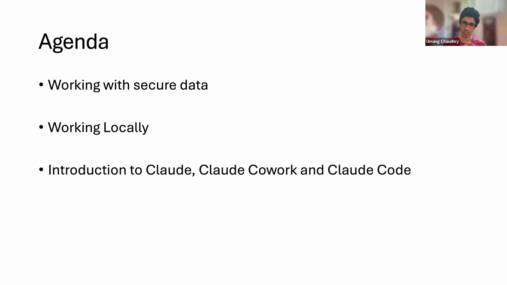

---

## Part 1 — Working with Secure Data (Umang Chaudhry)

### Why security matters before you do anything else

By default, your conversations with ChatGPT, Claude, Gemini, and most online LLMs may be used for future training. Requests sent through their APIs and embeddings endpoints can be used the same way. So before you build anything interesting, you need to know what the model provider will do with your data.

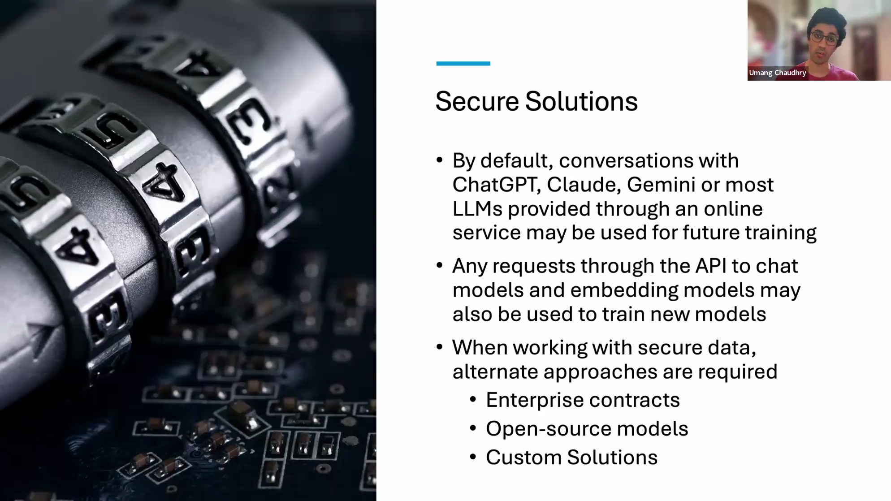

A subtle point that often gets missed: even when a provider promises not to *train* on your data, U.S. law currently requires AI providers to retain conversations indefinitely on their servers. "Not training on it" is not the same as "not storing it."

> "Even though they're saying that they won't use your data for training, which is great… US law now does require that all conversations with AI be saved by their providers. So while they may not use your data for training, it will be sitting on their servers indefinitely." — Umang Chaudhry

### Vanderbilt's four data classification levels

Most institutions classify data into four tiers. Vanderbilt's are:

- **Level 1 — Public.** Data intended for public release. Anything goes.
- **Level 2 — Institutional use only.** Unpublished research, internal documents. Most common gray area.
- **Level 3 — Restricted.** PHI, HIPAA, FERPA, GDPR-protected, NDA-protected.
- **Level 4 — Critical.** Law-enforcement records, classified information, most government work. Bespoke security required.

The corresponding allowed AI solutions look like this:

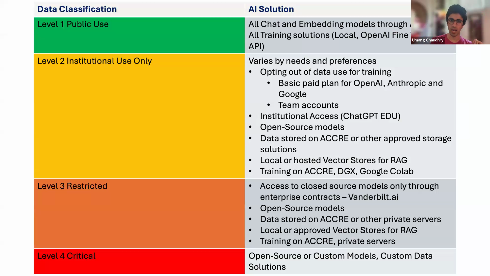

A few practical notes Umang highlighted:

- The **opt-out toggle** for training is *off by default*, even on paid plans. Go into settings and turn it on.
- **Team accounts** from major providers tend to opt you out of training automatically.
- **ChatGPT EDU** (Vanderbilt's enterprise OpenAI access) is approved up to Level 2.
- **Vanderbilt's Amplify** at `vanderbilt.ai` gives you Anthropic and OpenAI models with **Level 3** approval — but it gives you the *chat models*, not the agentic Cowork/Code framework.
- For Level 3 data storage, ACCRE works, but tell ACCRE that Level 3 data lives in those folders.
- **Level 4 always requires a custom solution** — coordinate with ACCRE before storing anything.

Maxwell Lieb (Vanderbilt security) added in chat: *"Above Level 2 open-source models require fully local hosting or for the hosting platform to meet compliance standards and be signed off by GRC."*

### Where Claude, Cowork, and Code fit

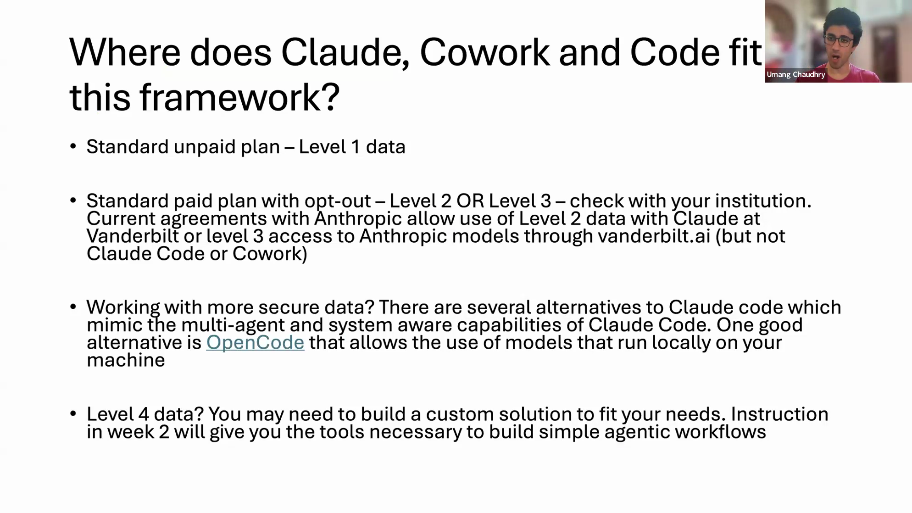

- **Standard unpaid Claude** → Level 1 only.
- **Paid Claude with opt-out** → Level 2, possibly Level 3 (check your institution's contract).
- Vanderbilt's current Anthropic agreement covers **Level 2** for Claude, Cowork, or Code.
- Vanderbilt's Amplify gives you Anthropic chat models at **Level 3** — but no agentic harness.
- **OpenCode** is a good open-source alternative that mimics Claude Code's multi-agent capabilities while letting you use locally-run models. Useful for Level 3+.
- **Level 4** always requires a custom solution. The Week 2 instruction will give you the building blocks to assemble one.

### Limitations of going fully local

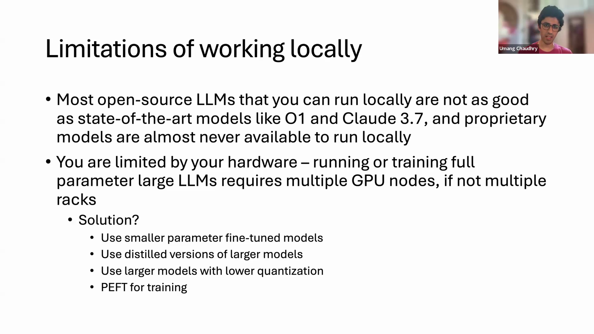

State-of-the-art proprietary models aren't available to run locally — by definition. And running a model the size of Claude 3.7 or GPT-5.5 locally would require multiple GPU racks. The practical workarounds are:

- **Smaller fine-tuned models** for narrow tasks.
- **Distilled models** — a small student model trained to mimic a large teacher. You compress most of the larger model's behavior into something that fits on your laptop.
- **Quantized models** — convert weights from high-precision floats (e.g., FP16) to lower-precision integers (e.g., INT4 or INT8). This shrinks the model size dramatically, speeds up inference, and lowers energy use, with minimal quality loss. You don't need to do this yourself — quantized versions of nearly every popular open-source model are pre-built and available on Hugging Face.
- **PEFT (parameter-efficient fine-tuning)** when you need to train but lack the compute to update every weight.

> "If you wanted to locally run the equivalent of a Claude 3.7, you're gonna need a couple of racks of GPUs, which can be very, very inaccessible and expensive." — Umang Chaudhry

(Last summer's AI Summer recordings cover PEFT and these techniques in much greater depth — see the `archive` folder in the repo. This summer focuses on agentic tools, not training.)

### Demo: LM Studio for fully-local model use

LM Studio is a free desktop app (Mac/Windows/Linux) that lets you browse open-source models, download them, and run them entirely on your machine.

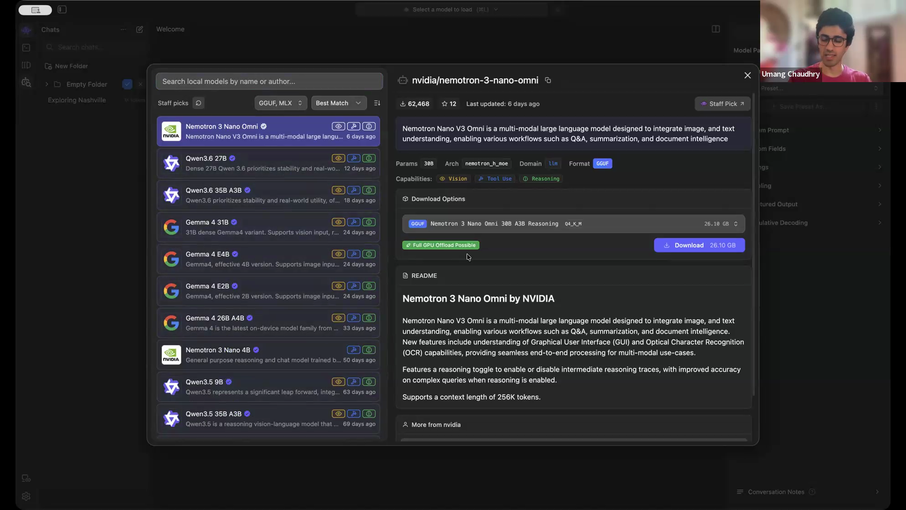

The left-side **search panel** connects directly to Hugging Face. You can search for any open-source model — Gemma, Llama, Qwen, Nemotron — and see which versions will fit on your machine. LM Studio computes the size up front so you know whether the download will run on your hardware.

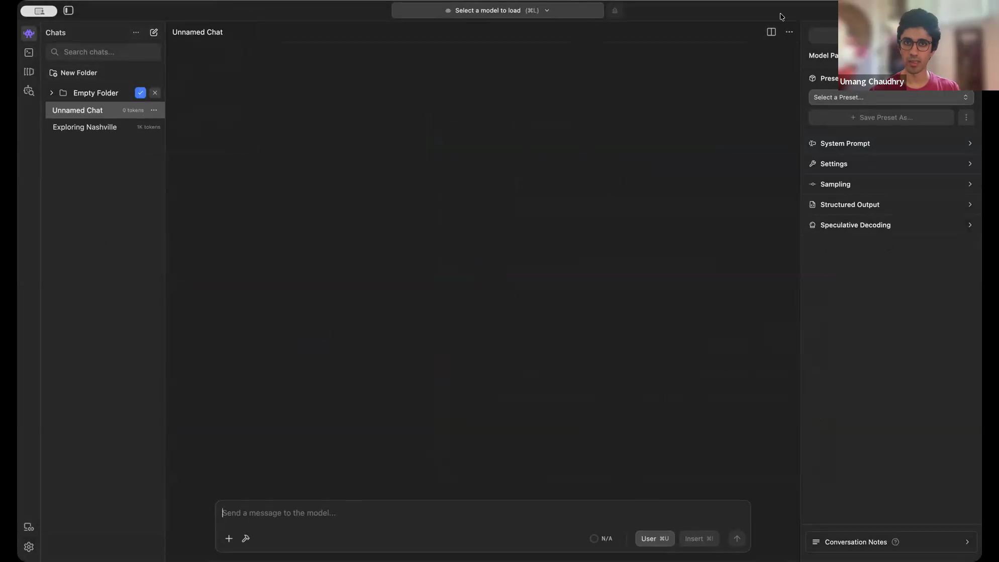

When you click into a model, LM Studio shows you the available **quantization formats** — e.g., 8-bit, 6-bit, and 4-bit versions of the same model. The 4-bit version is dramatically smaller; you trade a small amount of quality for the ability to actually run it on consumer hardware.

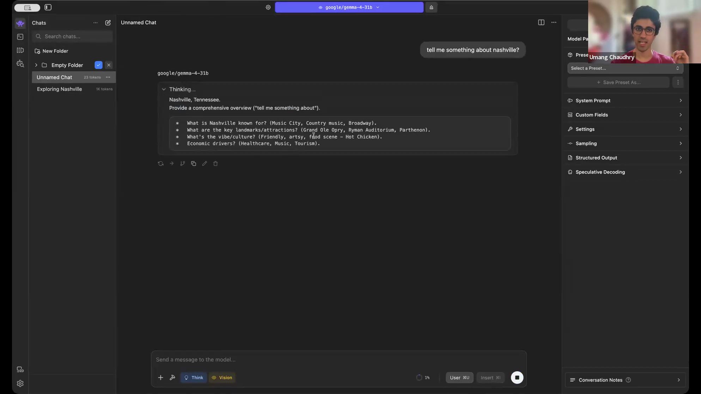

Umang demoed a Gemma 3 31-billion-parameter model, 4-bit quantized (~20 GB), running on his M3 MacBook Pro with 48 GB of RAM. The chat UI behaves like ChatGPT — you ask "tell me something about Nashville" and watch the model think and respond, locally:

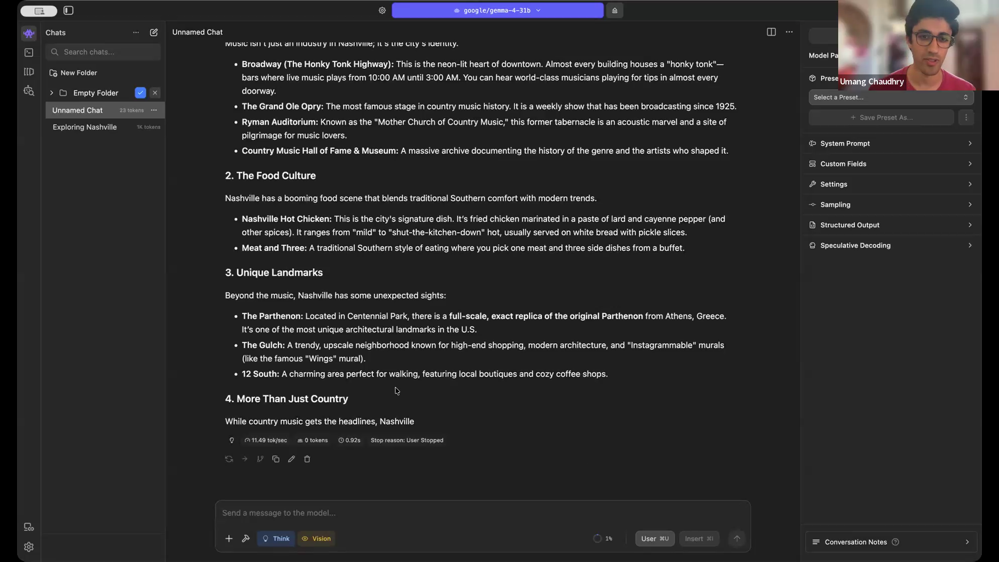

A practical caveat: if you want a local model to **use tools** (call APIs, run code), the model itself must have been trained on tool use. Check each model's card on Hugging Face to confirm. Gemma 3 supports it; not all open-source models do.

> "It's a little bit slower than you would see on ChatGPT or Claude, but that's also because this is using a little bit more than half my memory on my computer, and my Mac is about to take off." — Umang Chaudhry

#### Q&A — Local models

**Q (Veronica Dougherty):** Should we have downloaded LM Studio for the course?

**A (Umang):** Completely optional. It's only there in case Claude isn't a fit for the data sensitivity of your project.

**Q (Maxwell Lieb):** Are dynamically loaded models — the kind that move parts in and out of VRAM — actually useful, or a parlor trick?

**A (Umang):** Not a parlor trick, but the main thing those settings change is *speed*, not raw quality. The more of the model you can keep on the GPU/APU, the faster it runs. Quality-affecting parameters (like quantization level or flash attention) are a separate dial. For comparing configurations, benchmark sites like `llm-stats.com` are the most practical resource right now.

---

### Demo: Claude Chat vs. Cowork vs. Code

Umang then took the group on a tour of the three Claude experiences. From the user's perspective they look almost identical, but the capabilities are very different.

#### Chat

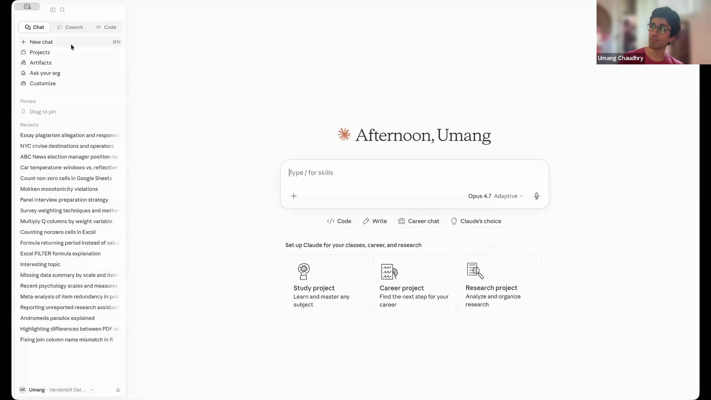

Chat is a single isolated session. It can search the web and call some tools, but it cannot read files on your computer, cannot maintain a project-style memory across sessions, and works only with what you upload. It will form general preferences over time if you let it (Umang turns this off — "I like my models as vanilla as possible").

#### Cowork

Cowork looks similar to Chat but you can **point it at a folder on your computer**. Once you grant access, Cowork can read, edit, write, and create files in that folder, asking permission for each action by default. The workspace is sandboxed — it runs inside a virtual environment within the Claude app, so it is *capable* but *not powerful*. Good for: document analysis, light scripting, simple solutions. Less good at: real coding projects.

#### Claude Code

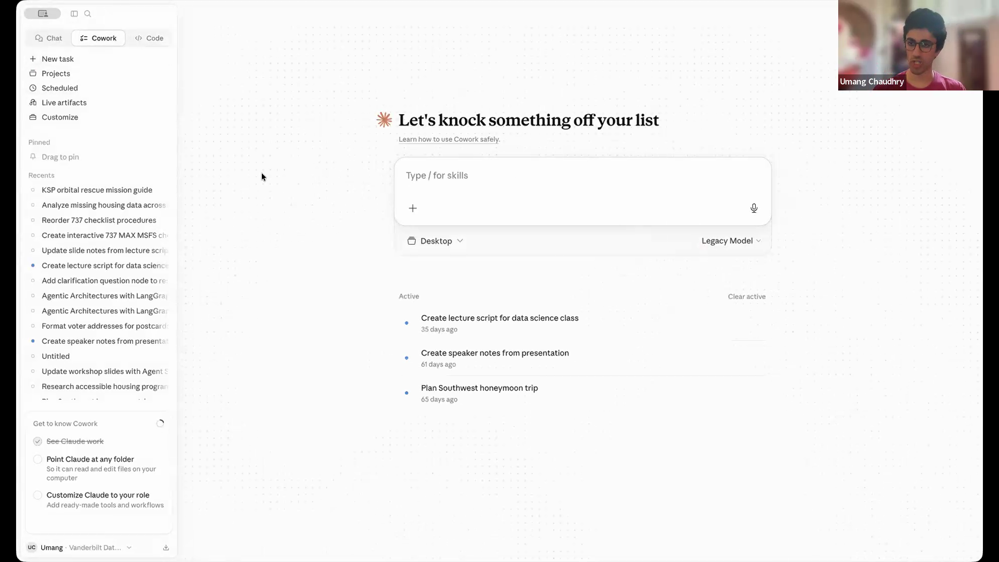

Code looks like Cowork but is purpose-built for software development. It tracks Git branches (you can see "main" in the screenshot above), lets you point at multiple project folders, and remembers conversations *per project* — each conversation gets the previous work in that folder as context. Inside the desktop app, Code still runs in a sandboxed VM, but a more powerful one than Cowork.

#### Claude Code from the command line

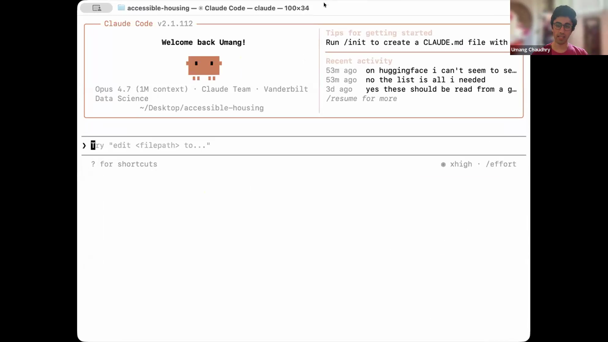

The most powerful version of Claude Code runs natively in your terminal (`claude` command). When run this way it is no longer sandboxed — it has full access to whatever directory you launch it from, can use your machine's hardware, and reads/writes your real filesystem. There's also a hosted version at claude.com if your local machine is underpowered, but everything then runs on Anthropic's servers (so consider data sensitivity).

#### Q&A — Claude Code in IDEs

**Q (Ida Metiam, in chat):** How is the Claude CLI different from the VS Code extension?

**A (Umang & Jesse):** The model is the same; the **agent harness** is what differs. Inside VS Code without the Claude Code extension, you're calling the Claude *model* but lack the harness — file access, task tracking, sub-agents — that makes Claude Code so capable. Cursor has its own agent harness, similar but not identical. If you prefer working in an IDE, install the Claude Code extension *inside* VS Code; that gives you the full harness with a code-first UI.

> "The model may be the same. You might be working in Claude Opus 4.7. But the agent harness is completely different. And so, in VS Code, you don't have that same agent harness. And we're going to see in a little bit that that can really make all the difference." — Jesse Spencer-Smith

---

## Part 2 — Chat vs. Agent (Jesse Spencer-Smith)

Jesse took over and started by polling the room with Zoom reactions: green checkmark if you've used an agent (Claude Code, Claude Cowork, or any other), red if only chat. Most of the group has used both.

The framing question for the rest of the session: *what really separates a chat from an agent, under the hood?*

The audience was warmed up to the answer:

- *Agents do things.* (Paras Karmacharya)
- *Agents take over your directories.* (Andrea Moro)
- *Agents have more autonomy and control over local directories.* (HD McKay)
- *Agents introduce a loop where the model can reason, act, and observe results before finalizing an answer.* (Che Guan)

All correct, all incomplete. Jesse pulled up an artifact he'd built that runs the *same* prompt — a manufacturing-line throughput problem — through a chat workflow and an agentic workflow side by side.

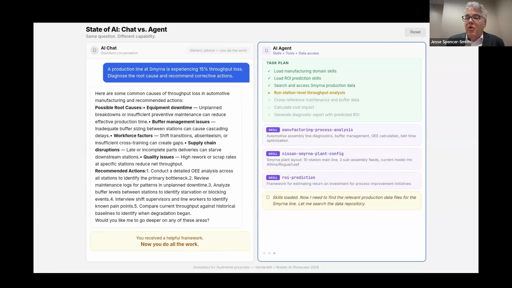

**The chat side** answers from internal knowledge (or a single search call), summarizes possible root causes and recommended actions, and hands the work back to you. *"Now you do all the work."*

**The agent side** does several things a chat structurally cannot:

1. **Plans before acting.** It analyzes the request and produces a tracked task list before doing anything else.
2. **Tracks state in a file.** Agents communicate with each other (and remember across long horizons) through a shared task file in the working directory.
3. **Spawns sub-agents** to handle pieces of the plan in parallel.
4. **Loads skills dynamically** — finding the right one based on the request.
5. **Evaluates its own answer** before returning to you.

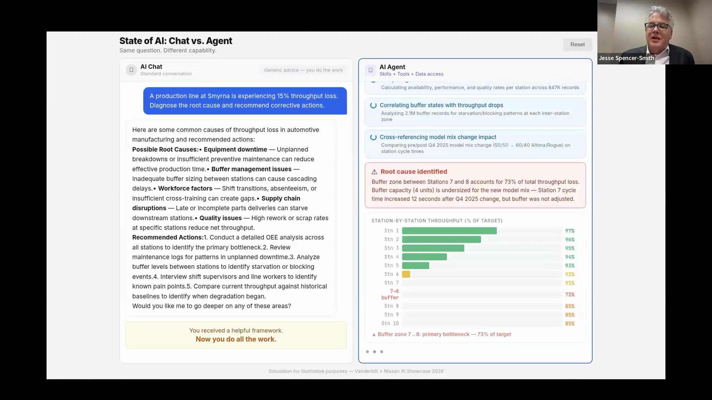

> "Agents do… a chat does one thing. They might be able to take some action, they might reason as well, but then they return to you, and then it's up to you. An agent, on the other hand, can take a goal, reason about the goal, come up with a plan before it does anything, spin up sub-agents as needed, take multiple actions, evaluate its answers before returning to you." — Jesse Spencer-Smith

### A short history of skills

Jesse walked through how this capability actually arrived:

> "How many of you remember the bad old days when you asked a model to create a PowerPoint for you, and it said, 'yes, I can create the PowerPoint for you'… and what it did was it came up with a list, like, of bullet points, and said, 'okay, here you go, now you can create the PowerPoint.' Do you remember that? So frustrating." — Jesse Spencer-Smith

In **September 2025** Anthropic released what at the time looked like new capabilities — Claude could suddenly produce real `.pptx`, `.docx`, and `.xlsx` files. What they actually shipped was *skills*. The PowerPoint skill contained (a) a description of what makes a good PowerPoint and (b) Python code that knew how to write `.pptx` files using `python-pptx`. The model translates user intent into calls into that Python code, and the harness runs it. Skills, not new model capabilities, did the work.

> "Agents without any skills built in are okay. They can do a lot more, but agents *with* skills are tremendously more powerful than chat, and more powerful than agents alone." — Jesse Spencer-Smith

#### Q&A — Skills, MCPs, and the agent harness

**Q (Maxwell Lieb, in chat):** Many AI chat sources do task listing and pseudocode generation. Are those leveraging the same kind of skills as fully agentic tools?

**A (Jesse):** Yes — chat has benefited from skills as well; that's how chat got the ability to produce binary PowerPoint and Excel files. The structural difference is what chat *can't* do: spin up sub-agents, write to a shared task file, persist memory across the harness. Skills augment chat, but the harness is what unlocks the agentic loop.

**Q (Andrea Moro, in chat):** Why didn't the chat call the agent to produce a better answer?

**A (Jesse):** Because chat has no scaffolding to do that. There's no harness running underneath chat that can spawn another agent or maintain shared task state. That infrastructure is what an agent harness *is*.

**Q (Sean Schaffer, voice):** Can the agent find the skill itself, or do you tell it which skill to use? Is there a skill repository?

**A (Jesse):** Both. Either you can manually invoke a skill by name, or the agent discovers it from its description (we'll see this live in a moment). And yes — there's a public Anthropic skills repository, and you can build your own.

**Q (Sean Schaffer, voice prompt):** What is MCP, exactly?

**A (Jesse, with Paras Karmacharya):** Model Context Protocol — *"a standard way of connecting to tools."* You may have heard MCP described as a "USB for agents." MCPs are powerful and broadly compatible, but they have a downside: the entire MCP description gets loaded into context up front, which can be enormous (the GitHub MCP, for example). **Skills are dynamically loaded** — only the short description sits in context until the model decides it needs more, then the rest is pulled in at the right moment. This is *progressive disclosure*, and it's why skills can do many things MCPs do but at a tiny fraction of the context cost.

> "When you load up a skill for your model to be aware of it, it loads up maybe 100 tokens, maybe 200 tokens. Very, very small. And the only thing in that description is, *you have this skill available*. If the model decides that it needs the skill, it'll pull up the rest of the skill." — Jesse Spencer-Smith

Skills are also *composable* (you can load several at once), shareable across all the major providers (OpenAI, Google, and the open-source ecosystem have all adopted them), and importantly — *they're text files you can read.* You can vet them.

---

## Part 3 — How LLMs Actually Work

To make sense of why agents and skills are organized the way they are, Jesse stepped back to the model itself.

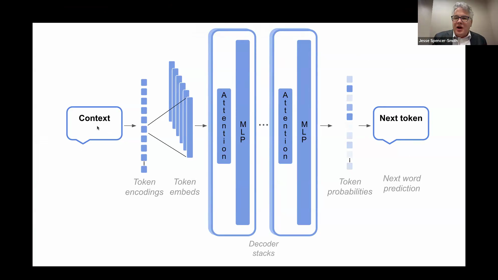

This is the architecture of a decoder transformer — the kind of LLM behind Claude, GPT, Gemini, and most modern LLMs. The flow:

1. **Context** (your prompt and any prior turns) is split into **token encodings** — integer IDs from a vocabulary.
2. Each token is mapped to a **token embedding** — a high-dimensional vector. The space is *semantic*: similar concepts live near each other.
3. The vectors flow through a stack of **decoder blocks**, each containing **attention** and a **multi-layer perceptron (MLP)**.
4. The output is a **probability distribution over the next token**.
5. The most likely token is sampled, fed back into the context, and the process repeats.

### Embeddings and the "king minus man plus woman" trick

Jesse anchored the embedding intuition with a familiar example. The token "king" lives at a particular point in the space; nearby concepts include *queen*, *highness*, *majesty*, *crown*, *royalty*. The famous result:

> king − man + woman ≈ queen

You can do *math* in the semantic space.

### Attention: words change each other's meaning

Attention is what lets the meaning of "king" depend on its neighbors. Jesse used the sentence:

> "She looked across the board and said triumphantly, 'King me.'"

The word *king* in that sentence is not a noun referring to royalty — it's a verb referring to a checker piece. How did everyone in the room know? *"Looked across the board"* and *"triumphantly"* — the surrounding words pulled the meaning of "king" to a new location. That's exactly what attention does mechanically: it computes a weighted average of the surrounding tokens' embeddings to produce a new contextualized embedding.

### MLP: the world knowledge layer

Knowing the sentence is about checkers — not chess — is a different kind of knowledge. *"You don't king someone in chess."* That world knowledge lives in the MLP, the second half of each decoder block. Jesse described the MLP as a *"fuzzy JPEG of everything the model has been trained on."* It is not a lookup table; it is a learned representation of regularities in the training data. Bigger MLP → more world knowledge → bigger model → more compute and energy to run.

### Why the same prompt gives different answers

A student question: if everything from context to next-token probability is deterministic, why does the same prompt yield different answers across sessions?

> *"We add a little bit of noise to the token probabilities. Why? Because people are repetitive. When we write things, we say the thing again, we restate ourselves again and again… we want to break that loop." — Jesse Spencer-Smith*

That noise dial is the **temperature**, which Paras correctly identified in chat. Higher temperature = more sampling diversity = sometimes-better problem-solving, sometimes-more-creative output, sometimes-more-mistakes.

### Q&A — Inside the transformer

**Q (Lori Troxel, voice):** It goes through several decoder stacks — does the model decide how many times, or is it sequential?

**A (Jesse):** Sequential. A given model has a fixed number of stacks. More stacks = generally more capable. Small language models have fewer stacks *and* a smaller MLP. There is an interesting variant called a **looped transformer** that iterates through the same stack multiple times — there's broad speculation that Anthropic's `mythos` model is a looped transformer — but even that uses a fixed number of iterations.

---

## Part 4 — Where Information Comes In: Context, Tools, and Skills

A model trained in 2025 can't know what happened in January 2026. It only knows what was in its training data. Yet modern LLMs answer questions about today's events surprisingly well. How?

> "The only way to get information to be considered by a model in real time is to get it into that context." — Jesse Spencer-Smith

Web search results, file contents, calculator outputs — everything gets stitched back into the context. *Context is the name of the game.*

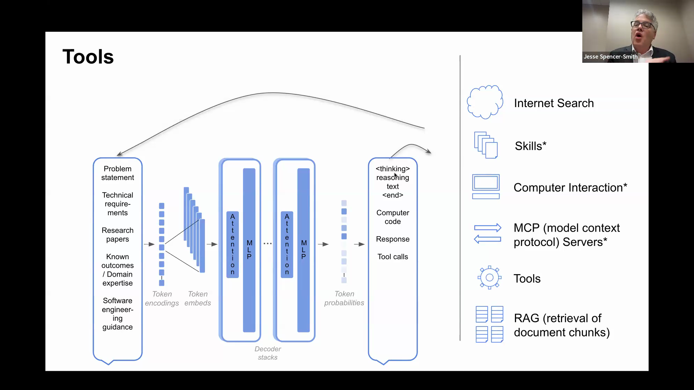

Common tool types that feed the context:

- **Internet search** — for currency.
- **Skills** — composable, dynamically loaded extensions.
- **Computer interaction** — running code, reading the screen.
- **MCP servers** — standardized data and tool connectors.
- **Tools** — calculators, code execution. *(Models are bad at math because they treat numbers as tokens; "What is 123 + 1?" needs a calculator call. The token "12" appears all over the training data; "3" appears all over the training data; the model has no inherent reason to compose them numerically.)*
- **RAG** — retrieval of document chunks.

### Why we may be past the golden age of RAG

RAG, classically, hopes that (a) you described your need well in context, (b) the chunking of your documents matched what you'd ask about, and (c) semantic similarity surfaces the right chunks. Three places to fail. Modern agents bypass much of this by using `bash` and `regex` tools to actually search documents directly — and the harness runs those searches in massive parallel.

> "The best agent harnesses have specialized versions of all of those commands to, at scale, and in parallel, carry out those tasks on behalf of the agent. So the agent just writes a bash command, writes a regular expression. But the harness has specialized code which can do that massively in parallel… That is what is putting RAG to bed right now." — Jesse Spencer-Smith

### Context rot

If you stuff a context full of irrelevant material, every token afterward gets influenced by it through attention. That's **context rot**. The whole point of skills, sub-agents, and progressive disclosure is to keep the *relevant* context dense and the *irrelevant* material out.

### Skills: progressive, composable, locality-of-reference

Skills get loaded as you mention them. The top of the `SKILL.md` file (a few hundred tokens) goes into context; the rest only loads if the model decides it needs it. Critically, skills load *adjacent* to the work — not way back at the top of the conversation like an MCP. This proximity matters: the skill instructions sit right next to the user message that triggered them, which Jesse argues is one of the reasons skills work so well.

---

## Part 5 — The Agent Harness ("Agent 2.0")

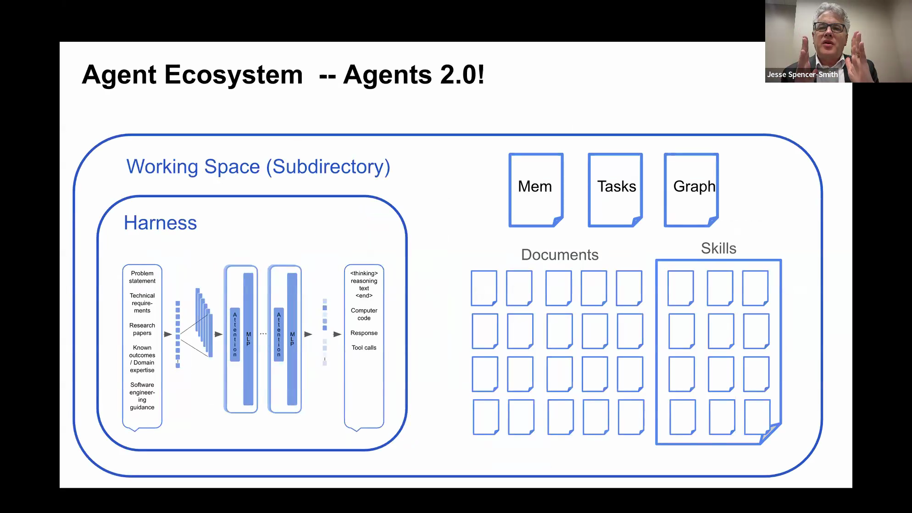

The full picture of an Agent 2.0 system:

- An **LLM** at the center.
- Surrounded by a **harness** that has access to:
  - The **working directory** (a subdirectory you've granted permission to).
  - **Memory** — persistent storage that can outlive a single context.
  - **Tasks** — the shared task file that is both the agent's to-do list *and* the communication channel between agents and sub-agents.
  - **Graph representations** of knowledge.
  - **Documents** in the working directory.
  - **Skills**.

### What changes with the harness

Instead of relying on RAG-style retrieval, the agent can write code or bash commands to look directly at files. It can spawn sub-agents to assess content in parallel, each returning either a summary or a targeted snippet. The lead agent's context stays curated — no fluff.

> "Now, instead of having to depend on something else to pull up the proper documents… it can write code, it can write bash commands, to directly go out and look in the documents to see what specific documents it needs to carry out a task, what parts of which documents it needs to carry out a task." — Jesse Spencer-Smith

### Why "Agent 2.0"?

In Agent 1.0 (last year's world), every agent was hand-built. You decided up front exactly which tools, sub-agents, and prompts would be used. In Agent 2.0:

> "Agents 2.0 dynamically create the architecture and the orchestration for it to handle problems. Agent 1.0, everything had to be handcrafted. Agent 2.0 — like Claude Code, like Claude Cowork, and like other agents that you're seeing coming on the market — are not handcrafted. Instead, they have a large number of skills that we create, or that we give to it, that actually solves problems for us." — Jesse Spencer-Smith

### A new improvement hierarchy

Before December 2024, the path to a more capable model was *retrain it*. That has flipped:

1. **Can a skill solve this?** Skills are fast and cheap to author, and run inside the existing harness.
2. **Does the harness need an upgrade?** Requires real coding, but doable.
3. **Does the model need to be retrained?** Almost never the right first answer — too expensive, too slow, not always possible (you can't retrain Opus 4.7).

### Q&A — Memory and parallelism

**Q (chat):** Does the agent do semantic search of memory or tasks?

**A (Jesse):** It can. Agent harnesses can use any of the techniques we covered earlier — RAG-style stores, semantic search, keyword search. The quality of the harness's memory subsystem is itself a major performance lever now: better memory store → better long-horizon agent behavior.

**Q (chat):** What enables a harness to run things in massive parallel?

**A (Jesse):** Specialized library code. The harness replaces stock bash commands with parallel-execution variants that run regex or search across many files at once. This is part of why agents have effectively replaced RAG for many use cases.

---

## Part 6 — A Concrete Skill: Lecture Recording → Lecture Notes

Jesse used one of his own real skills — the same one being used to generate *these* notes — as a worked example before the live build.

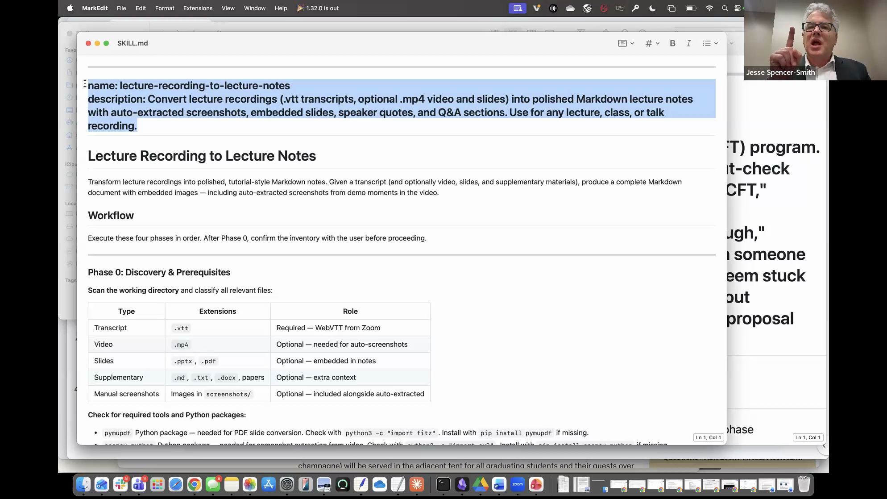

A skill is just a folder. This one is named `lecture-recording-to-lecture-notes` and lives under a `skills/` directory. Inside:

- `SKILL.md` — the skill's prompt and workflow.
- `scripts/` — Python scripts the skill calls (frame extraction, PDF→PNG, etc.).
- `evals/` — test cases used to validate the skill.

The top of `SKILL.md` is what loads into context up front. The description is short:

> *"Convert lecture recordings (.vtt transcripts, optional .mp4 video and slides) into polished Markdown lecture notes with auto-extracted screenshots, embedded slides, speaker quotes, and Q&A sections. Use for any lecture, class, or talk recording."*

That's the part the model uses to decide *"is this skill relevant?"* If the user says "make me notes from a talk I gave," the model recognizes the match and loads the rest:

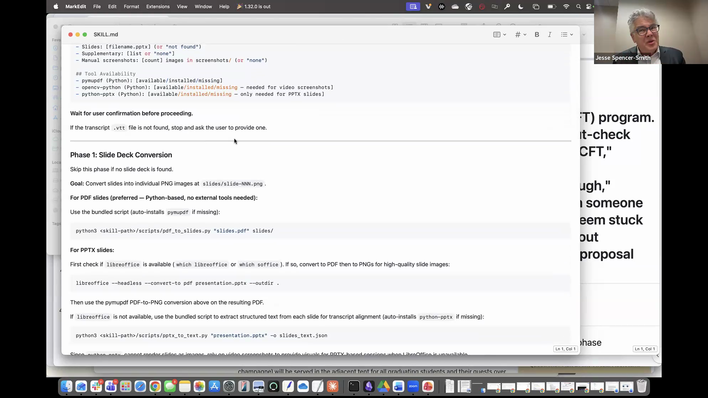

The skill works in four phases:

- **Phase 0** — discovery: scan the working directory, identify transcript/video/slides, check for required Python packages, install them if missing, and confirm with the user.
- **Phase 1** — slide deck conversion (slides → PNGs).
- **Phase 2** — transcript analysis: parse the VTT, detect demo moments using regex triggers (*"let me show you,"* *"as you can see,"* *"if you look at"*), gap detection, and slide transitions. Then extract video frames at those timestamps.
- **Phase 3** — note generation: the markdown itself, with embedded images and speaker quotes.

Jesse built this in about two hours, and explicitly chose **Claude Code** to do it because the skill needed cross-platform Python that would work on Mac, Windows, and Linux — heavy coding territory.

> "I had to create it using Claude Code, because it was creating stuff that would only work on a Mac. And I was like, well, I want you to write stuff in so it can work on a Mac, or any place where people are running this… Claude had to do some heavy coding to figure out how to do this." — Jesse Spencer-Smith

A note he made aloud: *the version of the skill in use today doesn't yet incorporate the Zoom chat log; he'd need to modify the skill to include those questions.* (You're reading the result anyway — the chat questions made it into the Q&A sections of these notes via a small assist.)

---

## Part 7 — Live Skill Creation in Cowork

Now the room co-built a skill. The audience suggested several problems; the group settled on:

> **Skill goal:** *Identify potentially sensitive data fields in databases.*

Jesse opened Cowork and started a new task with: *"I want to create a skill for identifying potentially sensitive data fields in databases."*

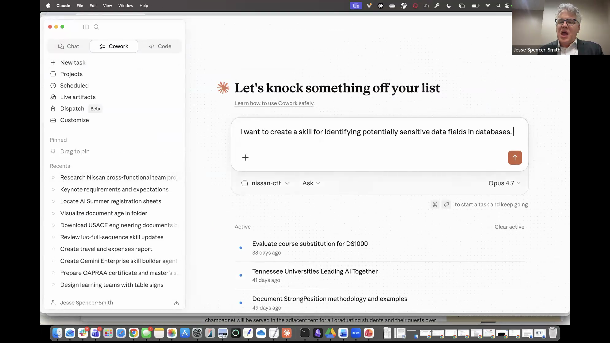

Two things to notice:

1. He typed `/skill-creator` to *manually* invoke the skill-creator skill. You can also let the model auto-discover skills, but this guarantees the right one is loaded. Forward-slash invocation is the manual-fire path.
2. He's using **Cowork**, not Claude Code. That's deliberate — this skill won't have heavy code, so the lighter Cowork sandbox is appropriate. *"This would have been overkill in Claude Code."*

### The skill-creator interrogates you

Skills can drive UI. The skill-creator uses the `AskUserQuestion` tool to walk you through scoping decisions before drafting anything:

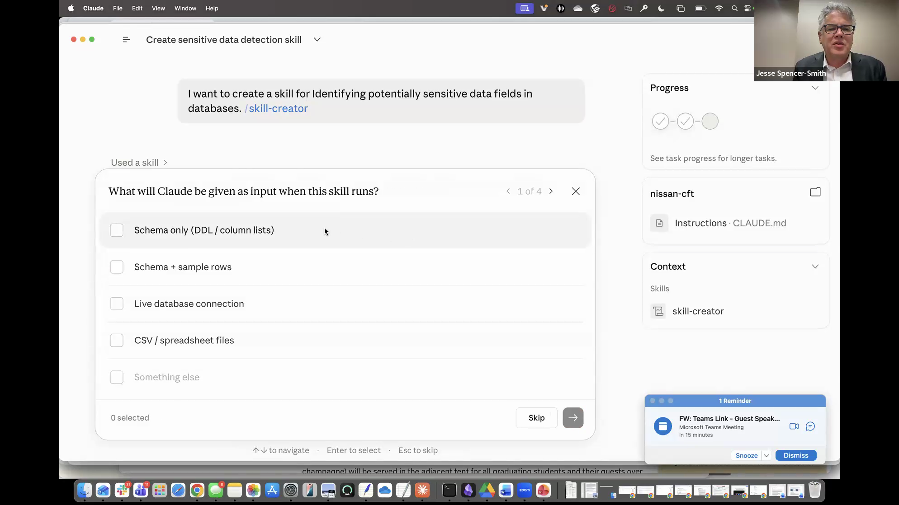

The questions, in order:

1. **What input will the skill receive?** Options included schema-only DDL (`CREATE TABLE` + column lists), schema + sample rows, live database connection, CSV/spreadsheet, or "something else." Ida selected **schema-only DDL / column lists** (most realistic for a demo without a real DB connection).
2. **What sensitivity categories should it flag?** Ida chose **PII and PHI**.
3. **What output format?** Ida chose a **Markdown report with a table of flagged columns**.
4. **Primary use case?** Ida chose **data governance / cataloging**.

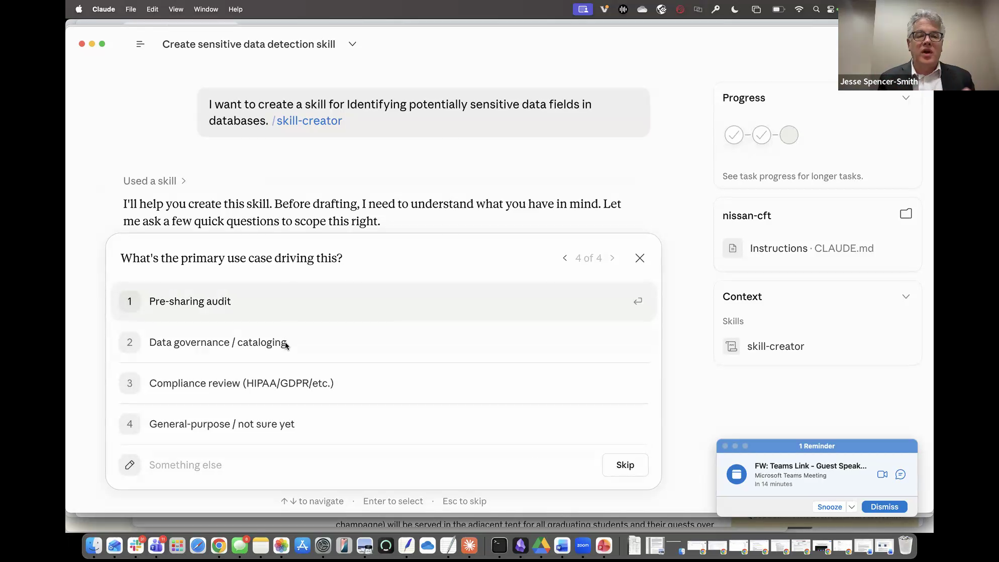

> "This is drawing on the full knowledge of the LLM to lead you through these questions. But you're the one answering the questions, and you're the one who came up with the first idea. The more you provide, and you share your expertise in what you're trying to do, the better the skill will be. So this is *you co-creating a skill with an LLM*. A skill which is authored only by an AI does not help that much, because a skill is meant to be the base knowledge and capability of the AI, *augmented by your expertise*." — Jesse Spencer-Smith

### Skill-creator goes to work

Once the questions were answered, the skill-creator laid out an explicit work plan in Cowork's task panel:

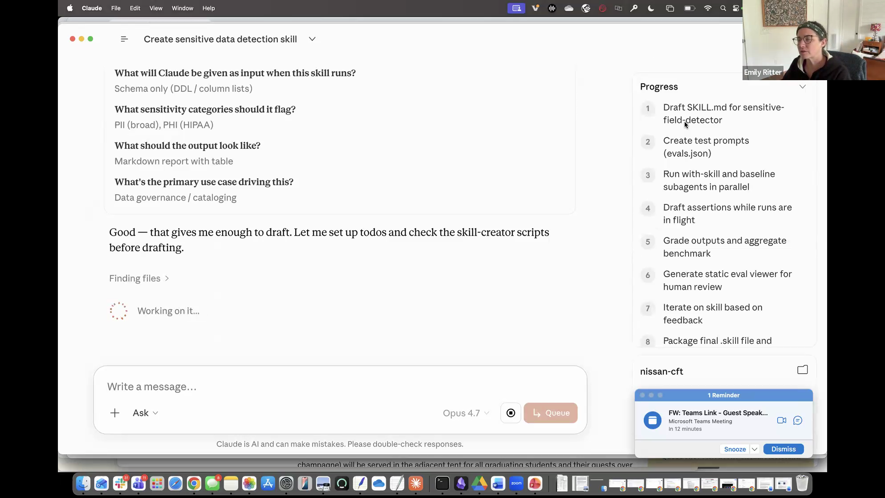

The plan it generated:

1. Draft `SKILL.md` for the sensitive-field detector.
2. Create three test prompts (and store them as `evals.json`).
3. Run with skill *and* without skill, in parallel sub-agents.
4. Draft assertions while the runs are in flight.
5. Grade outputs and aggregate the benchmark.
6. Generate a static eval viewer for human review.
7. Iterate on the skill based on feedback.
8. Package the final `.skill` file and present it.

This is the validation loop that makes skill-creation itself reliable: every skill it produces gets tested against an *agent-without-the-skill* baseline. *If the agent does about as well without the skill as with it, why bother?*

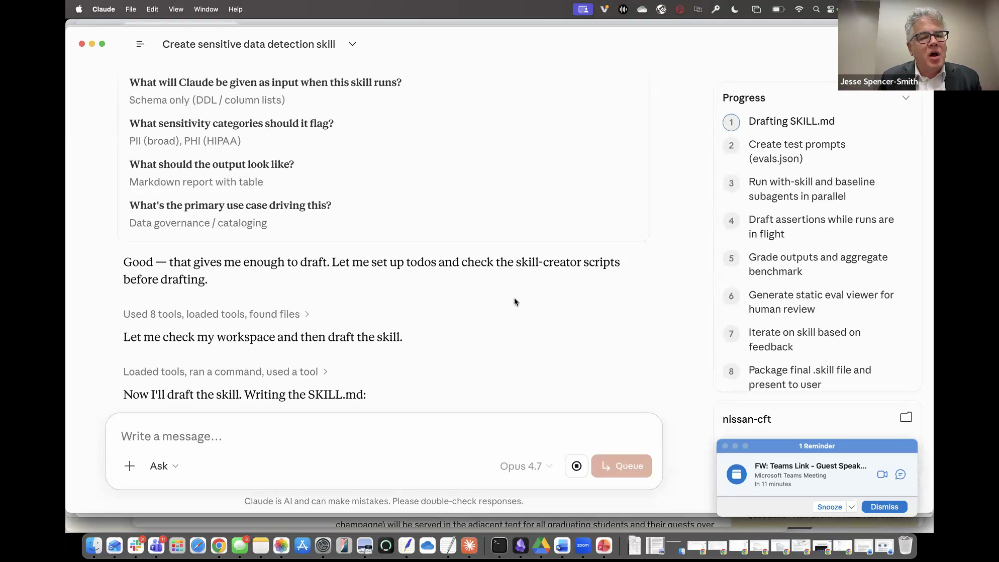

While the skill drafts, you can interject. *"If you have ideas for tests to run, you can give it beforehand."* You can hand it sample DDL, link to a project subdirectory, or paste in additional context — all before it commits to a draft.

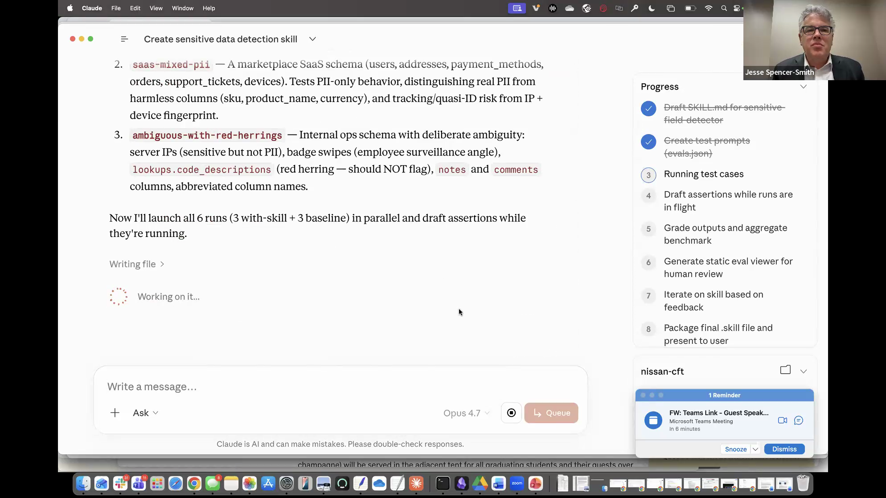

The skill-creator launched **six** runs (three test prompts × two conditions: with-skill vs. baseline) in parallel sub-agents.

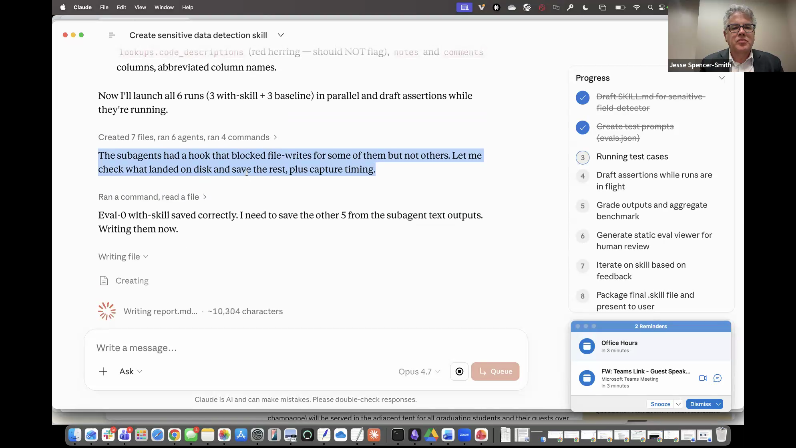

Mid-run, one sub-agent hit a file-write problem. *That's exactly the difference between an agent and a chat.* It detected the failure, came up with an alternative plan, and continued — without Jesse having to copy/paste a stack trace.

### The drafted SKILL.md

While the evaluation continued, Jesse opened the drafted `SKILL.md`:

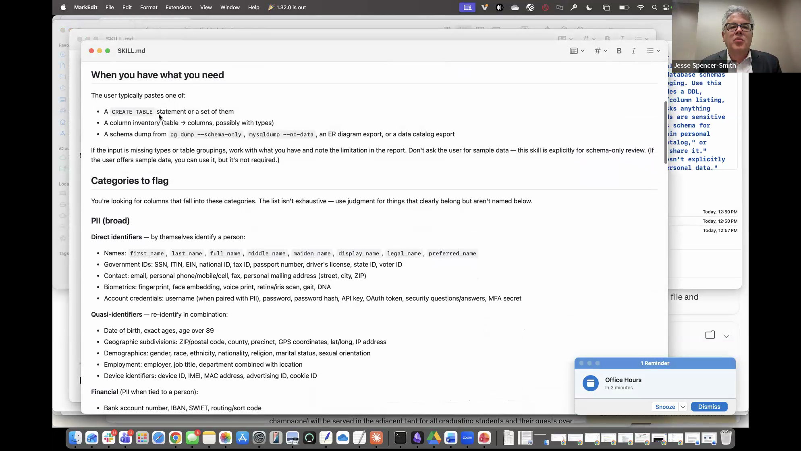

A few things to notice in the skill the agent produced:

- **Triggers are intentionally aggressive.** This skill should fire on phrases like *"DDL paste,"* *"schema audit,"* *"what should we mask."* Jesse pointed out: when you're auditing for sensitive data, you want to be *conservative*. False positives are fine; false negatives are not.
- **Categories to flag** are explicit: direct identifiers (SSN, MRN, email, biometrics), quasi-identifiers (DOB, ZIP, race, IP, employer), financial PII, free-text columns to flag with low confidence, and a separate HIPAA Safe Harbor section for the 18 PHI identifiers.
- **All of this is editable.** This is the point at which an expert reviewer can take over: edit the markdown directly. Add international postal-code patterns. Swap "HIPAA Safe Harbor" for "GDPR Article 9 special categories." Modify the output format. The skill *is the editable file.*

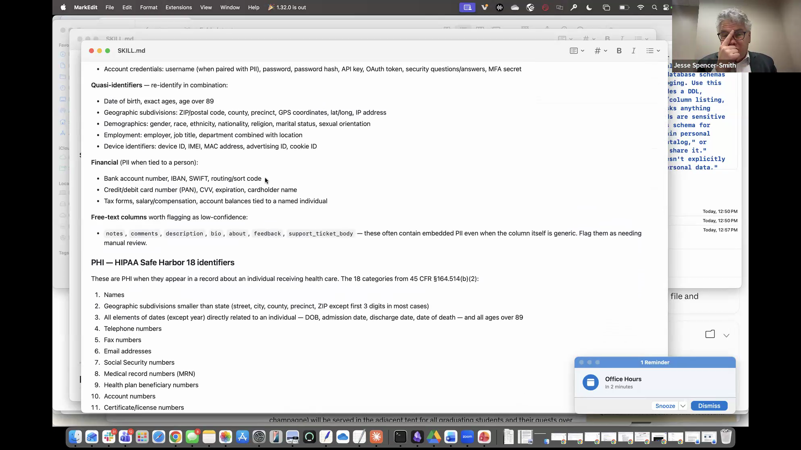

### Inside the skill folder

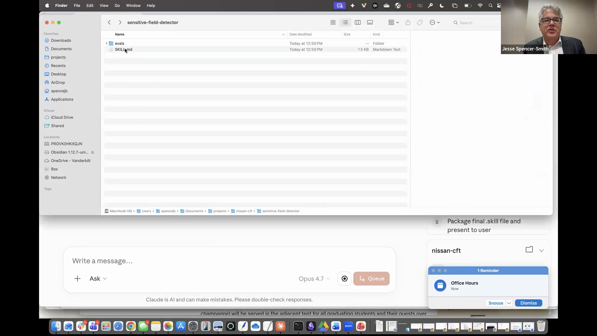

The output is a folder named `sensitive-field-detector/` containing the `SKILL.md` and an `evals/` subdirectory. To share a skill, you zip the folder and rename it to `.skill`:

> "A `.skill` is just a subdirectory zipped up and renamed `.skill`. That's all that it is." — Jesse Spencer-Smith

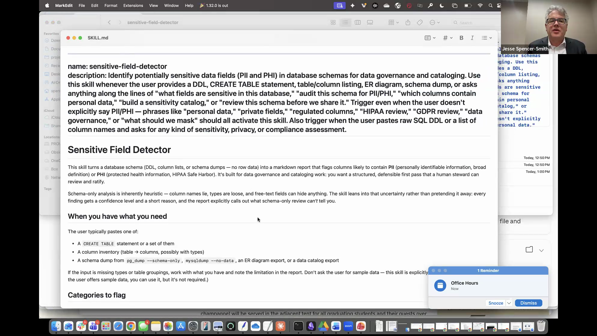

### Q&A — During the build

**Q (Emily Ritter, voice):** What are the typical costs for using something like this? I've hit token limits doing research-heavy tasks on a Pro account.

**A (Jesse):** Skills *save* token usage when designed well — because a skill can solve a problem with code rather than tokens. In this case, the skill will likely run a regex first pass over the DDL; that's the harness running code, not tokens being consumed. Beyond that: Jesse uses Claude Max ($200/month) because he uses Claude Code constantly. There's also a $100/month tier and overage purchases. Open-source small language models, augmented by skills, are getting genuinely good and avoid per-token charges entirely.

**Q (chat):** How do you think about modularity of skills?

**A (Jesse):** Try to keep individual skills *bite-sized* — one task or one part of a task. Skills can chain (one skill calls another), but the only ways skills can pass information are (a) via a file or (b) via the context. Aim for `SKILL.md` files of about **500 lines or less**, because that's what gets loaded when the skill fires. You can put extra material in subdirectories that only loads on demand (Thursday's session covers this in depth).

**Q (chat):** Are skills open source?

**A (Jesse):** You can read every skill — they're text — but the *license* varies skill by skill. Always check.

**Q (Umang, relayed from chat):** Can you speak to how skills live in Cowork vs. Chat vs. Code?

**A (Jesse):** This skill could have been built in chat (we weren't giving it much). Cowork is right when you have a working subdirectory with files for the skill to read. Claude Code is right when the skill needs heavy coding, like the lecture-notes one. Cowork puts the skill in a temporary location and gives you a download link; you can install it as a session skill or save the `.skill` file for later.

**Q (Cara Wade, in chat):** If I need a skill for a short-term project, do I need to "retire" it?

**A (Jesse):** You can disable or remove it; it's easy to take out. Keep it around if you'll reuse it, or share it. *"Skills can be shared and used by every major player right now."*

**Q (chat):** Is there a better GUI for managing agent skills than the default Claude interface?

**A (Jesse):** *"My goodness, this is the hardest part right now — this is ugly."* Skills as a public concept are only ~6 months old. Many people are managing them with GitHub repos. Expect a lot of tooling to land in the next year.

**Security warning Jesse flagged unprompted:** Be careful about running skills authored by strangers. Skills can include code that runs in your environment. They're sandboxed by design, *"but does somebody come up with an exploit? I don't know."* Use skills from people you trust, organizations you trust, or that you've authored yourself. (Maxwell agreed in chat: *"yes [it's something IT can vet] — but the asterisk is doing a lot of lifting there."*)

> "Once you author the skill, you can literally put the skill in front of [a colleague] and say, 'how did I do?' And they'll say, 'well, this is good, except you forgot that it's not just data governance, we also need to do a compliance review.' Now it's even better. So now, for the first time, we have a way of allowing people to contribute their expertise to the betterment of an agent." — Jesse Spencer-Smith

---

## Office Hours Q&A

After Jesse handed off, the room stayed for office hours. The major threads:

### Where do skills live?

**Q (Korede Ajogbeje):** Should skills be placed in the folder where you're working?

**A (Myranda & Umang):** They can. There are two common patterns:

- **Global skills** — store under `~/.claude/skills/` in your home directory. Available to Claude in any project.
- **Project-specific skills** — store under the project folder's own `.claude/` directory or wherever you point Claude. Loaded only when working in that project.

Umang's preference: project-specific. *"Everything I do is distinctly different in our perspective… a skill is very focused on a specific project."* Myranda keeps a single global `skills/` folder she points Claude at. Either pattern works.

### Skill examples

**Q (Lori Troxel):** Does the SKILL.md have code in it, or is it plain language?

**A (Umang):** It can have either. If the task needs code, there's code; if it doesn't, there isn't. When code is involved it's typically Python (LLMs default to Python for general code; HTML for UIs). Skills can also call R or Bash if you ask for it explicitly.

**Q (Lori, follow-up):** Can you give a few examples of skills you actually use?

**A (Umang):** Think of skills as helpers for tasks that are *repetitive but complex*. His "accessible housing" skill performs a structured web search across a fixed list of resources for any U.S. county. *"Anything you think could be done in a systematic fashion again and again is a good candidate for a skill."* Other plausible candidates: drafting emails in your style, grading rubrics (with privacy caveats), generating standard project reports.

### Working from VUMC machines

**Q (Vaibhav Janve):** I'm at VUMC. My work machines block Claude installs, and even my personal laptop tries to connect through the VUMC VPN.

**A (Myranda & Umang):** Several options. (a) Use Claude Code on the web at claude.com if it's not blocked. (b) Bring a personal laptop and don't connect to the VUMC VPN — work from home or the DSI. (c) Maxwell noted you can temporarily turn off the VPN on personal devices; check with IT. (d) Claude has a mobile app with Claude Code support, but a phone screen will be cramped. *"I would just keep this separate from work."*

### R vs. Python

**Q (Vaibhav):** Can the model write R, or is everything Python?

**A (Umang):** It will write R if you tell it to. Models default to Python when no language is specified, but R is fine — just request it.

### IT policy and ChatGPT EDU vs. Claude

**Q (HD McKay):** Vanderbilt told us not to use anything outside ChatGPT EDU, but at AI Days you said get Claude Pro. Which is it?

**A (Maxwell, Myranda, Umang):**

- ChatGPT EDU is approved for **Level 1** and **Level 2** data, provided you don't put grant-protected or otherwise sensitive material in it.
- For **Level 3**, Vanderbilt's Amplify (`vanderbilt.ai`) provides Anthropic and OpenAI models — *but no agentic harness*.
- The DSI is *not* speaking on behalf of VUIT. They're sharing what they personally use. If you have data-sensitivity concerns, you're restricted in what you can use.
- Some departments are exploring their own Claude proxies through AWS Bedrock for Level 3 compliance — ask in your department.

> "Yeah, I'm sorry, so I'm not directly on that team that defines those rules, but I'm on the team securing the overall enterprise… The OpenAI GPT for EDU is only approved through Level 1 and I believe Level 2. So as long as you're not sending anything that is protected university knowledge, you're fine. I think Claude's better, but that's just me." — Maxwell Lieb

### Claude Pro setup tips

**Q (HD McKay):** When setting up the Claude CLI, it asked about accessing my workspace at `/Users/<my-VU-ID>` and offered to create a `.claude` folder there. Is that the recommended setup?

**A (Umang):** Yes — that creates the global `.claude` folder, where global skills can live. Best practice in addition to that: still point Claude at a *specific project subdirectory* when working on a real project, not your whole home directory.

---

## Summary

- **Security comes first.** Map your data to Vanderbilt's classification levels (1–4) before choosing a tool. Opt out of training where possible. Even with opt-out, providers may store your conversations under U.S. law.
- **Claude Chat ≠ Claude Cowork ≠ Claude Code.** Same model under the hood; very different harnesses. Pick based on whether you need file access, project memory, or heavy coding capability.
- **A model is a token-prediction machine.** Context flows through embedding → attention → MLP → next-token probability. Everything else (retrieval, tools, skills, agents) exists to put the *right* information into the context at the *right* moment.
- **Agents 2.0 differ from chat in five ways:** they plan, track tasks in shared files, spawn sub-agents, evaluate their own work, and dynamically load skills.
- **Skills are the new software.** Composable, dynamically loaded, shareable across providers, augmented by your domain expertise. They are the right first answer when you want a model to do something better — before reaching for a new MCP or retraining.
- **Build skills with a partner — yourself.** A skill written only by an AI captures only the AI's base knowledge. The value comes from *your expertise* refining the draft. Edit the `SKILL.md` directly.
- **Validate every skill.** The skill-creator runs each new skill against a baseline (without the skill) on multiple test cases. If the skill doesn't beat the baseline, don't ship it.
- **Be careful with strangers' skills.** They can run code in your environment. Vet the source.

---

## Coming up

- **Thursday (Day 2):** Deep dive into skill architecture — progressive disclosure, references, scripts, and the skill-creator's evaluation loop. Most of the room will build their first skill.
- **Week 2:** Building the components needed for custom (Level 3+) agentic workflows.
- **Weeks 3–4:** Cohort-based hands-on building.

## References

- AI Summer 2026 repository: <https://github.com/vanderbilt-data-science/ai-summer-2026/tree/main>
- Last summer's archive (training, fine-tuning, PEFT): in the `archive/` folder of the same repo
- Vanderbilt Amplify (Level 3 access to Claude/OpenAI models): <https://vanderbilt.ai>
- LM Studio (local open-source models): <https://lmstudio.ai>
- LLM benchmarks: <https://llm-stats.com/>
- OpenCode (open-source Claude Code alternative for local models)
- Anthropic skills repository (linked in the session chat)
- Hugging Face (open-source model registry)
