# AI Summer 2026 — Week 1, Day 2

The session is a two-part deep dive on skills. Jesse opens with a recap of Tuesday — replaying the chat-vs-agent video, quizzing the room, and walking through two concrete skills he uses in production (the sensitive-field detector and the lecture-recording-to-lecture-notes skill that produces these notes). Umang then takes over for the second hour with his "Building AI Research Assistants with Agent Skills" deck — the anatomy of a `SKILL.md`, progressive disclosure, where skills live on disk, how to write descriptions that actually trigger, how to pass arguments, and a real composable case study: the three-step accessible-housing research pipeline that powers a Department of Special Education project.

---

## Key Concepts and Learning Objectives

**Key terms:**

- **Agent 2.0** — Jesse's shorthand for the new generation of general-purpose agent harnesses (Claude Code, Claude Cowork, Magic). The agent itself starts general; skills specialize it on demand.
- **Skill** — A folder containing a `SKILL.md` plus optional `scripts/`, `references/`, `assets/`. Plain Markdown with YAML frontmatter. Open standard (`agentskills.io`) — works across Claude.ai, Claude Code, the API, and other vendors.
- **Progressive disclosure** — Skills load in three levels: (1) metadata (name + description) always in context, (2) `SKILL.md` body loads when triggered, (3) bundled files load on demand. Keeps the context window lean.
- **Skill description** — The single most important field in a skill. Determines whether Claude auto-loads the skill at the right moment. Anthropic's formula: *what it does + when to use it + key capabilities*.
- **YAML frontmatter** — The fenced block at the top of `SKILL.md`. Required fields: `name`, `description`. Optional: `disable-model-invocation`, `user-invocable`, `allowed-tools`, `context`, `argument-hints`.
- **`$ARGUMENTS`** — The substitution variable for parameters passed to a slash-invoked skill. Use `$0`/`$1`/`$2` for individual positional arguments.
- **Skill scope** — Three levels: **Enterprise** (org-wide, set by admins, highest priority), **Personal/Global** (`~/.claude/skills/<name>/SKILL.md`), and **Project** (`<project>/.claude/skills/<name>/SKILL.md`).
- **MCP (Model Context Protocol)** — Open standard for connecting Claude to external tools, databases, and APIs. Adds the "kitchen"; skills are the "recipes."
- **Composable skills** — A pipeline of focused skills where each step's structured output becomes the next step's input. Independently re-runnable.
- **Skill Creator Skill** — A meta-skill (`/skill-creator`) that drafts skills, runs parallel with-skill vs. without-skill evals, and optimizes the description by running trigger queries.
- **Routines** — Claude Code's cron-job equivalent. Schedule a skill (e.g., "every Monday at 9 AM, run the housing pipeline for the next county") and let it run unattended.

**Learning objectives — by the end of this session you should be able to:**

1. Read a `SKILL.md` file and explain what each YAML field does and when the body gets loaded.
2. Decide where to put a skill — Enterprise, Personal/Global (`~/.claude/skills/`), or Project (`<project>/.claude/skills/`) — based on who needs to use it.
3. Write a skill description that actually triggers, using the *what + when + capabilities* formula.
4. Decompose a complex workflow into a chain of composable skills with structured handoffs.
5. Recognize four practical design patterns: canonical taxonomies, do-this/not-that tables, confidence ratings, and explicit cross-skill references.
6. Decide when to reach for the Skill Creator Skill versus drafting a simple skill yourself.
7. Explain MCP at a high level and connect a simple MCP server (GitHub, Sentry, etc.) using `claude mcp add`.
8. Use Claude Code's plan/accept-edits modes, effort levels, and routines for unattended skill execution.

---

## Part 1 — Recap and Architecture (Jesse Spencer-Smith)

### Why this recap exists

A Google Form glitch dropped about 100 emails to people who'd registered late, so a meaningful chunk of the room is here for the first time. Jesse spent the opening 10 minutes re-grounding everyone on what Tuesday covered, then handed off to Umang for the architectural deep dive.

> "We did have an issue with our Zoom form, so about 100 folks that had registered closer to the end didn't get that first email." — Jesse Spencer-Smith

### Replay: Chat vs. Agent

Jesse re-ran the visualization from Day 1 — same prompt sent to a chat (left) and an agent (right):

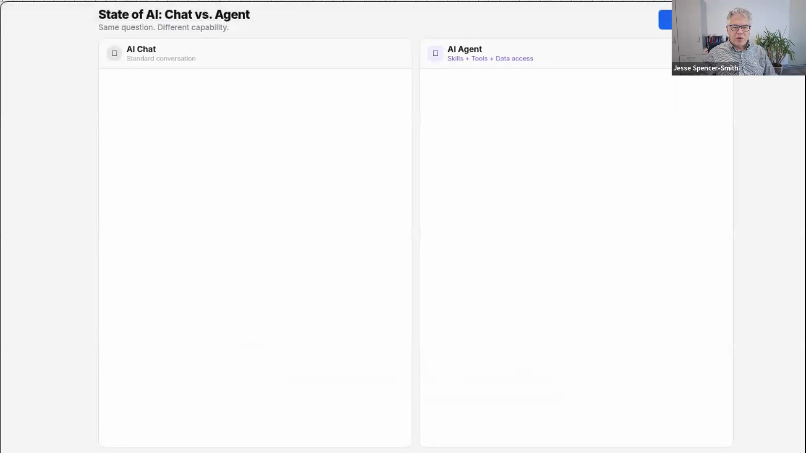

The agent side does what a chat structurally cannot: it analyzes the request, builds a task plan, and *actually does things* — reaches into files, performs computations, produces a diagnostic report:

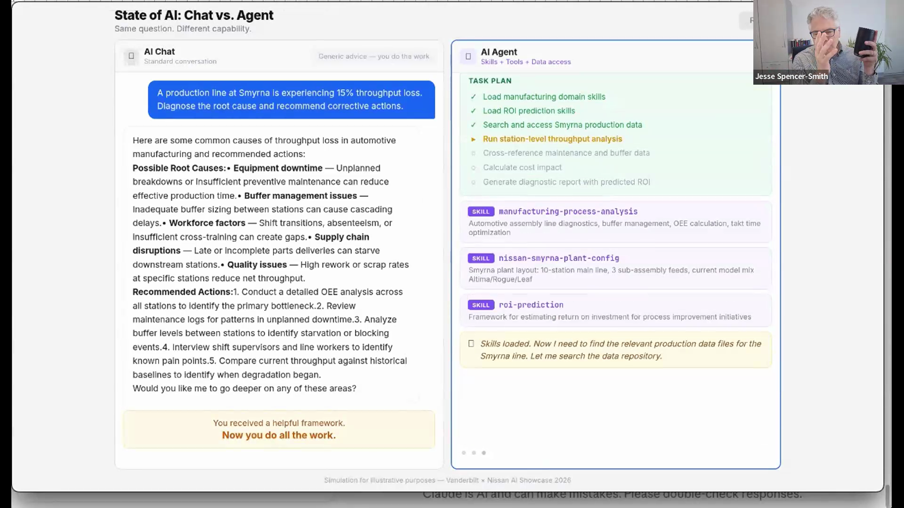

Jesse polled the room: *name one thing the agent is doing that the chat is not.* Answers (from voice and chat):

- *"It's summoning skills."* — Ida Metiam
- *"Interacting with other systems and data sources."* — Tim Darrah
- *"Planning."* — (from the chat)
- *"Spinning up sub-agents."* — multiple
- *"Accessing files."* — Ghina Absi, Md Kamrul Hasan, Gretchen Manco

All correct. Each one points at a capability the chat can't reach because it lacks a harness.

> "Chat has access to its context window. It can call on other tools to do work in that context window, but that's all it's got." — Jesse Spencer-Smith

### Cheryl's committee-calendar skill — a real one from the room

Jesse called on Cheryl Williams, who'd built a real skill before AI Summer started. Her use case: every year she has to assemble a calendar for seven committees, respecting who's on which committee, when they meet, who can't overlap, and the academic-calendar blackout dates. She gave the agent last year's calendar, the academic calendar, and the committee rosters; the skill now spits out the year's schedule.

> "I have a committee calendar of 7 committees I have to put together every year. I give it the parameters and the input, and then it spits out the committee calendar. So it calls on what it needs to complete the task… Zero programming experience." — Cheryl Williams

Cheryl built the skill inside Cowork using the **Skill Creator Skill** — a skill that creates other skills. This is the kind of thing that previously would have required a custom-built optimization solver with constraints, persistence, and a user interface. With skills, the agent does the optimization; the skill captures Cheryl's expertise (which committees exist, who can't double-book, what counts as a hard versus soft constraint).

### Agent Ecosystem 2.0 — the harness

To explain why an agent can do what a chat can't, Jesse pulled up the architecture diagram from Day 1:

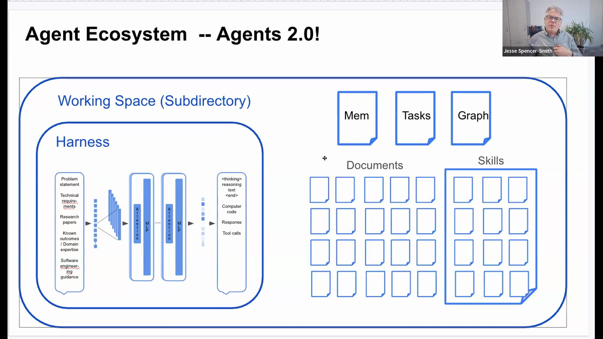

The core idea: the LLM sits inside a **harness**. The harness manages:

- **Working space** — a subdirectory on your filesystem where the agent can read, write, and run code.
- **Memory** — persistent across sessions if you set it up.
- **Tasks** — a shared task file. This is how a lead agent communicates with sub-agents (and how it tracks its own progress over a long horizon).
- **Graph representation** — for structured knowledge.
- **Documents** — the files in the working directory.
- **Skills** — composable, dynamically-loaded extensions.

> "When you spin up an agent, it doesn't know anything. But if you need the agent to know all about your scheduling and who you have to schedule, then you create skills. So it has a task and it can say, 'oh, this is all about scheduling. I have a scheduling skill. Let me pull it up.' Now you have a specialized agent." — Jesse Spencer-Smith

### Why "Agent 2.0"?

The name is Jesse's — *"nobody else is calling these agent 2.0; that's just me. But otherwise, it's too confusing"*. The distinction:

- **Agent 1.0** (pre-2024): handcrafted. You decided up front exactly which tools, which sub-agents, which prompts. Highly specialized.
- **Agent 2.0** (Claude Code, Cowork, Magic): general-purpose. Spin up a vanilla agent, and it dynamically loads skills to specialize itself for each new task. Sub-agents can be spawned at runtime as needed.

#### Q&A — How agents remember (and don't)

**Q (Ghina Absi):** Can agents unlearn things they learn? If they use a skill and it doesn't fit, do they remember it for a while, or can we make them forget?

**A (Jesse):** Skills don't *train* the model — they get pulled into context. As soon as the agent is done, the context is gone. The only persistent piece is whatever the agent wrote to its **memory** file. If you don't want a skill polluting context, you can spin up a sub-agent without the skill and it knows nothing about it.

> "Skills are like downloading knowledge — you remember the very first Matrix movie, when Neo gets plugged in for the first time and says 'I know jiu-jitsu'? Well, the difference here is that the model *forgets* jiu-jitsu. As soon as it's over, it doesn't retain that knowledge." — Jesse Spencer-Smith

**Q (Andrea Moro):** Is memory the *real* difference between chat and agents? In principle, you could load everything into a chat's context.

**A (Jesse):** In principle yes — and that's what people used to do for sensitive environments where Claude Code isn't available. The Army Corps of Engineers, for instance, dumps skill content directly into chat context. But you start hitting **token rot** (Jesse's term for context degradation): attention starts spreading too thin across irrelevant tokens. A harness that *curates* context — selecting what to load, when, and into which agent — produces dramatically better results.

**Q (Susan Alexander):** What's the difference between Claude Code and Vanderbilt's Magic?

**A (Jesse):** Magic is Jules White and Alan Carnes' internally-developed system, Level-3 certified, oriented toward *building software solutions* (plugins, repeatable apps). Claude Code is a more general agent ecosystem with skills as a first-class citizen, designed for interactive dynamic work. Same underlying ideas (it's also an Agent 2.0), different focus.

**Q (Matthew Estes, in chat):** Thoughts on Obsidian as a second brain for long-term memory?

**A (Jesse):** Powerful, especially if you set it up bidirectionally — the agent both *reads* your Markdown graph for context and *adds* new notes with their connections. *"Anything that you can do to guide the agent in what it ought to be looking at — what you're doing is you're curating the context."*

### Demo 1: The sensitive-field-detector skill (Nissan visit)

Jesse pulled up a real skill he co-built at Nissan in front of about 100 people — *"always a smart idea to do live coding in front of a group of 100 people; always works well"* — for identifying PII and PHI in database schemas:

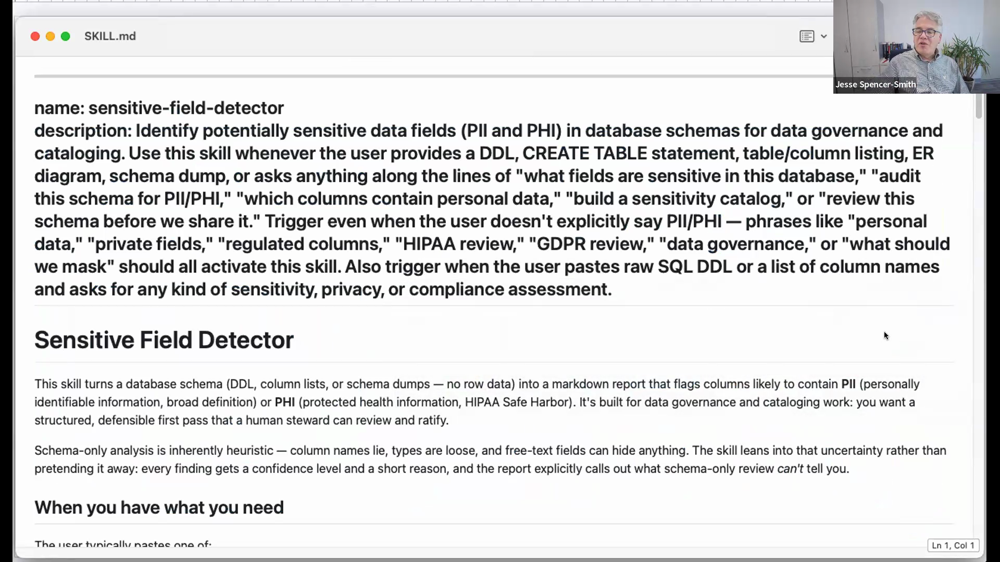

Two things to notice:

1. **The description is doing trigger work.** It lists *"DDL, CREATE TABLE statement, table/column listing, ER diagram, schema dump,"* and triggers on phrases like *"what fields are sensitive in this database,"* *"audit this schema for PII/PHI,"* *"build a sensitivity catalog,"* *"GDPR review,"* *"data governance,"* *"what should we mask."* Pushy on purpose — when you're doing a sensitivity audit, you want this skill to fire eagerly.

2. **The body is essentially a prompt.** Categories to flag (direct identifiers, quasi-identifiers, financial PII, free-text columns, PHI per HIPAA Safe Harbor), how to format the output report, working tips ("don't ask for sample data — it might be sensitive," "don't invent findings"). No code.

This is what Jesse calls a "simple skill" — pure prompt, no scripts. The agent, once loaded with this skill, suddenly *knows* PII detection the same way Neo suddenly knows jiu-jitsu.

#### Q&A — How simple skills work in practice

**Q (Md Kamrul Hasan):** How does the skill access the data? Does it run on your Cloud editor, or on the user's system?

**A (Jesse):** Skills are **composable**. The sensitive-field skill doesn't access data itself — it expects the user to paste in DDL, or it can be chained with another skill that knows how to access a specific data source. Once the data is in context, the sensitive-field skill knows what to do with it.

**Q (Kayla Zumbrunnen):** Do you have to think ahead about *every* skill the agent will need? Or can you tell it to *figure out* what skills it needs?

**A (Jesse):** Mostly the former. A skill triggers because its description matches the request. To meta-create skills, use the Skill Creator Skill — and to make sure it fires, type `/skill-creator` explicitly (the leading slash bypasses auto-detection and forces invocation).

The deeper point Jesse made in response: **skills authored only by an AI are mediocre.** The model already knows what it knows; what makes a skill valuable is *your* domain expertise — the documents you've collected, the corner cases you've encountered, the goals only you understand. The Skill Creator Skill is at its best when you give it real materials (a transcript, a stack of references, a whitepaper) and ask it to co-build with you.

> "Skills which are created only by the AI — where you don't curate the information, give it the documents, give it the approach, give it the goals — are not that great. Research has shown that if you have an agent create a skill for itself to use, even with all the tools and research, it's just not that great. Skills that represent the knowledge and expertise of the user are successful." — Jesse Spencer-Smith

**Q (Paras Karmacharya):** If you always use two or three skills in a row, should that be a new skill that triggers and calls the others?

**A (Jesse):** Yes — that's a coordinator skill. It triggers on the higher-level task, then calls the individual skills as sub-tasks. *"What you're really doing is informing the Agent 2.0 on how to do that work — and that work may involve multiple skills."*

**Q (Lori Troxel):** And those expert-knowledge skills — you co-create them with chat, or with an agent?

**A (Jesse):** Match the surface to what the skill needs:

- **Chat** — paste everything into context. Works for skills built from a single document or conversation transcript.
- **Cowork** — point it at a *subdirectory* with all your files (PowerPoints, drafts, notes on napkins). Better when there's too much material to dump into a chat.
- **Claude Code** — when the skill itself needs to do significant *coding* (e.g., the lecture-recording-to-lecture-notes skill, which writes cross-platform Python).

### Demo 2: lecture-recording-to-lecture-notes — a code-heavy skill

Jesse opened up the very skill that produced *these notes*:

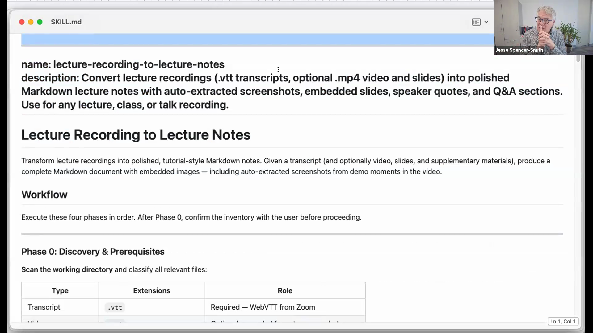

Unlike the sensitive-field detector, this skill *does* invoke code:

- **Phase 0** — discovery: scan for `.vtt`, `.mp4`, `.pptx`, check for required Python packages, install missing ones.
- **Phase 1** — convert slides (PPTX → PDF → PNG, or PDF directly).
- **Phase 2** — transcript analysis: regex-trigger detection for demo phrases ("let me show you," "as you can see"), gap detection, slide-transition detection. Then extract video frames at flagged timestamps using `opencv-python`.
- **Phase 3** — generate the Markdown with embedded slides, screenshots, speaker quotes, and a Q&A section.

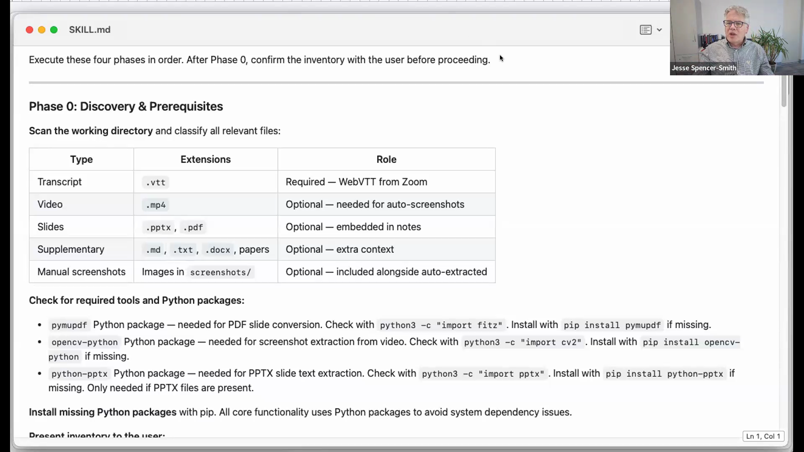

The skill *itself* is a folder on disk:

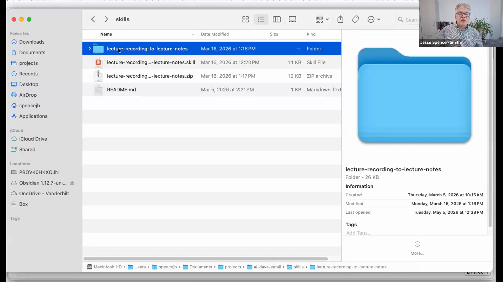

When Claude loads this skill, it reads `SKILL.md` first (Level 2 of progressive disclosure). When the skill says *"run `scripts/extract_frames.py`,"* the harness executes that script directly without loading its source into context. That's Level 3 — bundled files load on demand.

> "I built this skill in about an hour. I did some additional work, so it took me 2 hours total. I built it in Claude Code, because I knew it was going to have to do some significant coding — it had to be cross-platform. I would have paid \$20–30 a month for this software if it had been available last year." — Jesse Spencer-Smith

#### Q&A — Where code stops and tokens start

**Q (Umang, relaying from chat):** In that skill, how much of the work is generated/executed code versus tokens?

**A (Jesse):** The intelligent parts are tokens — the agent reasoning *"does what the speaker is saying right now match what's on this slide, or did they switch to a screen share?"* That's hard to write deterministically; it's the agent's job. But once the answer is "screen share," the *grab a frame at this timestamp* is just code — Python with OpenCV. The skill handoff is: **agent reasons about semantics, code handles deterministic mechanics.** Token-efficient by design.

**Q (Sam McFarland):** Is the output of Skill Creator that whole folder with the scripts and SKILL.md — not just SKILL.md?

**A (Jesse):** Right. The "Save skill" button on Claude Code drops a `.skill` file (a zipped folder). You can share that, install it, or unzip it and inspect every line.

---

## Part 2 — Building AI Research Assistants with Agent Skills (Umang Chaudhry)

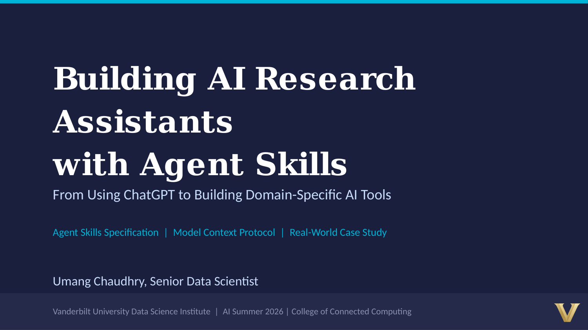

Umang's second-hour overview:

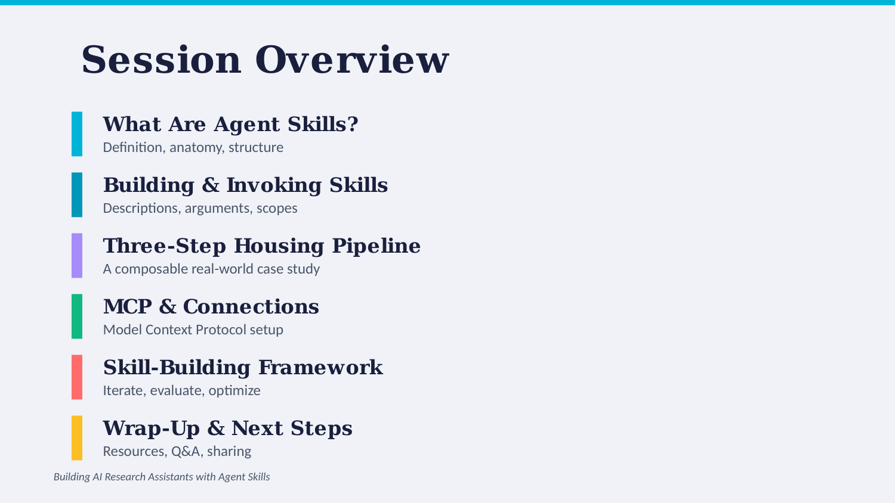

His delivery had a brief PowerPoint mishap to start — *"my Mac has decided to hide my slides from me"* — which the room found endearing. Then onto the substance.

### What are agent skills

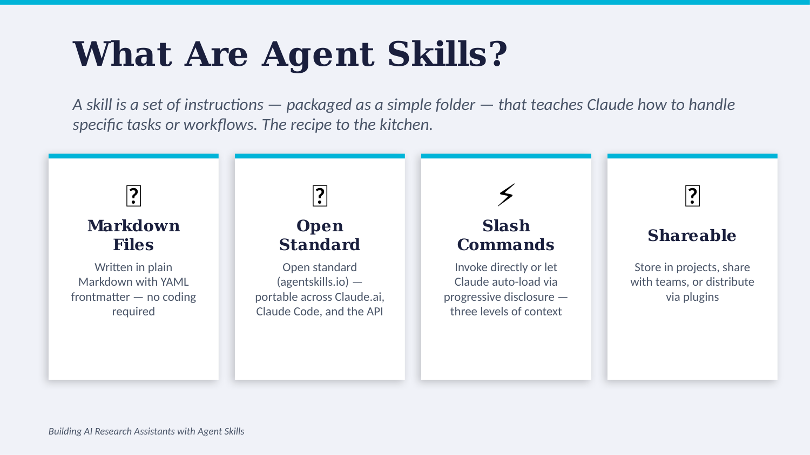

Four properties that make skills work:

1. **Markdown files.** Plain text with YAML frontmatter. No coding required (though you can bundle scripts).
2. **Open standard.** `agentskills.io`. Skills you write for Claude work in Gemini, work in the API, work in other agentic systems. Only minor reformatting needed at the edges.
3. **Slash commands.** Invoke directly (`/lit-review`) or let Claude auto-load via the description.
4. **Shareable.** Drop in projects, share with teams, distribute as `.skill` files (zipped folders).

> "Agent skills are simply Markdown files with instructions that teach Claude new capabilities. They follow this open standard, which means they work across all sorts of AI tools, not just Claude Code." — Umang Chaudhry

#### The kitchen analogy

Umang reached for Anthropic's standard analogy: **MCP is the kitchen — the tools, ingredients, equipment. Skills are the recipes.** Without skills, you have a kitchen but no idea how to cook anything reliably. With skills, you get repeatable workflows that activate at the right moments and produce consistent output.

A concrete example: connect Claude to PubMed via an MCP (that's the kitchen). Add a `literature-review` skill that knows how to apply PRISMA guidelines, your inclusion/exclusion criteria, and your preferred output format (that's the recipe). Same MCP, dramatically different — and reproducible — results.

### Anatomy of a SKILL.md

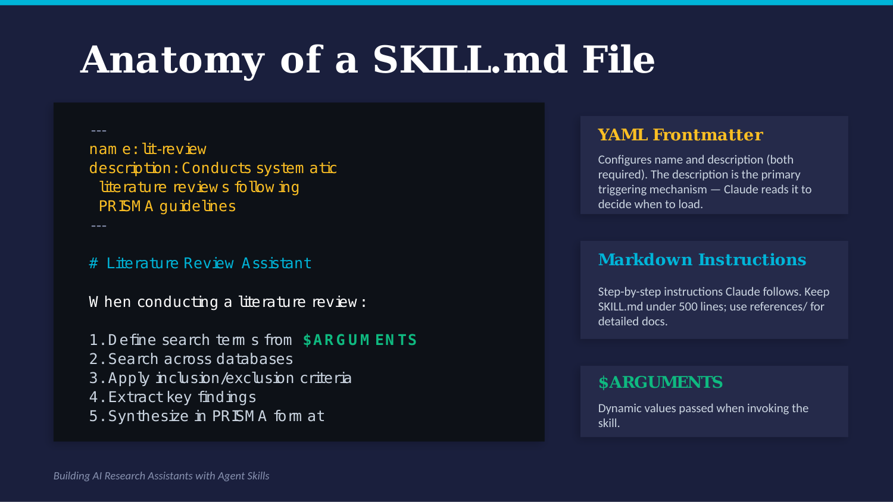

Three pieces:

- **YAML frontmatter** — the fenced block at the top with `name` (required) and `description` (required for auto-invocation). The description is the *only* part of the skill that's always loaded into context — keep it under ~1,000 characters.
- **Markdown body** — your instructions, domain knowledge, examples. Aim for under 500 lines.
- **`$ARGUMENTS`** — substitution variables for parameters passed when you invoke the skill via slash command. `$ARGUMENTS` gets the full string; `$ARGUMENTS[0]`, `$ARGUMENTS[1]`, etc. (or shorthand `$0`, `$1`, `$2`) get individual positional arguments.

#### Frontmatter fields beyond name and description

Umang walked through the more obscure frontmatter fields:

- **`disable-model-invocation: true`** — Claude can't auto-load this skill; it only fires when you manually type `/skill-name`. Useful for **destructive skills** (e.g., one that pushes code to GitHub, or one that mass-deletes files). You want manual confirmation, not auto-trigger.
- **`user-invocable: false`** — the inverse: hide the skill from the user, only Claude can decide to load it. Umang's never personally used this, but it's useful for background-knowledge skills that should never be invoked directly.
- **`allowed-tools`** — list specific tools Claude can use without asking (e.g., `Read, Grep, Bash, Python`). Useful for skills with destructive potential where you want tight control.
- **`context`** — lets the skill spin up an isolated sub-agent that doesn't carry the parent's context. Good for fresh-start sub-tasks.
- **`argument-hints`** — autocomplete hints shown to the user when typing the slash command.

### Progressive disclosure — the three loading levels

This is the central performance idea behind skills:

1. **Level 1 (always loaded):** `name` + `description` of every available skill. That's the entire "what's available" inventory the model carries.
2. **Level 2 (loads on trigger):** the full `SKILL.md` body. Loaded only when the model decides the skill is relevant for the current task.
3. **Level 3 (loads on demand):** bundled files in `references/`, `scripts/`, `assets/`. Loaded only when the skill explicitly tells the model to read them.

> "Cloud will first load the description of the skill, then it will choose to load the skill itself, and then if it needs to run any of the scripts or refer to any of the documentation that you've added, only then would it load your references and your scripts and your examples and your assets." — Umang Chaudhry

This is what keeps a "rich skill library" from blowing out the context window. You can have dozens of skills available and pay only for the descriptions until one fires.

### Where skills live — three scopes

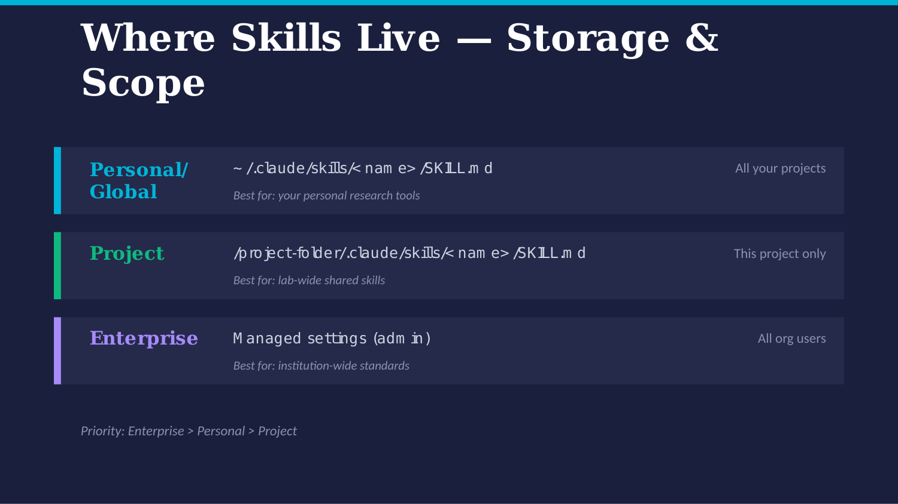

Three locations, with **Enterprise > Personal > Project** priority order:

- **Enterprise** — managed by an admin on a Cloud Team/Enterprise account. Available to all org users. Use for institution-wide standards (data policy, branding, compliance).
- **Personal / Global** — `~/.claude/skills/<skill-name>/SKILL.md` in your home directory. Available across every project on your machine. The `.claude` folder is hidden on Mac/Windows; press **Cmd+Shift+Period** on Mac to see hidden folders.
- **Project** — `<project>/.claude/skills/<skill-name>/SKILL.md`. Scoped to one project. Use for skills tightly coupled to a single codebase or domain.

A practical pattern Umang uses: skills that are very project-specific live with the project; cross-project utility skills live in `~/.claude/skills/`.

### Skill directory structure

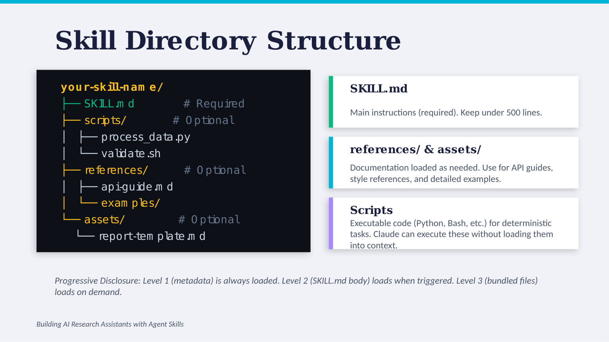

Every skill is a folder named after the skill. Inside:

- **`SKILL.md`** (required) — the main instructions. Loaded into context when the skill triggers. Keep under 500 lines.
- **`scripts/`** (optional) — executable code (Python, Bash, etc.) the agent can run *without* loading the source into context. Use for deterministic mechanics: file format conversion, web scraping, regex passes.
- **`references/`** (optional) — documentation, API guides, style references, taxonomy files. Loaded on demand when the skill body points the agent at them.
- **`assets/`** (optional) — files used *in* output (templates, brand fonts, icons).

The progressive-disclosure principle continues inside the skill: even if you have a 50-page `references/` folder, Claude scans for relevant files and loads only the one(s) needed for the current sub-task.

### Writing skill descriptions that actually trigger

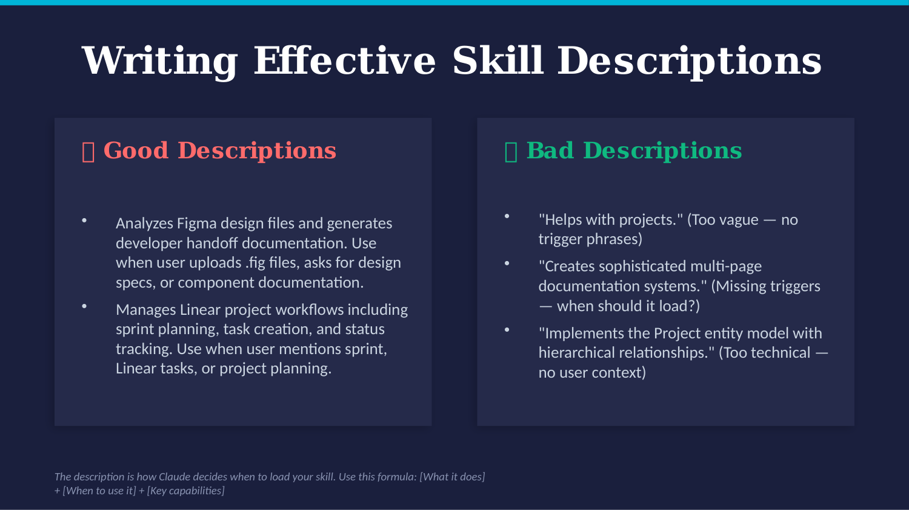

Anthropic's formula for a good description: **[what it does] + [when to use it] + [key capabilities]**.

Good:
> *"Analyzes Figma design files and generates developer handoff documentation. Use when user uploads .fig files, asks for design specs, or component documentation."*

Bad:
> *"Helps with projects."* (Too vague — no trigger phrases.)
> *"Creates sophisticated multi-page documentation systems."* (Missing triggers — when?)
> *"Implements the Project entity model with hierarchical relationships."* (Too technical — no user-facing context.)

A debugging tip from the deck: **ask Claude "when would you use this skill?"** before you ship. If the answer matches your intent, the description is fine. If it doesn't, rewrite.

> "Description must include what it does, when to use it, and should be under about a thousand characters. Just because you want that progressive disclosure to load as little as possible in the beginning." — Umang Chaudhry

### Passing arguments

![Passing Arguments — $ARGUMENTS, $ARGUMENTS[N], $0/$1/$2, $CLAUDE_SESSION_ID](slides/slide-012.png)

When a user invokes a skill as `/lit-review ML in oncology`:

- `$ARGUMENTS` → `"ML in oncology"` (the full string)
- `$ARGUMENTS[0]` → `"ML"` (first token, zero-indexed)
- `$0` / `$1` / `$2` → shorthand for positional arguments
- `${CLAUDE_SESSION_ID}` → the current session ID, useful for logging

Reference these directly in your `SKILL.md` body — the harness substitutes them at runtime.

---

## Part 3 — Case Study: The Three-Step Housing Pipeline

This is the section that ties the abstractions to a working production system. Umang's been building it for the Department of Special Education to map accessible-housing solutions across the United States, starting with Tennessee.

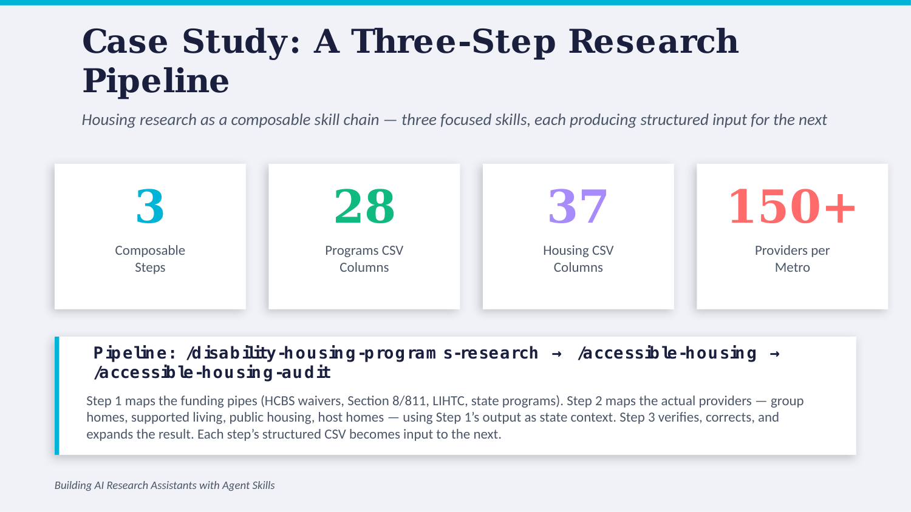

The single mistake people make when building a system like this is **packing everything into one mega-skill**. Umang split it into three:

1. **`/disability-housing-programs-research`** — for a state, find every funding program (HCBS waivers, Section 8/811, LIHTC, state programs, non-profits). Output: a 28-column CSV with agency names, contacts, eligibility criteria.

2. **`/accessible-housing`** — for a city, use Step 1's CSV as state context. Spin up parallel sub-agents (one per program), Google for actual providers, drill down on specific disabilities (autism, mobility, etc.). Output: a 37-column CSV with 50–150+ providers per metro.

3. **`/accessible-housing-audit`** — re-verify Step 2's output. Has a `references/gap-analysis.md` of known systematic blind spots (e.g., "we kept missing state DD agency provider directories — search them with full pagination"). Updates stale entries, fills missing fields, doubles as a refresh tool.

### How the steps compose

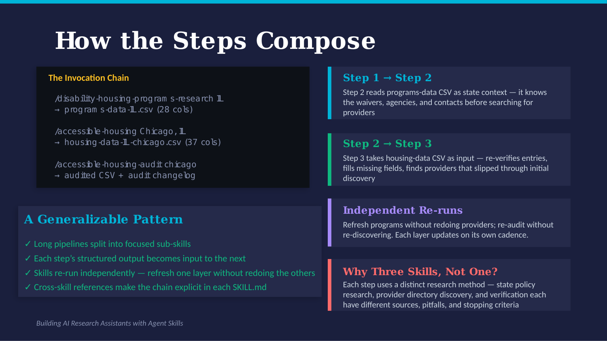

The handoff pattern:

```
/disability-housing-programs-research TN
→ programs-data-TN.csv (28 cols)

/accessible-housing Nashville, TN
→ housing-data-TN-nashville.csv (37 cols)

/accessible-housing-audit nashville
→ audited CSV + audit changelog
```

Each skill knows it's part of a chain. The Step 2 skill explicitly loads Step 1's CSV as state context before doing anything. The Step 3 audit skill knows where Step 2 wrote its output. This explicit cross-skill referencing is what makes the chain debuggable.

Three things to notice:

- **Independent re-runs.** You can re-audit Nashville without re-running provider discovery, and you can refresh the programs CSV when funding rules change without redoing everything downstream.
- **Distinct research methods per step.** Step 1 is state-policy research; Step 2 is provider-directory discovery; Step 3 is verification. Each has different sources, different stopping criteria, different pitfalls — three different skills.
- **Each step's structured output is the next step's input.** This is the "structured handoff" pattern. CSVs work well because they're easy to load, easy to validate, and easy to diff between runs.

> "Rather than packing everything into this one mega skill, what we decided to do was split it into three focused steps." — Umang Chaudhry

### Design patterns that make this work

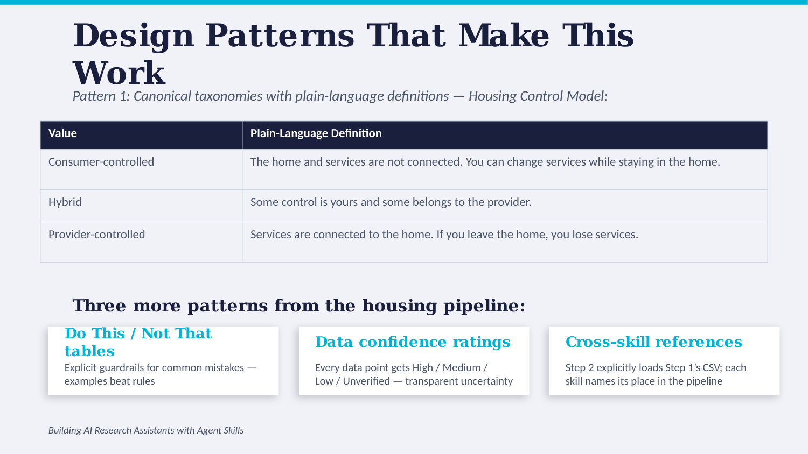

Four patterns Umang surfaced from the housing pipeline that generalize to almost any composable skill chain:

1. **Canonical taxonomies with plain-language definitions.** The Housing Control Model has three values — Consumer-Controlled, Hybrid, Provider-Controlled. The skill's `references/housing-control-model.md` defines each in plain language. Claude has its own intuitions about these terms; the taxonomy file forces consistency. Umang has about 50 such taxonomies in `references/`.

2. **Do-this / Not-that tables.** The skill was finding "transitional housing for people leaving the prison system" — *technically* housing, but not what the Department of Special Education is cataloging. Add a row: "Do: accessible-housing for disabilities. Don't: re-entry housing." **Examples beat rules.**

3. **Data confidence ratings.** Every data point gets High / Medium / Low / Unverified. The audit skill prioritizes Low and Unverified entries for re-checking. Makes uncertainty *transparent* rather than hiding it.

4. **Cross-skill references.** Each skill explicitly names the others in the pipeline ("Step 1's output lives at `data/programs-data-{state}.csv`. Read it before searching."). The chain is documented inside each `SKILL.md`.

### Live demo: invoking the skill in Claude Code

Umang switched to Claude Code, pointed at the `accessible-housing` repo, and typed:

> *"Find all the accessible housing solutions in Memphis, Tennessee."*

He didn't say `/accessible-housing`. He used natural language so the description's auto-trigger would do the work:

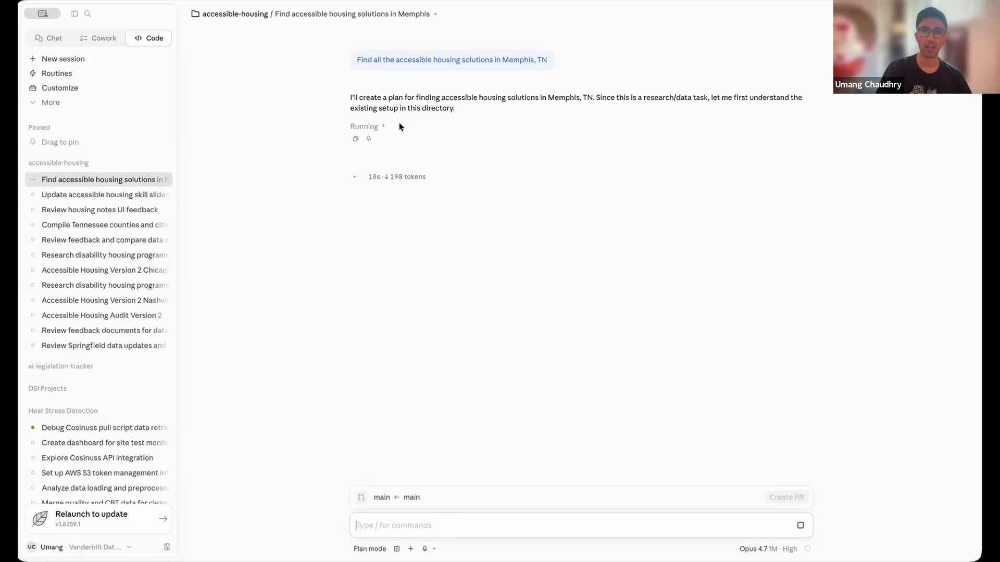

Notice the narration on the left side — *"finding accessible housing skill, accessing find accessible housing V2 skill location."* Claude announces which skill it's loading, which is exactly what you want for trust.

> "If you look at the top, Umang put 'find all the accessible housing solutions,' and then it says, 'okay, I'm going to create a plan,' and then it ran four commands. So you can actually look at what it's doing. One of those is `find skill directories`. So it actually looked for the skills." — Myranda Shirk

Then the skill writes a plan:

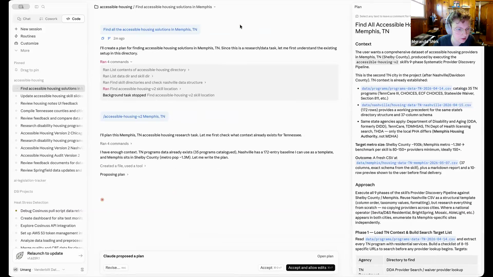

Claude Code was in **plan mode** — it shows the plan and waits for accept before executing. The accessible-housing skill defines a 9-phase process: program research → housing search → de-duplication → validation → classification → supplementary searches → cross-reference → audit pass → CSV output. Each phase is described in the `SKILL.md` body.

#### Inside the .claude folder

Umang then opened the project's `.claude/` folder so the room could see what a real installed skill looks like on disk:

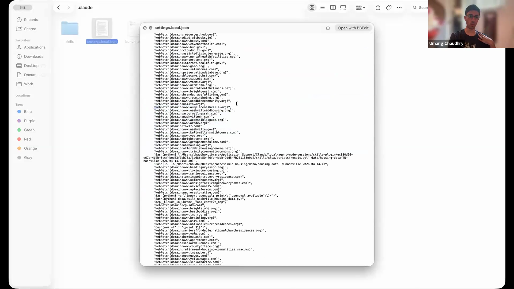

The `.claude/` folder contains:

- **`settings.local.json`** — pre-authorized actions (specific websites Claude can fetch without asking each time). On first use, Claude asks for permission; once you grant it, the permission persists in this file.
- **`skills/`** — the actual skills folder. For the housing project, three sub-folders: `disability-housing-programs-research/`, `accessible-housing/`, `accessible-housing-audit/`. Each has its own `SKILL.md`.

#### A real SKILL.md

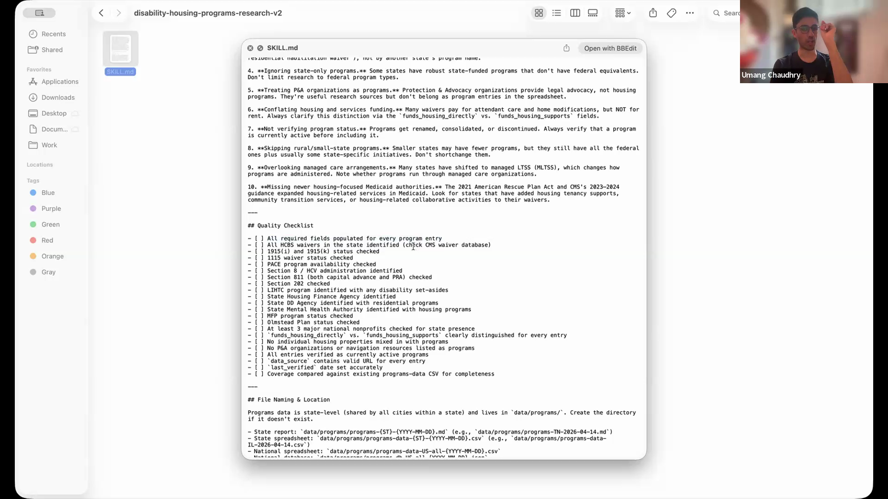

Things to notice in this real production SKILL.md:

- A **changelog** at the top, auto-maintained by Claude across iterations.
- **Web-search strategy per state** — combine "X program," "state DD agency," "HCBS waiver state," etc.
- **Output schema** — every CSV column documented (agency name, contact, eligibility criteria, etc.).
- **Do This / Don't Do That** sections, by category.
- **Quality checklist** the skill runs against itself before declaring complete.
- **File naming and location** rules.

These are not generic skill scaffolding — they're skill-specific reliability scaffolding, evolved over many runs.

#### Output structure

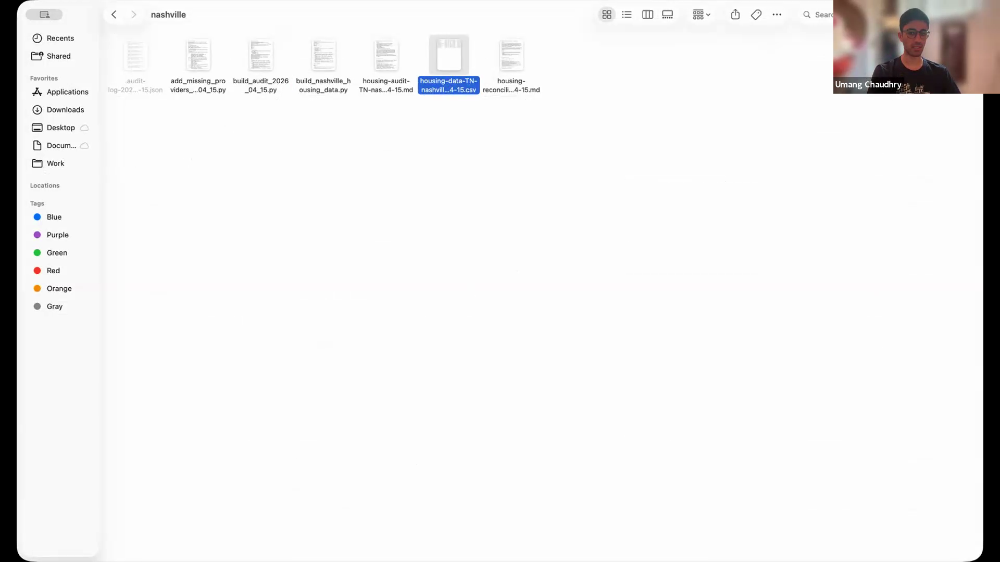

The output folder includes:

- `housing-data-TN-nashville_<date>.csv` — the actual housing data
- `housing-audit-TN-nashville_<date>.md` — audit findings in Markdown
- `housing-reconciliation_<date>.md` — explanation of any reconciliation between data versions
- `add_missing_providers.py`, `build_audit.py`, `build_nashville_housing_data.py` — helper scripts Claude wrote *during execution* and saved so they wouldn't need to be recreated next run

That last bullet is interesting: the agent recognized recurring CSV-build work, wrote a Python helper, asked permission to save it to disk, and now uses it on every future run — saving tokens.

### Skill-building framework

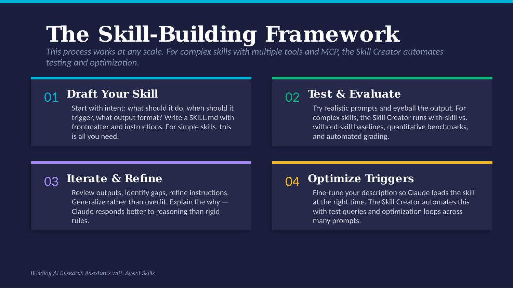

Umang's recommended progression — works for skills you build by hand *and* mirrors what the Skill Creator Skill does automatically:

1. **Draft your skill.** Start with intent — what should it do, when should it trigger, what's the output format? Write the `SKILL.md`. For simple skills, this is all you need.
2. **Test & evaluate.** Pick a small ground-truth sample (Umang picks a county he already knows). Run the skill. Eyeball the output.
3. **Iterate & refine.** Identify gaps. Update the skill. Re-run.
4. **Optimize triggers.** Run trigger queries — does the skill auto-load when it should? Does it stay quiet when it shouldn't? Refine the description.

### When to reach for the Skill Creator Skill

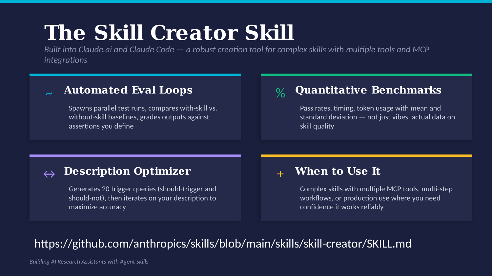

The Skill Creator Skill automates the full framework with extra rigor:

- **Automated eval loops.** It spawns *parallel* test runs — one with the skill, one without (the baseline). If your skill doesn't beat the no-skill baseline, why ship it?
- **Quantitative benchmarks.** Pass rates, token usage with mean ± stddev, wall-clock timing per assertion. Not vibes — actual numbers.
- **Description optimizer.** Generates ~20 trigger queries (mix of should-trigger and should-not-trigger), iterates on your description, picks the version that scores best on the held-out test set.

Use the Skill Creator when:

- The skill has **multiple MCP tools** or multi-step workflows.
- The skill will be used in **production**.
- You need confidence the skill works **reliably across many prompts**, not just the three you tested by hand.

Repo: <https://github.com/anthropics/skills/blob/main/skills/skill-creator/SKILL.md>

> "In my experience, the Skill Creator still follows the guidelines — your main skill is going to be under that 500-word limit, your description is going to be within that 1000-character limit, regardless of how long your conversation with the Skill Creator has been." — Umang Chaudhry

---

## Part 4 — Model Context Protocol (MCP)

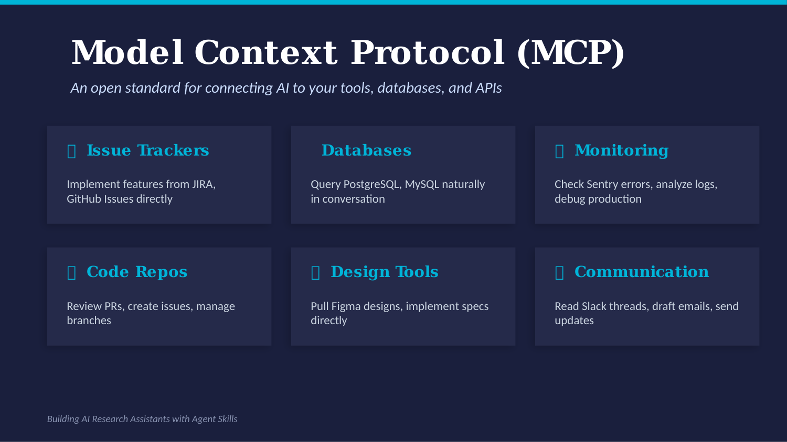

MCP is an **open standard** (also created by Anthropic) for plugging external tools into AI. Think of it as a universal adapter:

- **Issue trackers** — Jira, GitHub Issues, Linear
- **Databases** — query PostgreSQL, MySQL naturally
- **Monitoring** — Sentry errors, log analysis
- **Code repos** — review PRs, create issues, manage branches
- **Design tools** — pull Figma designs, implement specs
- **Communication** — read Slack, draft emails, send updates

> "MCP is like a universal adapter between your AI tool and existing infrastructure. It's like a protocol, like HTTP — it's not a specific product." — Umang Chaudhry

### Setting up an MCP server

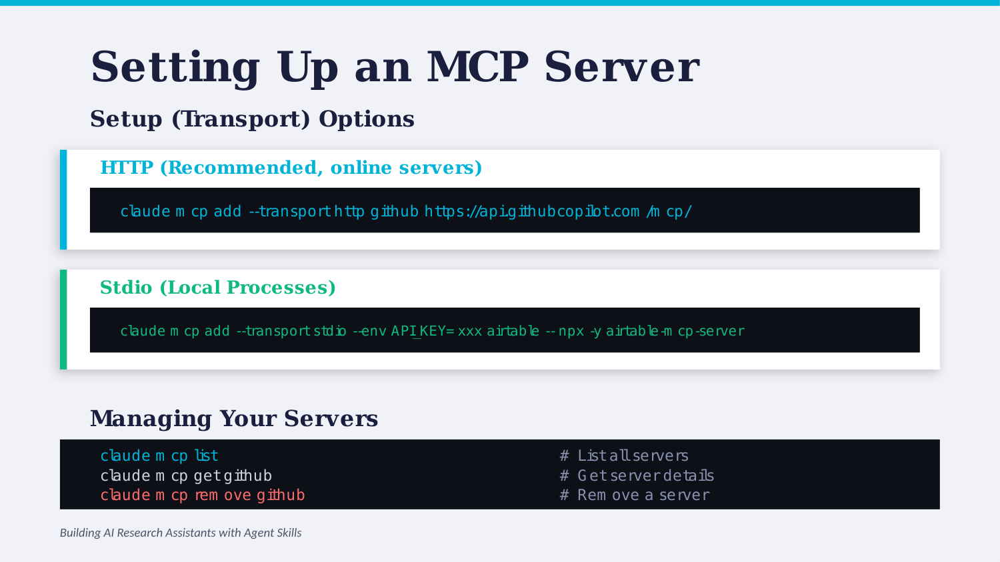

Two transport options:

- **HTTP** — for remote/online servers. `claude mcp add --transport http <name> <url>`
- **Stdio** — for local processes (e.g., an API key + a Node-based MCP server). `claude mcp add --transport stdio --env API_KEY=xxx <name> -- npx -y <package>`

Management:

```
claude mcp list             # list all servers
claude mcp get <name>       # get server details
claude mcp remove <name>    # remove a server
```

### Concrete examples

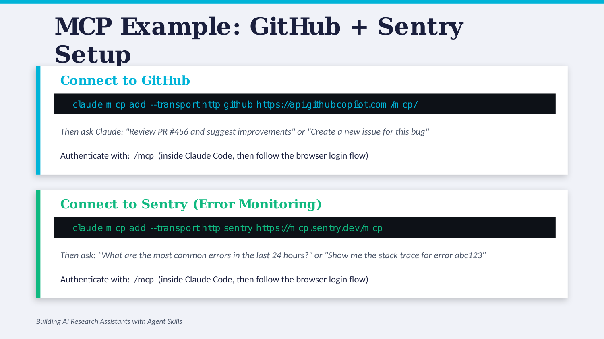

Connect GitHub:

```bash
claude mcp add --transport http github https://api.githubcopilot.com/mcp/
```

Then authenticate inside Claude Code with `/mcp` (browser login flow), and you can ask:

> *"Review PR #456 and suggest improvements."*
> *"Create a new issue for this bug."*

Connect Sentry:

```bash
claude mcp add --transport http sentry https://mcp.sentry.dev/mcp
```

Then ask:

> *"What are the most common errors in the last 24 hours?"*
> *"Show me the stack trace for error abc123."*

### Using MCP from inside a skill

In your `SKILL.md`, just declare what's expected to be connected:

> *"This skill assumes the GitHub MCP and Gmail MCP are connected to Claude Code. Use these for any operations on issues, PRs, or email."*

The skill body can then write natural-language operations; Claude figures out the right MCP calls. No code, no manual API plumbing.

#### Q&A — MCP fundamentals

**Q (in chat):** Is MCP like a cloud server?

**A (Umang):** Yes. An MCP server runs somewhere — could be a hosted service (Anthropic's, GitHub's), could be a local stdio process you run on your laptop. The MCP *protocol* is the standard for how Claude talks to it.

**Q (in chat):** Is MCP like an API?

**A (Umang):** Essentially, yes — a standardized API for agentic tools. The standardization is the value: write a skill once, swap MCPs without rewriting the skill.

---

## Part 5 — Claude Code Beyond Skills

After the skills tour, Umang spent the last few minutes on Claude Code features people might not have discovered yet.

### Permission modes

Claude Code runs in one of three modes:

- **Plan mode** — Claude writes a plan and waits for you to accept before executing anything. Best for the first time you run a complex skill.
- **Accept-edits mode** — Claude asks for permissions on a limited set of actions (writes, deletes) but proceeds on safe ones (reads, searches). Default for ongoing work.
- **Ask-permissions mode** — Claude asks before *every* action. Most conservative — useful when working with sensitive data or untrusted skills.

Toggle modes from the bottom-left of the Claude Code window.

### Effort levels

Claude Code has a model-effort dial: **low / high / max**. Umang found that the housing pipeline doesn't work well at **low** — the model gives up before exhausting the search space. He runs:

- **`high`** — typical county-level runs
- **`max`** — large metros (New York City)
- **`low`** — never, for this kind of research workload

Effort trades thinking time for cost. For research-heavy skills, default to **high**.

### Routines — Claude Code's cron

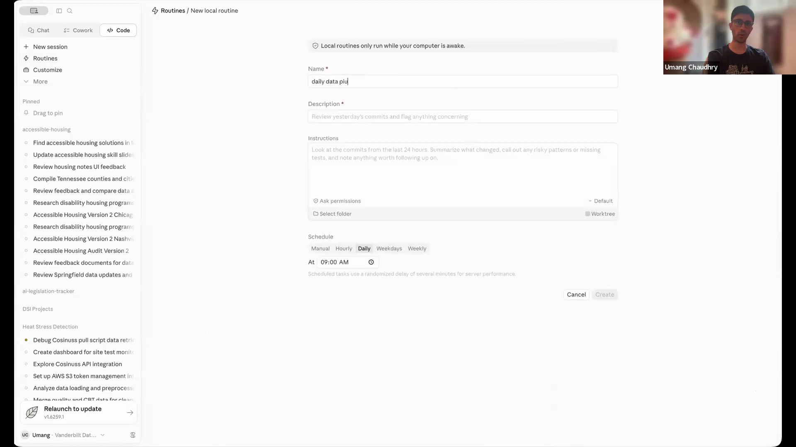

Routines let you schedule a Claude Code task. Umang's setup: every Monday at 9 AM, run the accessible-housing skill against the next un-processed county in his county list. The skill runs unattended, accumulates data, and the audit catches anything that slipped through.

> "Down the road, I'm going to create a spreadsheet with all the counties in the US, and have it keep that as a log, and set this up so that every day at 9 AM it goes and does one county for me. And I don't need to sit here and manually do that." — Umang Chaudhry

Routines feel like cron jobs (Kimberly Starks made the same comparison: *"like the old cron job"* — confirmed). They run on your local machine when it's awake, or on Claude Code Cloud (hosted) when you want it to run unattended.

### Connectors

Claude has a built-in **Connectors** panel under Settings for low-friction integrations: Outlook, Google Drive, etc. Vanderbilt's account configuration limits which Umang can demo (some require admin permission). For Outlook-style work without connector setup, **Vanderbilt's Amplify already has several tools for Outlook calendars** — a useful first stop before installing more MCPs.

---

## Office Hours Q&A

After the formal session, the room stayed on for an hour. Highlights:

### Do skills save tokens?

**Q (Vaibhav Janve):** Do skills reduce token usage overall?

**A (Umang):** Mostly yes — but not because each *invocation* uses fewer tokens. It's because *without* a skill, you spend tokens having a long back-and-forth conversation trying to guide the agent. With the skill, you fire the slash command and barely talk to it until the CSV lands. *"I end up using more tokens if I did not have the skill."*

The Skill Creator's quantitative benchmarks (with-skill vs. baseline) confirm this in numbers, but the qualitative version is: *the skill replaces conversational guidance with documented guidance*.

### Authentication and secrets in skills

**Q (Vaibhav Janve):** I have NIH sites that need login credentials. Can I bake that in?

**A (Umang):** Use a `.env` file for credentials. Have Claude invoke your *code* — and have the code (not Claude directly) read the `.env`. The skill orchestrates; the script handles the secret. *"Your code is just reading from the `.env` file, and Claude is invoking your code, not the `.env` file."*

For most authenticated services there's also an MCP — that's typically the cleaner path than rolling your own credential plumbing.

### MCP for newcomers

**Q (Divyan Kannayan):** Where do I run `claude mcp add`? Is that in the chat?

**A (Umang):** Your machine's terminal (Mac Terminal app, Windows command prompt). Not inside the Claude app. After `claude mcp add` succeeds, the MCP is registered and you can use it from Claude Code.

### Amplify vs. paid Claude

**Q (Zaruhi Sahakyan):** I only have the free Claude. Can I follow along with Amplify?

**A (Myranda):** Amplify gives you the chat models with FERPA-level data approval, but **not** Claude Code or Cowork — those are separate paid software you install. Without those, you can *write* a skill but can't run a skill that needs filesystem or sub-agent access. *"If you just want to get it for a month, maybe write it off in some way."*

### Outlook + Claude — security worries

**Q (Lori Troxel):** I'm worried about someone else getting into my Outlook because Claude has access.

**A (Umang & Myranda):** The realistic concern isn't *other people* — it's that the AI provider can theoretically train on email content. Don't connect Claude to anything containing sensitive data (SSNs, PHI, etc.). For routine calendar work, Vanderbilt's Amplify has Outlook integrations already vetted for Level 3 data; start there.

### Does using a Claude desktop "see" the same chats as the web?

**Q (HD McKay):** I use Claude Desktop, but when I log into claude.com I see the same projects and chats. Is anything actually local?

**A (Myranda):** **Claude Desktop and claude.com share state** — same account, synced. **Claude Code and Claude Cowork** are the ones that touch your local files. Claude Desktop alone is essentially a fancier browser for the web app.

---

## Summary

- **A skill is a folder with a `SKILL.md` plus optional `scripts/`, `references/`, `assets/`.** Plain Markdown, YAML frontmatter, open standard.
- **Progressive disclosure is the key efficiency trick.** Metadata always loaded, body loads when triggered, bundled files load on demand. You can have dozens of skills installed and pay only for descriptions until one fires.
- **The description is the trigger.** Use the formula: *what it does + when to use it + key capabilities*. Be specific about trigger phrases. Test by asking Claude "when would you use this skill?" before shipping.
- **Three scopes:** Enterprise (admin-managed), Personal/Global (`~/.claude/skills/`), Project (`<project>/.claude/skills/`). Priority is Enterprise > Personal > Project.
- **Split big workflows into composable skill chains.** The accessible-housing pipeline is 3 skills, not 1. Each step produces structured output the next step ingests. Each can be re-run independently.
- **Four design patterns to copy:** (1) canonical taxonomies with plain-language definitions in `references/`, (2) do-this/not-that example tables, (3) per-data-point confidence ratings (High/Medium/Low/Unverified), (4) explicit cross-skill references inside each `SKILL.md`.
- **Skill-building framework:** draft → test & evaluate → iterate → optimize triggers. For complex skills, use the Skill Creator Skill — it automates eval loops, benchmarks with-skill vs. baseline, and optimizes the description against trigger queries.
- **MCP is the kitchen, skills are the recipes.** Connect MCPs to give Claude raw capabilities; write skills to make those capabilities reliable for your domain.
- **Connect an MCP in one line:** `claude mcp add --transport http <name> <url>`. Run it in your terminal, not in the Claude app.
- **Use Claude Code's plan/accept-edits modes** for safety, **effort: high** for research workloads, and **routines** to schedule unattended runs.
- **Skills are universal.** Write once, use across Claude, Gemini, OpenAI, open-source models. Only minor reformatting at vendor edges.

---

## Coming up

- **Next Tuesday (Week 2, Day 1):** More applied skill development — Myranda taking the lead. Likely some coding-oriented topics, possibly more MCP.
- **Office hours:** Continued every Tuesday/Thursday after the session + AI Fridays 10am–12pm.

## References

- AI Summer 2026 repo: <https://github.com/vanderbilt-data-science/ai-summer-2026>
- Claude Code Skills docs: <https://code.claude.com/docs/en/skills>
- MCP Documentation: <https://code.claude.com/docs/en/mcp>
- The Complete Guide to Building Skills for Claude: <https://resources.anthropic.com/hubfs/The-Complete-Guide-to-Building-Skill-for-Claude.pdf>
- MCP Server Registry: <https://github.com/mcp>
- Anthropic Skills repository (including the Skill Creator Skill): <https://github.com/anthropics/skills>
- Skill Creator SKILL.md: <https://github.com/anthropics/skills/blob/main/skills/skill-creator/SKILL.md>
- Vanderbilt's Amplify (Level 3 AI access): <https://vanderbilt.ai>
- agentskills.io — the open skill standard
