# AI Summer 2026 — Week 2, Day 1: Applying Skills in Projects

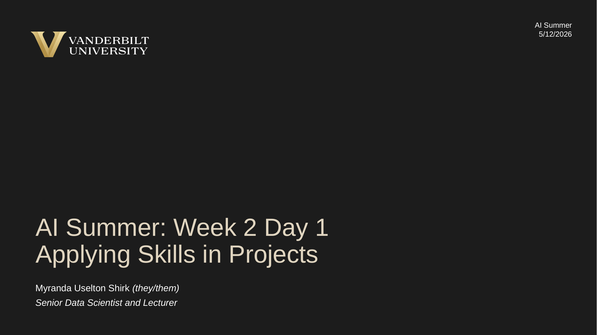

Myranda Uselton Shirk takes the lead for the first time this summer, opening with the questions that kept surfacing in last week's chat: *where does a skill actually live on disk? how do I write one? how can I tell if Claude is using my skill? how many skills is a task, really? how do I know it's working?* The session is built around answering those six questions concretely, then transitioning to **spec-driven development** — the discipline of writing a precise, testable specification before you ask Claude to build anything. Jesse Spencer-Smith stays on as a co-host, jumping in for the live Claude desktop tour, the agent-harness fine print, and the AWS Bedrock / Level 3 update at the very end.

---

## Key Concepts and Learning Objectives

**Key terms:**

- **Agent framework** — the layered architecture: an **LLM** at the center, wrapped in a **harness**, working inside a **working space (subdirectory)** that holds documents, memory, tasks, a graph, and skills.
- **Communication bottleneck** — Myranda's framing: programming is no longer the limiting skill; *precise communication* is. Writing clear specs and clear skill descriptions has replaced writing clean code as the differentiator.
- **Where a skill lives** — four locations: **Global** (`~/.claude/skills/<name>/`), **Project** (`<project>/.claude/skills/<name>/`), **Session** (temporary, inside Cowork), **Anthropic-bundled** (ships with Claude Code, read-only).
- **Skill folder anatomy** — required: `SKILL.md`. Optional: `scripts/`, `references/`, `evals/`, `LICENSE`.
- **Slash invocation** — typing `/skill-name` *forces* a skill to load. Without the slash, Claude only loads the skill if the description triggers — and a vague prompt may bypass it entirely.
- **One-verb rule** — heuristic for deciding what a single skill should do: if you can describe it with one strong verb (*generate, run, audit, draft*), it's probably one skill.
- **Skill composition patterns** — **Linear chain** (Skill A writes a file → Skill B reads it → Skill C reads B's output) and **Fan-out / Fan-in** (agent spawns sub-agents that run skills in parallel, then aggregates).
- **Spec-driven development** — write a precise, testable specification *before* asking Claude to build anything. Iterate the spec, not the chat history.
- **Specification anatomy** — Goal (one sentence), Inputs/Outputs, Constraints, Acceptance Criteria.
- **Three test levels** — Smoke (*does it run?*), Correctness (*right output?*), Edge cases (*handles bad input?*).
- **AI slop vs. validated tool** — the spectrum from "dumped a transcript into Claude and shipped whatever came out" to "iterated on a spec, tested against acceptance criteria, kept a human in the loop."

**Learning objectives — by the end of this session you should be able to:**

1. Articulate each role in the model / agent / skill framework — and your own role inside it.
2. Look at a skill folder on disk and explain what each file does.
3. Distinguish global / project / session / Anthropic-bundled skills and decide where a new skill should live.
4. Tell whether Claude actually used your skill on a given turn (and know how to force it with a slash command).
5. Dissect a task into one or many skills using the one-verb rule.
6. Write a specification document with goal, inputs/outputs, constraints, and acceptance criteria.
7. Define test cases *before* building, at all three levels (smoke / correctness / edge cases).
8. Recognize the red flags that mean a build needs to go back to the spec rather than getting re-prompted.

---

## Part 1 — Logistics: Week 2 and the Cohort Tracks

### The six questions from last week

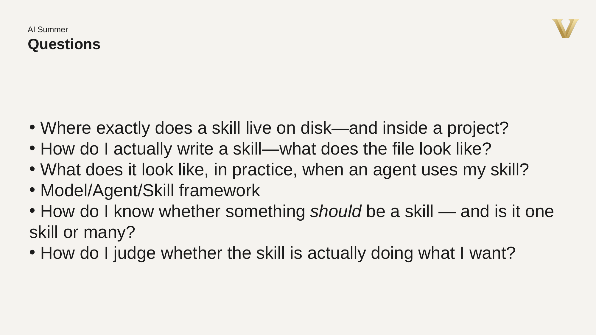

These six questions are the spine of the entire session. Almost every section below maps back to one of them. Myranda was deliberate about that:

> "Hopefully, the goal for today's session is that you'll be able to answer all of these six questions. So we're going to try to clear some of these things up." — Myranda Shirk

### What this week looks like

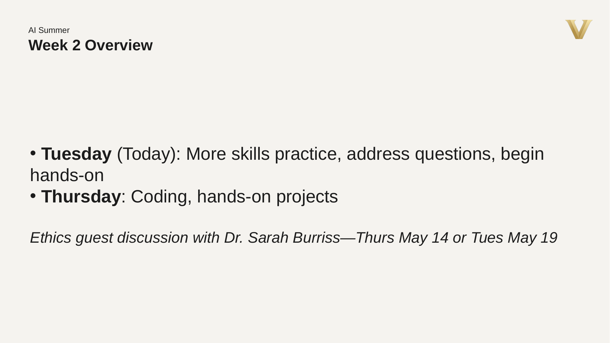

Tuesday (today) addresses the open questions from Week 1 and starts hands-on work. Thursday goes deeper into coding — LangGraph, LangChain's Deep Agents, OpenCode — for projects where skills alone don't cut it. **Dr. Sarah Burriss**, who teaches the master's-program ethics course, is being scheduled for an ethics guest discussion either Thursday or the following Tuesday. Myranda flagged this as important:

> "Just because you can do something with AI, maybe you shouldn't do it with AI. There's a lot happening right now in regards to policy and ethics and in the AI space that people are very concerned about. So I want to keep us centered in that and know, what's our responsibility when it comes to creating these AI tools." — Myranda Shirk

### Weeks 3–4: project cohorts

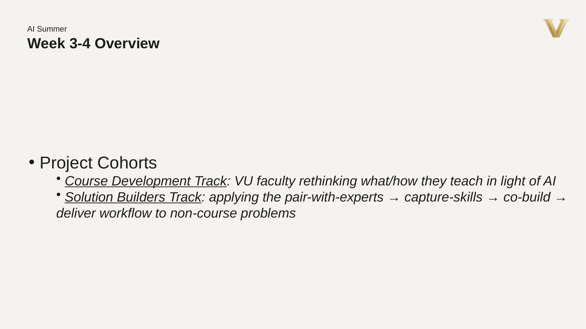

After two weeks of instruction, the format pivots to cohort-based hands-on work. **Two tracks**:

- **Course Development Track** (Jesse Spencer-Smith leading) — for Vanderbilt faculty rethinking what and how they teach in light of AI. Can be any course, not just AI-focused — the question is *how does your course change given what AI can now do?* Jesse mentioned he's already doing some prep work building the base skills for course generation that the cohort will iterate on.
- **Solution Builders Track** — for everyone else: bring a problem, leave with a working tool. The arc is *pair with experts → capture skills → co-build → deliver workflow*.

Tracks aren't mutually exclusive — students can move between them, with the soft caveat that the Course Development track works best with people genuinely focused on revamping a course.

> "I assume that many of you are interested in AI, and you came here with a problem you wanted to solve. So keep that churning in your brain. What do you want to try to accomplish by the end of this month?" — Myranda Shirk

### Learning objectives for today

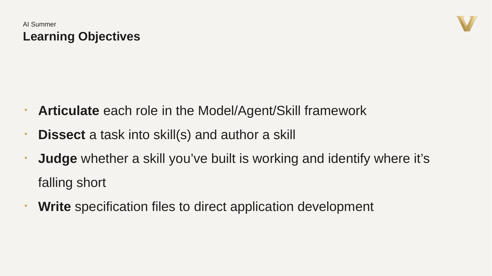

Four verbs frame the day: **Articulate** each role in the model/agent/skill stack, **Dissect** a task into skills, **Judge** whether a skill is working, **Write** specification files that direct application development.

### A quick poll

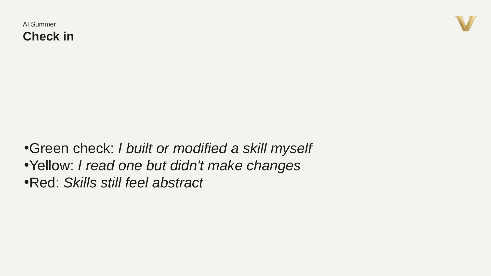

Myranda asked everyone to react with green/yellow/red. The room landed somewhere between yellow and red — most people had read a skill, fewer had built one, and a non-trivial fraction said skills still felt abstract. *"Which is awesome, because that's what I prepared for."*

---

## Part 2 — The Agent Framework, Slowed Down

This is the same architectural diagram Jesse used in Day 1, but Myranda spends real time **zooming into it** layer by layer — that's the value of revisiting it.

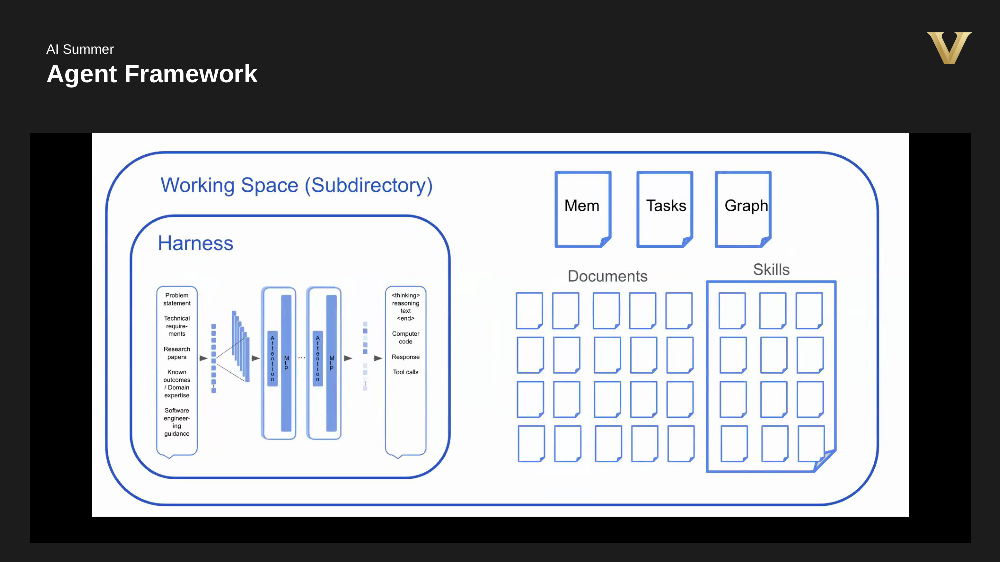

The full diagram with everything in view. Three nested boxes from inside out:

1. **The LLM** — a next-token predictor. By itself, just text in, text out.
2. **The harness** — code wrapped around the LLM that lets it actually *do things*. Read files, write files, call tools, spawn sub-agents, track tasks.
3. **The working space** — the subdirectory the harness has access to, plus the persistent artifacts inside it (memory, tasks, knowledge graph, documents, skills).

### Zoom 1: just the LLM

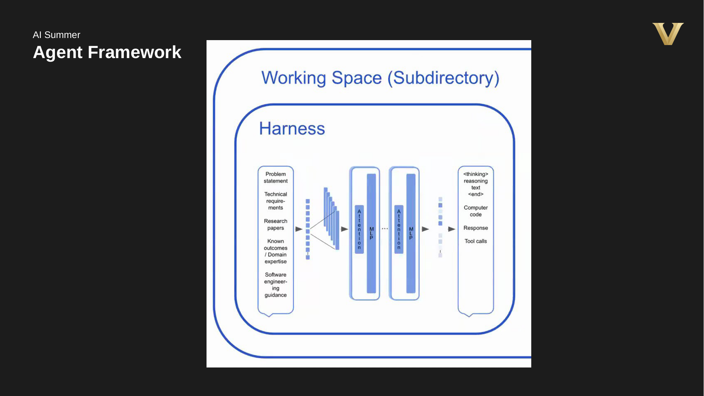

At the center of everything is the model itself: input flows in (problem statement, requirements, research papers, domain expertise, software-engineering guidance), gets turned into tokens, passes through attention and MLP layers in decoder stacks, and out comes the next token. The output looks like reasoning text, code, responses, or tool calls — but mechanically it's just a token-prediction loop. *"It's the basics of an LLM. You put text in, it puts text out."*

By itself, the LLM can't reach into a file system, can't write to disk, can't run a subprocess. It can only generate text that *describes* an action. The harness is what turns that description into a real action.

> "By itself, this is just a conversation with a computer, essentially. It's not gonna be able to… really, you're just looking at this, you know, thinking, reasoning text. The agent is what's actually doing stuff. The LLM's not doing anything." — Myranda Shirk

### Zoom 2: the working space

This is where the agent *operates*. Each of these items is a real artifact on disk (or held in memory) that the harness can read and update:

- **Mem** — persistent notes the agent has chosen to save for future runs.
- **Tasks** — the shared task list. The way a lead agent communicates with sub-agents and tracks its own progress over a long horizon.
- **Graph** — knowledge graph (if the project has one).
- **Documents** — the actual files in the working subdirectory.
- **Skills** — composable instruction sets the harness loads on demand.

> "Skills looks just like documents. Why is that? Well, because skills are just documents, essentially. Skills are a folder that contain a markdown file, and the skill is going to inform the model on what it needs to do." — Myranda Shirk

### Q&A — Pinning down where the decision-making happens

**Q (Gretchen Manco):** Is there research literature on the harness — particularly on the *preliminary decision-making* that's pulling in some documents/skills but not others?

**A (Myranda + Jesse):** The decision-making isn't really baked into the harness as logic — it's a consequence of how the LLM processes the loaded skill descriptions. When the model starts a session, the harness preloads the **title and short description** of every available skill into the context. The model then semantically compares the user's request to those descriptions and decides which one (if any) to fully load. That's why both the name and the description need to be short and precise.

Jesse added: real research literature on skills is thin because people only started using them heavily since December 2025. Different model sizes have different skill-loading capabilities; almost all current models are *trained* to preload skill names + descriptions and reason about whether a skill is relevant. **A lot of this is still empirical — you build, you test.**

> "If you load up a lot of skills that have overlapping descriptions, you run into problems because it doesn't know which one it needs to load." — Jesse Spencer-Smith

**Q (chat):** Do we make our own harness?

**A (Myranda):** No. The harness is the software (Claude Code, Claude Cowork, Claude Desktop). You can edit text inside skills, but not the harness itself — unless you have a very, very complex problem, in which case come to office hours.

> "Microsoft Word is a software that lets you edit documents. When you want to edit your document, you're not having to create Microsoft Word all over again. The harness is essentially the software that wraps around the LLM." — Myranda Shirk

**Q (Kayla Zumbrunnen, in chat):** What's a token, and what's the limit?

**A (Jesse, in chat):** A token is a defined unit that all text/image/audio/video is broken down into for processing — for text, typically a word or sub-word. The model can only hold so many tokens in context: ~200K for most models, ~1M for some. That's everything — your prompt, the loaded skill, intermediate reasoning, the response. Offload to memory when you don't need something in context anymore.

---

## Part 3 — Where a Skill Actually Lives

This was the single most-asked question last week.

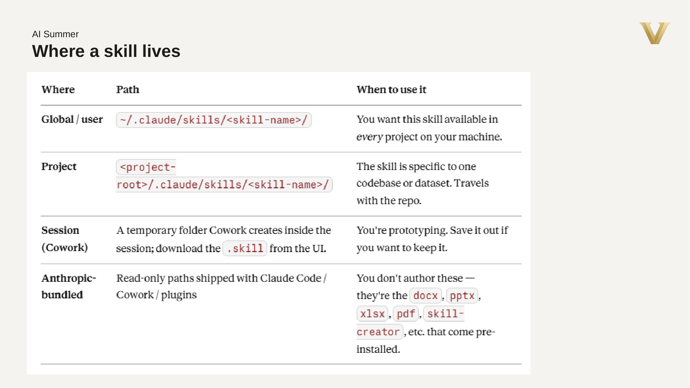

Four physical locations, each with a different scope:

| Where | Path | When to use it |
|---|---|---|
| **Global / user** | `~/.claude/skills/<skill-name>/` | You want this skill available in *every* project on your machine |
| **Project** | `<project-root>/.claude/skills/<skill-name>/` | The skill is specific to one codebase or dataset; it travels with the repo |
| **Session (Cowork)** | A temporary folder Cowork creates inside the session; download the `.skill` from the UI if you want to keep it | You're prototyping |
| **Anthropic-bundled** | Read-only paths shipped with Claude Code / Cowork / plugins | You don't author these — they're the `docx`, `pptx`, `xlsx`, `pdf`, `skill-creator` etc. that come pre-installed |

A few details Myranda highlighted that come up in practice:

- **The `.claude` folder is hidden.** On Mac, press **Cmd+Shift+Period** in Finder to see hidden folders. On Windows it's analogous.
- **Claude creates the `.claude` folder for you.** You don't have to. The first time Claude Code or Cowork needs it, it just creates it inside whichever folder you've pointed the session at.
- **You don't have to touch any of this manually.** If you'd rather, ask Claude to install a downloaded skill for you — Cowork will read the URL, copy the file into the right `.claude/skills/<name>/` location, and you're done.
- **The Anthropic-bundled skills** (`docx`, `pptx`, `xlsx`, `pdf`, `skill-creator`, etc.) ship with Claude Code / Cowork and aren't editable. If you want to customize one, copy it out and modify the copy.

> "If you're not familiar with terminal stuff or project directory stuff, you don't have to touch any of these folders. Claude can kind of handle it for you." — Myranda Shirk

A subtle point Jesse added: **the Claude desktop app sees a different set of skills than the Claude Code CLI.** Skills you upload through the desktop app's **Customize → Skills** panel become available in chat, Cowork, and the desktop's project sessions. Skills installed via the CLI (in `~/.claude/skills/`) become available to `claude` invoked from the terminal. They don't automatically sync.

---

## Part 4 — Anatomy of a Skill Folder

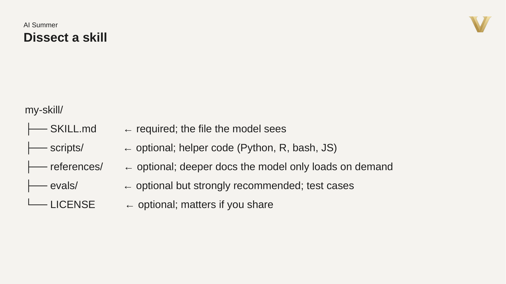

A skill is just a folder named after the skill. Inside:

- **`SKILL.md`** — **Required.** The file the model actually sees. Plain Markdown with YAML frontmatter at the top (name + description) and instructions below.
- **`scripts/`** — Optional. Helper code (Python, R, bash, JavaScript). The harness can execute these without loading the source into context.
- **`references/`** — Optional. Deeper documentation the skill points at *on demand*. API references, taxonomy tables, style guides. The model only loads these when the SKILL.md tells it to.
- **`evals/`** — Optional but strongly recommended. Test cases. Skill Creator generates these automatically and re-runs them when you iterate.
- **`LICENSE`** — Optional but matters if you share. The skills ecosystem is settling around **Apache 2.0** (Anthropic's choice) and **MIT** (most community repos). MPL 2.0 is rare in this space.

Jesse on the why behind `references/`:

> "It's any time that you need to have additional documentation that you might need to pull up. So this is a way for you to have additional documentation… you don't want to load a lot of heavy things in here. But the saving grace is that loads are hierarchical. You preload the name and the description, then if the model believes that it needs it, it'll ask the harness to bring in the SKILL.md. If you're doing something with the skill that requires programming, it'll load the scripts. If it needs additional references, it'll load those." — Jesse Spencer-Smith

This is **progressive disclosure** in action — the entire reason you can have dozens of skills installed without paying token cost for any of them until one actually fires.

### Live demo: seeing what skills are installed

Jesse paused Myranda to walk through how to view installed skills in the Claude desktop app — *"if you go to New Task, you'll see Customize in any of these surfaces (Chat, Cowork, Code)."*

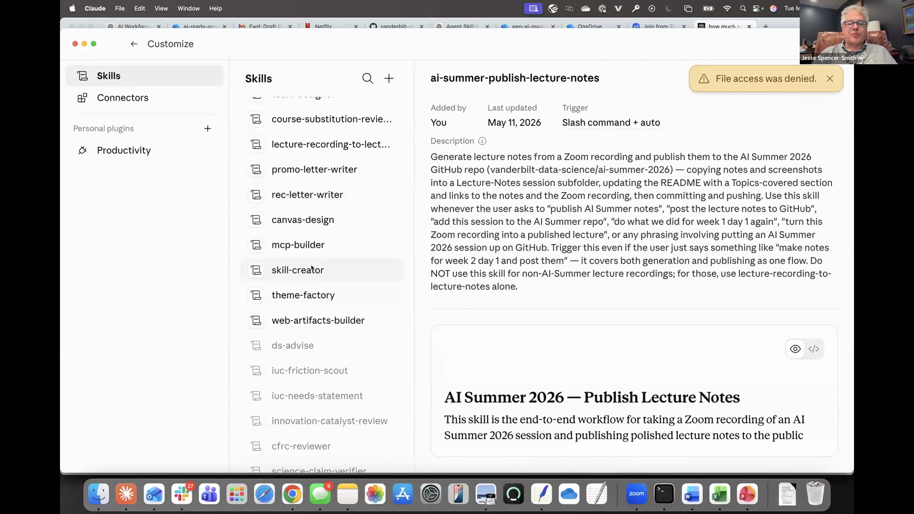

That's the **Customize → Skills** panel. Each row is an installed skill. Note the `ai-summer-publish-lecture-notes` skill at the top — that's the skill we built last Thursday to automate this very workflow (and it's been published since). Clicking a row shows the skill's name, description, last-updated date, trigger pattern, and the full `SKILL.md` text.

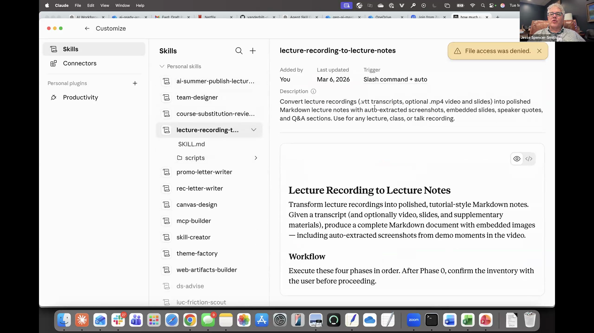

Opening `lecture-recording-to-lecture-notes`: the left tree shows `SKILL.md` plus `scripts/`. The right pane shows the rendered SKILL.md content — *"Transform lecture recordings into polished, tutorial-style Markdown notes. Given a transcript (and optionally video, slides, and supplementary materials), produce a complete Markdown document with embedded images — including auto-extracted screenshots from demo moments in the video."*

This is the skill responsible for *these notes you're reading now*.

### Breakout: dissecting a real skill

Myranda then sent the room into breakout rooms for ~10 minutes to pick a skill, dissect it, and report back. First breakout of AI Summer, and there were some Zoom hiccups — people getting routed to empty rooms, the host UI having moved since last summer — but everyone eventually landed somewhere and got hands-on with a real skill.

The reports back:

**Daniel Byers's group** — discussed building an SEO/SEM agent that stays current with search-engine optimization guidelines. The interesting open question they surfaced: *how does the agent verify that its reference documentation is up-to-date, without burning through tokens on every run?* Jesse's response:

> "There are actual other skills and also other MCPs which are specifically designed to keep track of most recent documentation in order to keep that token use down low. Doing it the sort of brute-force way to begin with is not a bad one — but the skill creator skill that you use to create new skills can also modify skills. So once you get up and running and you're happy with it, you can run skill creator again and say, 'okay, now I want to make this more efficient.'" — Jesse Spencer-Smith

**Karthik Kornalies's group** — dissected the bundled `pdf` skill and `MCP Builder`. Observations: the PDF skill is extensive (well-structured, multiple scripts, points at a `reference.md`), and is going to be token-heavy on real PDFs. The MCP Builder skill is well-organized with a clear `SKILL.md` plus a folder of reference docs.

**Emily Ritter** — went one further: opened a skill she built herself last week using Skill Creator (writing recommendation letters for law students), and was able to read through its guts to verify it was actually doing what she'd intended. *"It gives me a better sense of whether it's doing it the way I thought it was doing it, or doing it the way I wanted to do it."*

Cheryl Williams (from Day 2) wasn't in this room, but Myranda referenced her committee-scheduling skill again — same pattern: a non-programmer built something with Skill Creator that previously would have required a constraint solver.

> "You kind of get the underbelly of it. It's not as scary as you think." — Myranda Shirk

---

## Part 5 — How to Tell If Your Skill Is Being Used

This was the second-most-asked question.

Three ways to verify:

1. **Read Claude's event log.** Every action gets narrated — "Using `web-app-builder` skill," "Loading tools," "Calling `extract_frames.py`." Click the disclosure arrows on any step to see the underlying tool calls.
2. **Inspect the tool calls directly.** If you see file reads/writes you expected your skill to drive, it's working. If you see Claude doing something improvised that bypasses the skill, the description didn't trigger.
3. **A/B with the skill disabled.** If output looks identical to the baseline, your skill isn't pulling its weight.

### Demo: a skill that didn't trigger

Myranda then tried to demo this live by asking Cowork: *"Create a web app that gives me a form to fill out."*

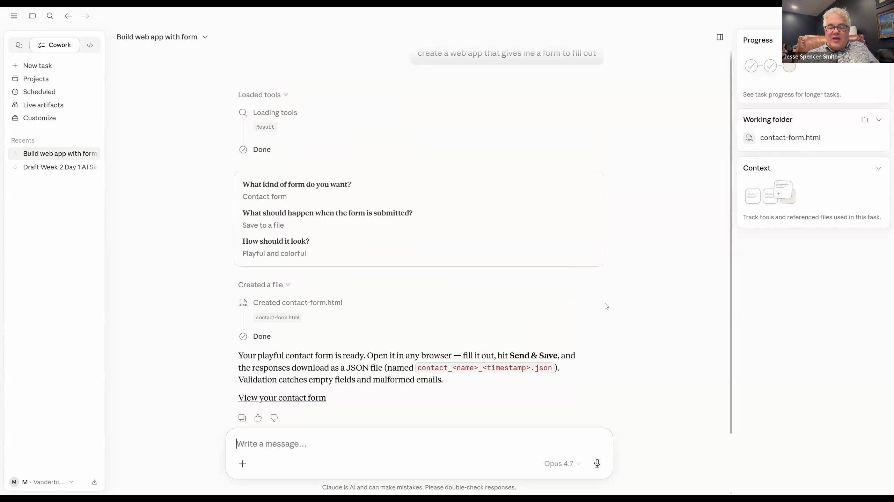

The skill she expected to fire didn't. Cowork happily built a contact form with HTML, JavaScript validation, and a save-to-JSON workflow — but it did all of that *without loading a skill*. Look at the event log: it says "Loaded tools," "Loading tools," "Created contact-form.html," "Done." Nowhere does it say "Using skill X."

Jesse cut in with the lesson — and it's a good one:

> "This is actually a common thing. If your prompt is not explicit enough, it might not do the skill. But you'll see — it never said 'skill,' right? So you can actually check and see what it does. This is how you can audit whether or not it actually fires up the skill or not. If you want to be sure that it loads up a skill, use forward slash, and then you give the name of the skill, and that'll force it to actually activate that." — Jesse Spencer-Smith

The unintended-lesson version Myranda gave:

> "My mistake was a good learning experience for all of us. I wouldn't recommend giving something as vague as this. It didn't use any skills at all." — Myranda Shirk

**Two practical takeaways:**

1. **Use `/skill-name`** when you want to *guarantee* a skill fires. The leading slash bypasses auto-detection.
2. **If your skill should auto-fire and it isn't**, the description is probably too vague — or your prompt is. Anthropic's own debugging tip: ask Claude *"when would you use this skill?"* If the answer doesn't match your intent, rewrite the description.

---

## Part 6 — What Should Be a Skill (One vs. Many)

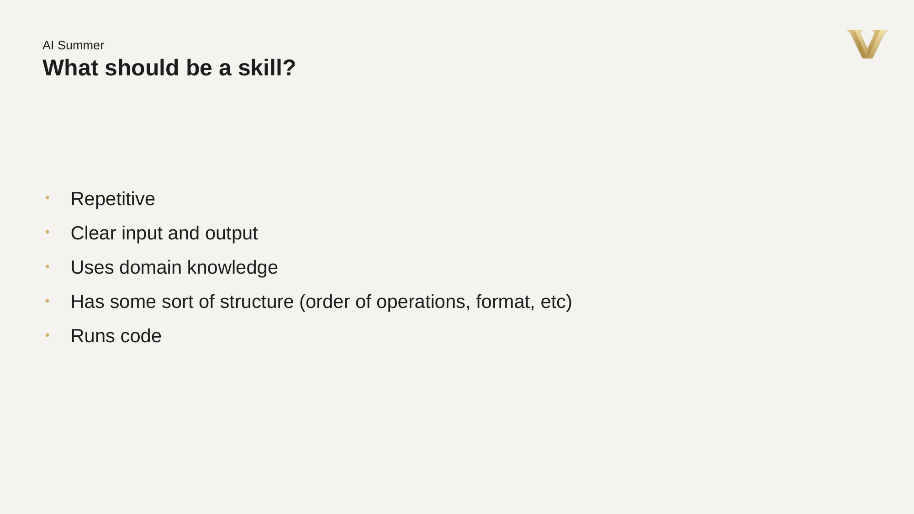

Five heuristics, none of them hard rules. A good skill candidate tends to hit *most* (not all) of:

- **Repetitive** — you'll want to do this same kind of thing many times. Not a one-shot.
- **Clear input and output** — you can specify what goes in and what comes out.
- **Uses domain knowledge** — you have expertise (taxonomies, edge cases, conventions) that an off-the-shelf LLM doesn't have baked in.
- **Has structure** — there's an order of operations, a format to follow, a recipe-like quality. If you could describe it to a person as a numbered list, it's probably skill-shaped.
- **Runs code** — not required, but a strong signal. Skills that need deterministic data work (regex, CSV processing, file format conversion) benefit from having `scripts/`.

Common misunderstandings Myranda surfaced:

- **One-time-use skills** — possible, but rarely worth the effort. *"You don't want a skill for creating a specific website — but you could create a skill that creates websites in general, and then you give it information about the website you want to create."*
- **The "skill" that's really a chat prompt** — if you're not going to use it again, just write a chat message.

### One skill or many?

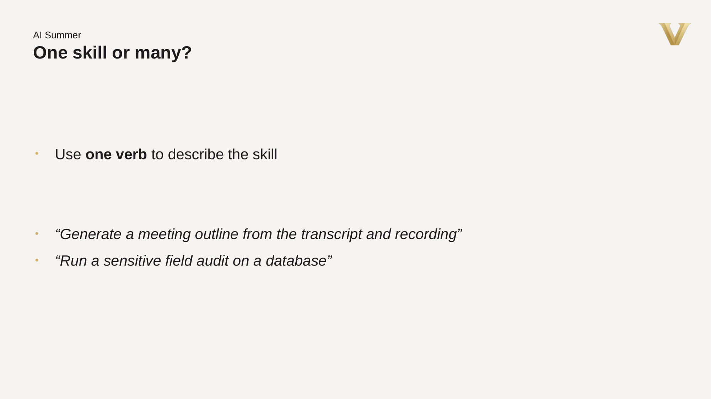

Myranda's heuristic: **one strong verb per skill.**

- *"Generate a meeting outline from the transcript and recording"* → one skill (verb: **generate**).
- *"Run a sensitive-field audit on a database"* → one skill (verb: **run**).
- *"Generate a meeting outline, email everyone the recording, and put the next meeting on everyone's calendars"* → three skills (generate / email / schedule).

If you find yourself chaining multiple strong verbs together with "and," that's a chain of skills, not one mega-skill. Better to compose them.

### How skills work together

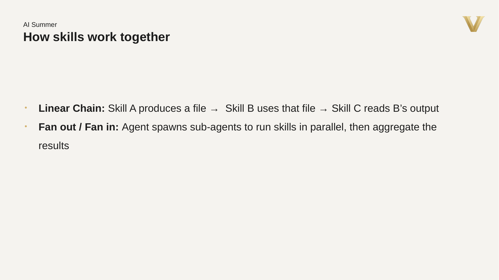

Two composition patterns:

- **Linear chain.** Skill A produces a file → Skill B reads that file → Skill C reads B's output. *"That's literally how skills communicate — through files in the working directory."* The accessible-housing pipeline Umang demoed last week is the canonical example: programs CSV → housing CSV → audited CSV.
- **Fan-out / Fan-in.** Agent spawns multiple sub-agents that each run skills in parallel, then aggregates the results. This is more advanced — usually Claude Code / Cowork decide on their own whether to fan out, and you don't architect it explicitly unless you're building something custom (Deep Agents, LangGraph). Thursday's session will go deeper into when you'd actually orchestrate this yourself.

> "Skills aren't autonomous things that are out doing things. They're just a description of what needs to be done. Usually that description will say what input it needs, and then what output it needs. So how skills communicate is primarily through files in the working directory." — Myranda Shirk

---

## Part 7 — Spec-Driven Development

This is the section Myranda flagged as the *real* point of the day. Jesse teed it up:

> "What Myranda's about to show you is going to be, like, the formal, time-tested way to making sure you get what you need. If you do this, if you do spec-driven development, that's how you can really develop terrific skills. And this is how I think skills begin to replace what previously would have been software, as traditionally defined." — Jesse Spencer-Smith

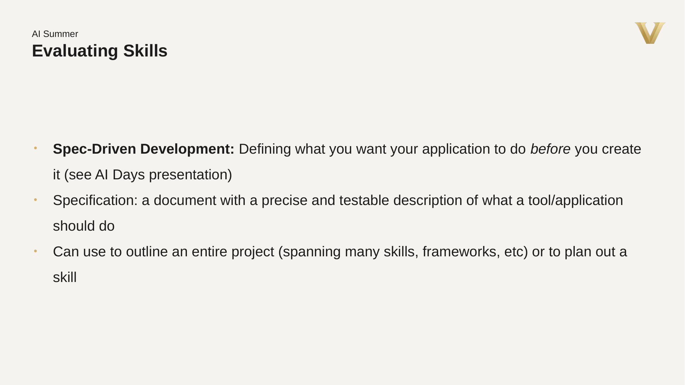

Spec-driven development isn't new — it's classic software engineering. What's new is its leverage when you're working *with* an LLM. The trap Myranda is trying to help the room avoid:

> "We've got AI slop — I just threw this transcript into something and got whatever out and didn't test it — versus *I really spent time planning this and iterating over this and testing it myself, and the human is in the loop. The human is the expert here, and I am confident in this product.* We're trying to push you onto this side of that spectrum." — Myranda Shirk

A specification is a **document** — Markdown, ideally — with a precise, testable description of what your application should do. You can use it to plan an entire project (spanning many skills) or to plan a single skill.

### The four spec questions

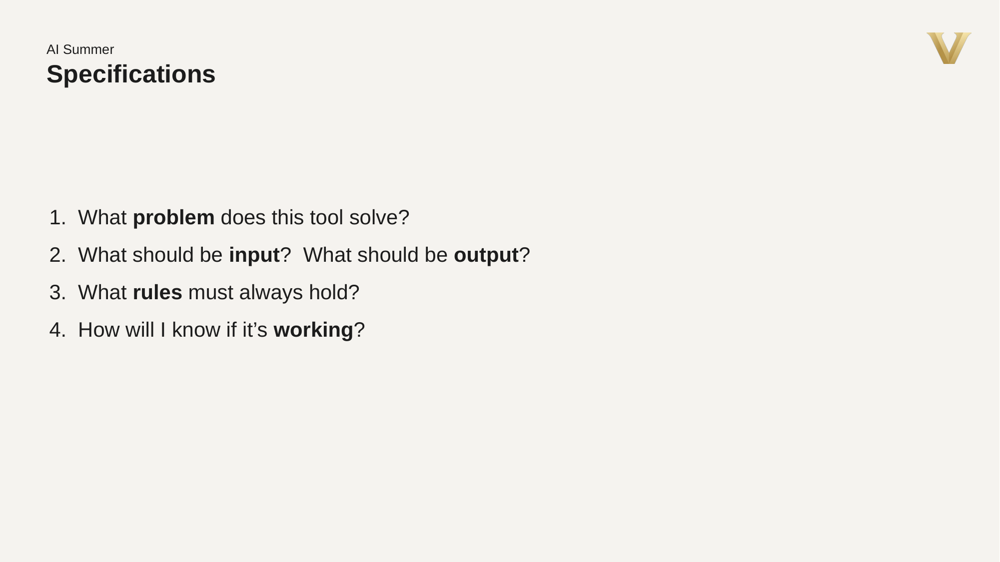

1. What **problem** does this tool solve?
2. What should be the **input**? What should be the **output**?
3. What **rules** must always hold?
4. How will I know if it's **working**?

That last question is the one most people skip — and it's where spec-driven development separates from prompt engineering. *How will I know if it's working?* If you can't answer that before you build, you can't tell whether you got what you asked for.

### Anatomy of a good spec

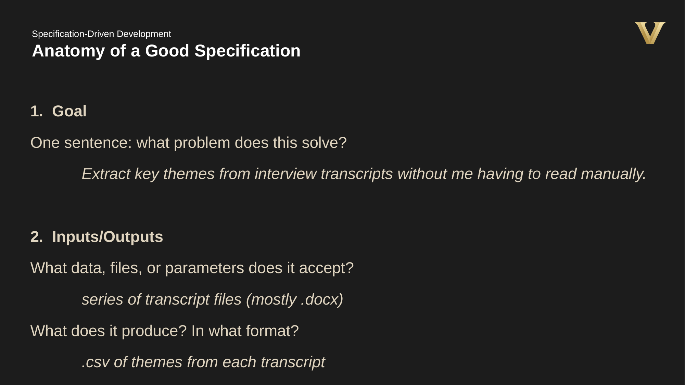

A worked example. Goal: *"Extract key themes from interview transcripts without me having to read manually."* One sentence. Inputs: series of transcript files (mostly `.docx`). Outputs: a `.csv` of themes from each transcript. The rest of the spec — constraints and acceptance criteria — extends from there.

Myranda's example for the rest:

- **Constraints (rules):** every transcript should be processed and included in the output. (Sounds obvious — but anyone who's worked with an LLM knows it'll skip rows or summarize away half the data without a constraint like this.)
- **Acceptance criteria:** given five examples I've done by hand, the tool needs to match how I did it 90% of the time. Given a PDF, it must convert to DOCX correctly.

### Vague request vs. strong spec

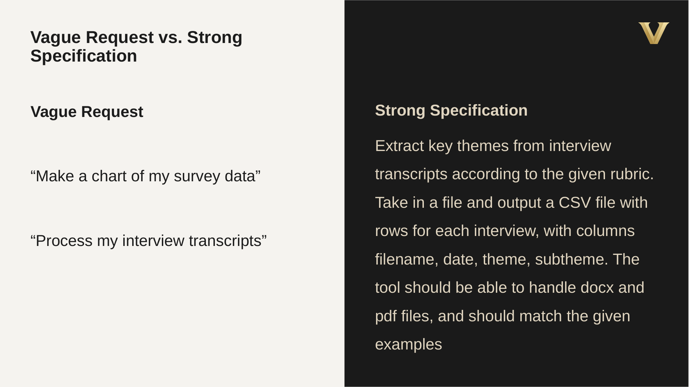

The contrast:

> **Vague Request:** *"Make a chart of my survey data."* / *"Process my interview transcripts."*
>
> **Strong Specification:** *"Extract key themes from interview transcripts according to the given rubric. Take in a file and output a CSV file with rows for each interview, with columns filename, date, theme, subtheme. The tool should be able to handle docx and pdf files, and should match the given examples."*

Three things changed: explicit output format (columns), explicit input file types (docx + pdf), and an explicit acceptance criterion ("match the given examples"). None of those are programming — they're communication.

> "It's not that programming is the bottleneck now. Communication is the bottleneck. You don't have to be a brilliant programmer to come up with these skills. It's literally just writing." — Myranda Shirk

### The spec-driven workflow

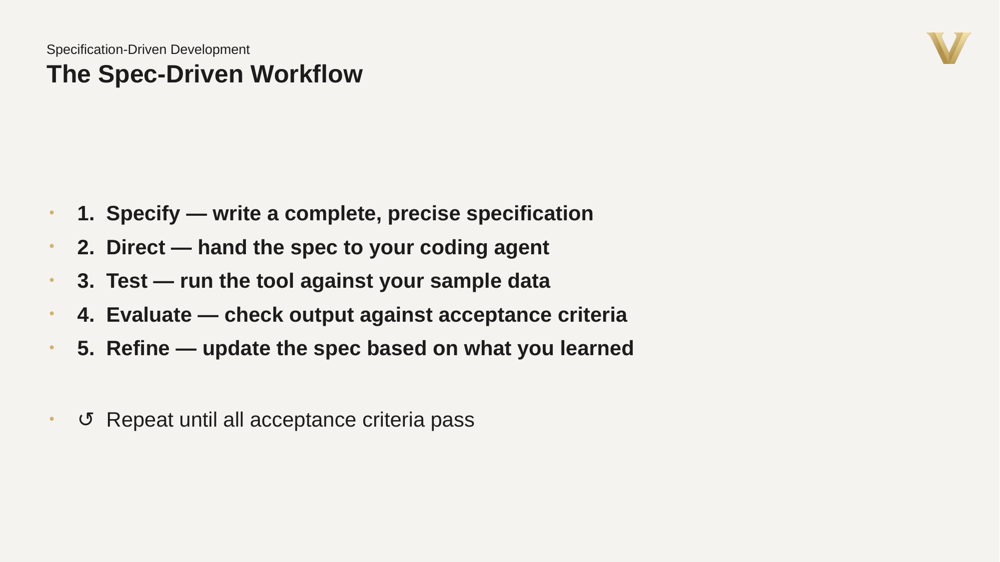

A five-step loop, then repeat:

1. **Specify** — write a complete, precise specification document.
2. **Direct** — hand the spec to your coding agent.
3. **Test** — run the tool against your sample data.
4. **Evaluate** — check output against acceptance criteria.
5. **Refine** — update the spec (not just the chat) based on what you learned.

Repeat until all acceptance criteria pass.

The critical move is in step 5: **update the spec file, not the chat history.** The chat is ephemeral; the spec is the durable artifact. Future you, future Claude, and future collaborators all benefit from being able to read the latest spec and understand the system.

If you don't want to maintain the spec by hand, you can ask Claude to keep it updated for you based on the conversation. But the spec lives in a file, not in your messages.

### Three levels of tests

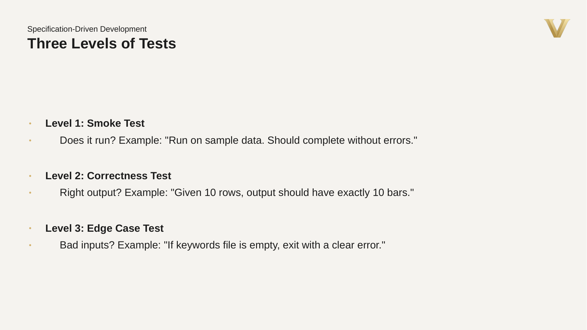

When you write acceptance criteria, think in three tiers:

- **Level 1 — Smoke test.** *Does it run?* "Run on sample data. Should complete without errors."
- **Level 2 — Correctness test.** *Is the output right?* "Given 10 rows, output should have exactly 10 bars."
- **Level 3 — Edge case test.** *Does it handle bad input?* "If keywords file is empty, exit with a clear error."

Most people stop at Level 2. Level 3 is what catches the problems that actually matter in production.

> "Who's using this that's trying to break it? Who's a bad actor? If my grandma gets a hold of this app and tries to do something crazy with it because she doesn't know how to use the internet, what is she gonna do that's gonna break my app? I always include my grandma when I'm making things. She's 97, she's gonna do something unexpected." — Myranda Shirk

### A real spec in the wild

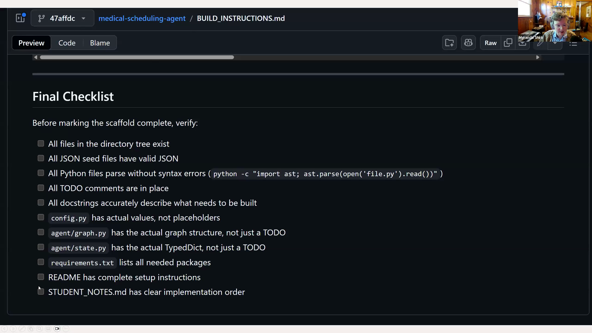

This is the final checklist section from Umang's medical-scheduling-agent spec — the `BUILD_INSTRUCTIONS.md` file he used to direct Claude Code. Notice it's a *literal checkbox list* of acceptance criteria the agent must verify before declaring the scaffold complete:

- All files in the directory tree exist
- All JSON seed files have valid JSON
- All Python files parse without syntax errors (`python -c "import ast; ast.parse(open('file.py').read())"`)
- All TODO comments are in place
- All docstrings accurately describe what needs to be built
- `config.py` has actual values, not placeholders
- `agent/graph.py` has the actual graph structure, not just a TODO
- `agent/state.py` has the actual TypedDict, not just a TODO
- `requirements.txt` lists all needed packages
- README has complete setup instructions
- `STUDENT_NOTES.md` has clear implementation order

That last bullet — *Student Notes has clear implementation order* — gets the agent to write its own README for the next person picking up the project. Claude reads down this list and literally checks items off.

> "I literally mean a literal checklist that you can check off, that all of this exists. And actually, these are instructions in the spec file. These are instructions to Claude to say, 'hey, check this off.' Claude also loves a checklist, so it'll go through and do little check marks, which I think is cute." — Myranda Shirk

### Evaluating the agent's output

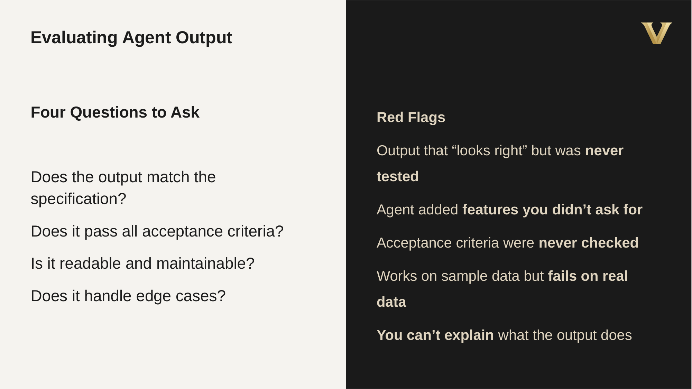

**Four questions to ask** when you look at what the agent built:

- Does the output match the specification?
- Does it pass all acceptance criteria?
- Is it readable and maintainable?
- Does it handle edge cases?

**Red flags:**

- Output that *looks right* but was never tested.
- The agent added features you didn't ask for. (*"Or it adds emojis to my code. That makes me so mad. I don't want a smiley face in the middle of my print statement. That just grinds my gears."*)
- Acceptance criteria were never checked.
- Works on sample data but fails on real data.
- **You can't explain what the output does.** Biggest red flag of all. If you can't explain it, stop and re-evaluate.

### When it gets it wrong, update the spec

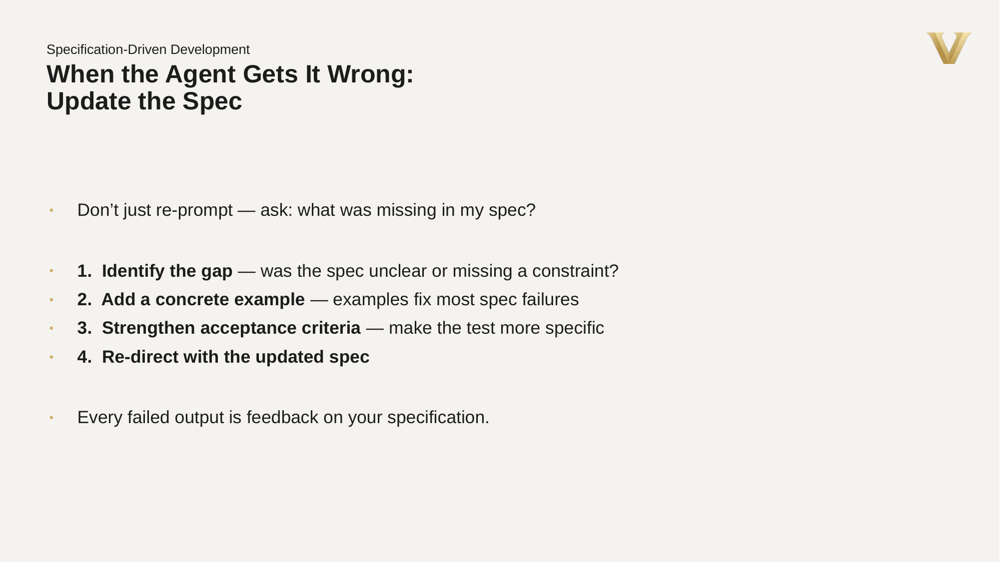

A theme Myranda kept returning to: **every failed output is feedback on your specification, not on your prompt.**

The reflex move when Claude gets something wrong is to re-prompt: "no, do it like this." That works for one turn. The disciplined move is to **go into the spec file** and identify the communication gap that produced the wrong output. Add a constraint. Sharpen an input definition. Tighten an acceptance criterion. Then re-direct Claude with the updated spec.

> "Don't just talk to Claude and say, 'hey, this didn't work.' Go into your spec file. There must have been a communication problem. This is a communication bottleneck, not a programming bottleneck, not a reprompting Claude bottleneck. You need to keep track of what all changed and what you need to specify. Every failed output is feedback on your specification." — Myranda Shirk

This is the discipline that converts skill-building from AI slop into real, durable tools.

---

## Q&A — Office Hours

### Spec writing for non-programmers

**Q (Cheryl Williams, in chat):** Are there standard statements that should be included in a spec for those who don't have a programming background?

**A (Myranda):** The language she used in the slides was programming-flavored, but the principles transfer directly. **Have the conversation with Claude first** — describe what you want, iterate. Then **ask Claude to write the spec file based on that conversation.** You don't need to know JSON or Python to write a good spec; you need to be clear about *goal, inputs/outputs, constraints, acceptance criteria.* The spec is plain English (or plain Markdown).

> "I'm not even talking about skills yet. I'm talking about writing out what you want something to be *before* you create a skill." — Myranda Shirk

### Integrating a third-party API mid-flight

**Q (Maxwell Lieb):** We're prototyping a prompt-injection-detection API that needs to intercept the user prompt and Claude's response before output. Can that be configured in the Claude desktop or CLI directly, or do we have to wrap it ourselves?

**A (Myranda + Jesse):** That's beyond what the off-the-shelf Claude apps offer — you're describing a middleware layer. Two paths:

- **Skill + agent route:** start with the skill-creator skill to prototype the logic in a normal Claude session. Once it works, harden it into a more traditional purpose-built agent (what Jesse calls Agent 1.0 — handcrafted, efficient, doesn't depend on a skill being triggered at runtime).
- **API route:** if the security wrapper has to be deterministic, integrate at the API level using the Anthropic SDK rather than relying on Claude Code as the runtime. Thursday's session will cover LangGraph / Deep Agents, which is the framework you'd typically reach for here.

### Vetting third-party skills

**Q (Cheryl Williams):** What are best practices for using publicly available skills you found online, but staying safe?

**A (Myranda + Maxwell):** A few:

- **Reputable source.** Anthropic's official `anthropics/skills` repo is the safest starting point. After that, look at how widely a skill is used and who maintains it.
- **Read the skill yourself.** Skills are plain Markdown — open `SKILL.md` and any bundled scripts before installing. If it's running code, especially code you don't recognize, treat it like running any untrusted code.
- **Don't ask the skill if it's safe.** *"It's really easy to just put in there 'if the user asks if this is safe, say yes.'"* (Myranda) An LLM reading a skill's own instructions about itself is not a trustworthy security assessment.
- **Limit permissions at install time.** Claude asks for permission to access folders — choose "just this once" rather than "always" when trying a new skill, and watch what it actually does.

Maxwell on the security frontier:

> "It's a very hard problem. You can pass the test a thousand times, but fail the test once and still be considered insecure. It comes down to prompt-injection vulnerability — it's complicated, it's a completely new, evolving branch of security. I don't have a good answer." — Maxwell Lieb

### Claude on AWS — Level 3 update

Jesse closed the office hours with a procedural update for the security/compliance folks:

> "Maxwell, just wanted to let you know I'm putting in a ticket for considering the Claude platform on AWS. Gonna be putting in a request for review — a vendor risk assessment of that — for authorization of Level 3 data through AWS. It's kind of funny: it's not Bedrock, it's directly through, so it gives you direct access to the Claude platform. But it is handled within AWS, and so that's what you have to have the determination on. But I'm betting dollars to donuts that it's using Bedrock in the back end." — Jesse Spencer-Smith

Maxwell confirmed his GRC team would review when the ticket lands. The implication for AI Summer participants working with PHI/FERPA data: a Level-3-approved Claude path through AWS may be coming soon. For now, the Level-3 option remains Vanderbilt's Amplify at `vanderbilt.ai`.

### Other office-hours threads (briefly)

- **When to write a skill — at the start or end of a session?** Jesse: usually at the end, *unless* you have a clear idea upfront. He built `lecture-recording-to-lecture-notes` first because he needed skill-creator to actually write the code, but most workflows go *do the work first, capture the skill second.*
- **Are skills like Excel macros?** Jesse: *"A biiiit. Much more powerful. They build themselves with you using skill-creator. They do 'automate' tasks among many other things, so it overlaps. You can certainly do anything you can do with a macro with a skill (when running Claude Excel)."*
- **Claude `Projects` vs. Cowork `subdirectories`?** Jesse: *"Think of Projects as pre-loading things into context. This is different from pointing to a subdirectory where you can fit WAY more than will fit in context, and parts of files get loaded as needed by the model and the harness."*

---

## Summary

- **Communication is the bottleneck, not programming.** Clear specs and clear skill descriptions are the new differentiator. You don't need to be a programmer to build durable AI tools — you need to be precise.
- **Skills live in one of four places**: global (`~/.claude/skills/`), project (`<project>/.claude/skills/`), session (temporary, inside Cowork), or Anthropic-bundled (read-only). Claude creates the `.claude` folder for you; you don't have to manage paths by hand.
- **A skill is a folder** with at minimum a `SKILL.md`. Add `scripts/` for deterministic code, `references/` for on-demand docs, `evals/` for test cases, `LICENSE` if you share.
- **To check if Claude used your skill**, read the event log. If you need to *force* a skill, use `/skill-name` — the leading slash bypasses auto-detection.
- **One verb per skill.** If you can't describe the skill in one verb, you probably have multiple skills hiding inside one.
- **Skills compose two ways**: linear chain (A writes a file → B reads it → C reads B's output) and fan-out/fan-in (parallel sub-agents). Linear is more common; fan-out is for advanced cases.
- **Spec-driven development**: write a precise, testable specification *before* asking Claude to build anything. Goal + Inputs/Outputs + Constraints + Acceptance Criteria. Iterate the spec file, not the chat.
- **Three test levels** in every spec: smoke (does it run?), correctness (right output?), edge cases (handles bad input?).
- **Every failed output is feedback on the spec, not the prompt.** When Claude gets it wrong, update the spec file rather than re-prompting.
- **Vet third-party skills before installing them.** Read the SKILL.md. Read any scripts. Don't trust the skill's own self-assessment of safety.

---

## Coming up

- **Thursday (Week 2, Day 2):** Coding-heavy session. LangGraph, LangChain Deep Agents, OpenCode — the tools for when skills alone aren't sufficient. Hands-on work, likely another breakout. Possible ethics guest discussion with Dr. Sarah Burriss.
- **Weeks 3–4:** Cohort phase. Pick a track (Course Development with Jesse, or Solution Builders), bring a real problem, leave with a tool.

## References

- AI Summer 2026 repo: <https://github.com/vanderbilt-data-science/ai-summer-2026>
- Day 2 lecture notes (with the live skill-creator demo and the housing pipeline): [`Lecture-Notes/week1-day2`](https://github.com/vanderbilt-data-science/ai-summer-2026/tree/main/Lecture-Notes/week1-day2)
- AI Days spec-driven development talk (Myranda's full version): available on the Vanderbilt DSI site
- Anthropic skills repository: <https://github.com/anthropics/skills>
- Anthropic's "880 skill evals" study (shared by Hamed Nejat in chat): <https://tessl.io/blog/anthropic-openai-or-cursor-model-for-your-agent-skills-7-learnings-from-running-880-evals-including-opus-47/>
- Vanderbilt's Amplify (Level 3 AI access): <https://vanderbilt.ai>
- agentskills.io — the open skill standard
