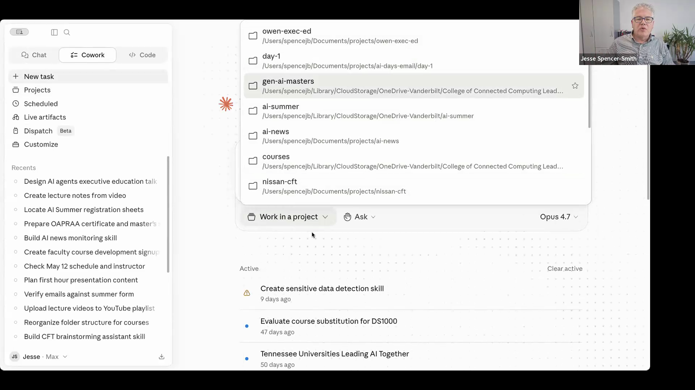
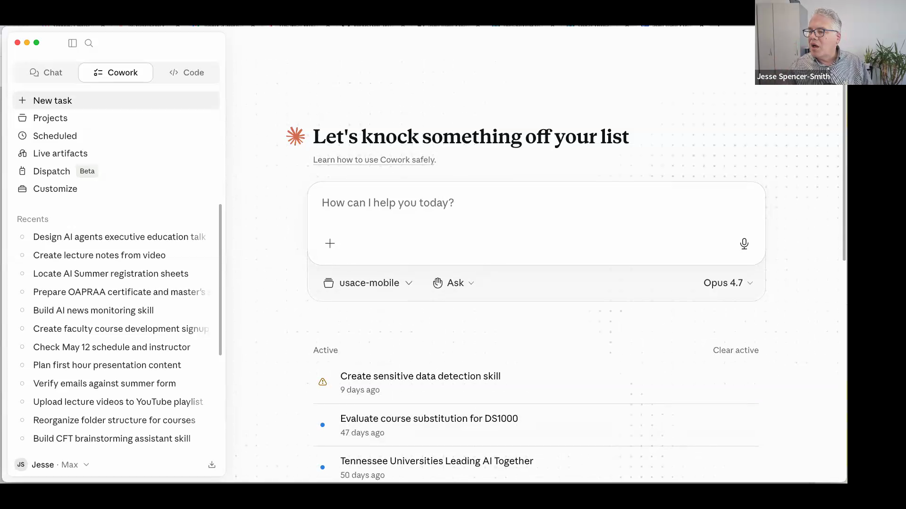
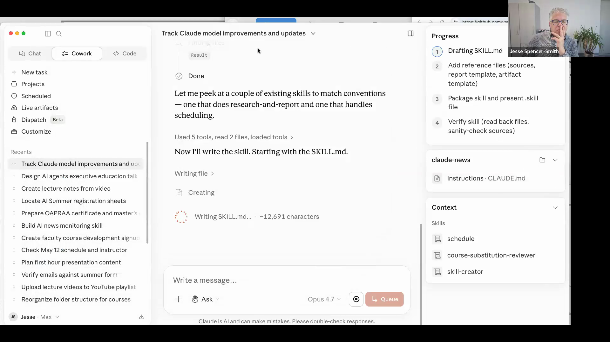
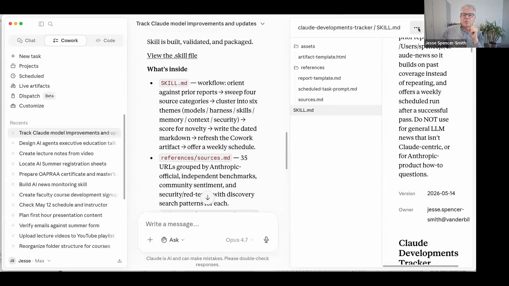
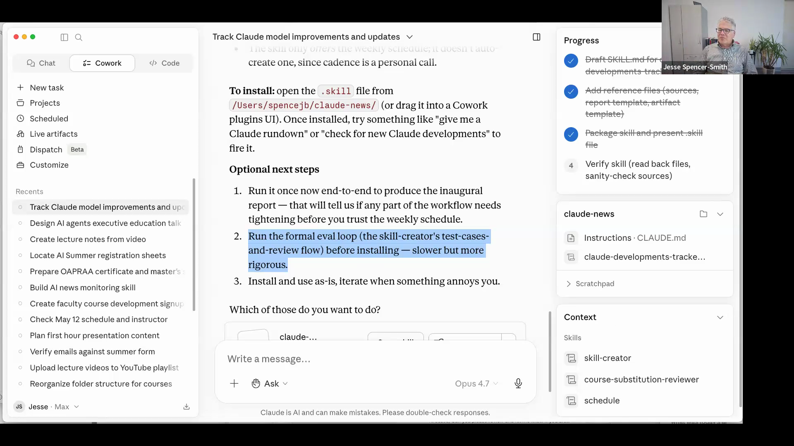
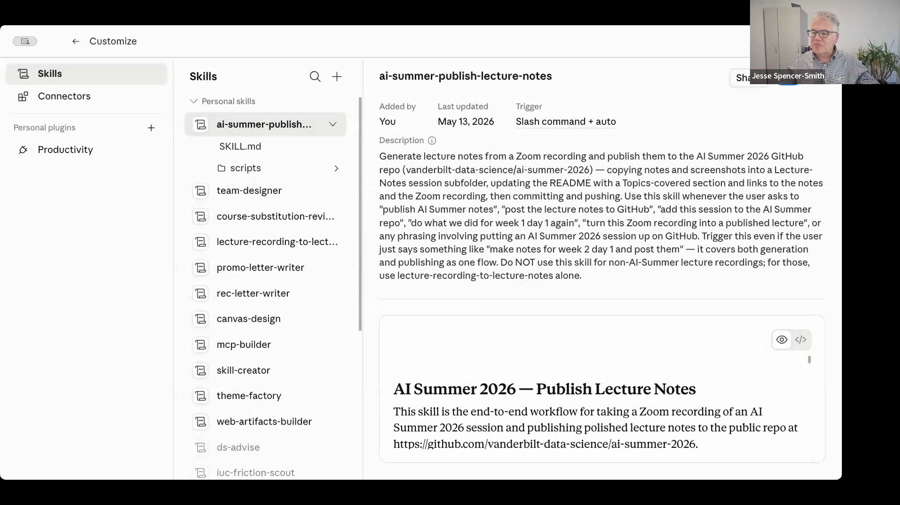
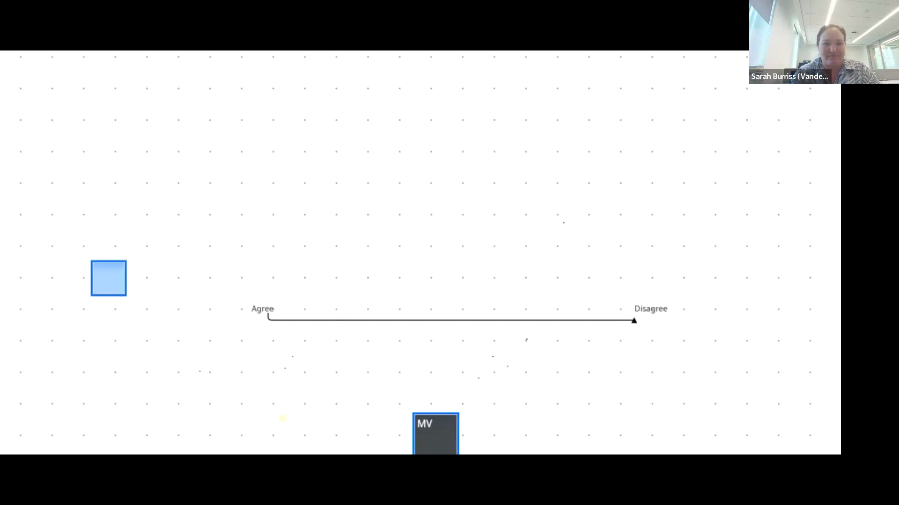
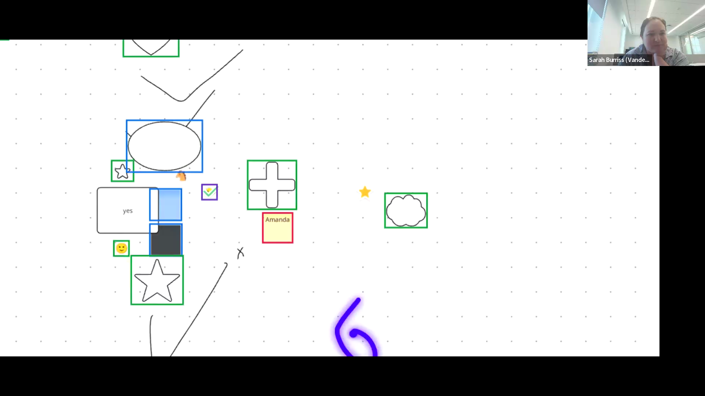
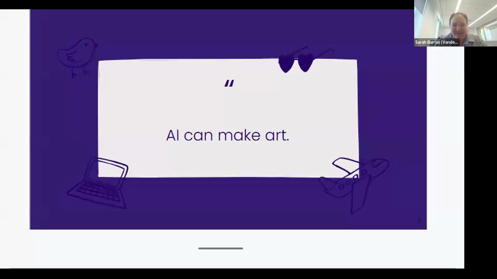

# AI Summer 2026 — Week 2, Day 2

Two acts. In the first hour Jesse leads hands-on skill creation — recapping the three surfaces (chat, Cowork, Claude Code), then building a "Claude developments tracker" newsletter skill live in Cowork while the room watches. Breakout groups build their own skills (transcript-to-action-items extractor, math tutor, Federal Reserve data downloader) and report back. Jesse closes with a tour of the Plugins marketplace — Legal, Small Business, Bio Research, now shipping. In the second hour Dr. Sarah Burriss takes over for a deeply personal hour on AI ethics, anchored in a story from her time as a Charleston librarian and Safiya Noble's *Algorithms of Oppression*. Office hours runs long with discussion of AI's environmental impact (Myranda's ongoing research with the Vanderbilt Law Lab), the next 6 months in agents, and whether skills are protectable IP.

---

## Key Concepts and Learning Objectives

**Key Terms and Concepts:**

- **The three surfaces** — Chat (everything in context), Cowork (sandboxed agent with subdirectory access), Claude Code (full filesystem access for reusable code).
- **Curated context** — In the post-prompt-engineering era, leverage comes from what's in the working directory, not from clever wording.
- **Skill Creator eval loop** — Each new skill is auto-tested twice: once with the skill, once without. If the with-skill run doesn't beat the baseline, you're burning tokens.
- **Plugin** — A bundled collection of connectors and skills, installable from `Customize → Add Plugin`. Anthropic released Legal, Small Business, and Bio Research this week.
- **Routine** — Cowork's scheduled-task mechanism. Build a skill, then schedule it to run every Monday at 9 AM, etc.
- **Sociotechnical system** — Sarah's framing: AI is technology *embedded* in social systems (companies, laws, training data, people). Ethics has to cover all three pillars.
- **Algorithms of Oppression** — Safiya Noble's book showing how PageRank shaped Dylann Roof's radicalization. The anchor of Sarah's argument that "AI is never neutral."
- **Model card** — Standardized accountability document for a deployed model: training data, evaluation results, known limitations, environmental impact.
- **Looped transformer** — An architecture (likely powering models like Anthropic's Mythos) that loops within a layer for longer-horizon coherent reasoning. Jesse expects public releases in 6 months.
- **Small-model-plus-skill ≈ frontier model performance** — A locally-run Qwen 3.6 with a tight skill can match Opus 4.7 on the narrow task that skill addresses.

**Learning Objectives:**

1. Pick the right surface for a skill (chat / Cowork / Claude Code) based on context size, filesystem needs, and how much reusable code the skill needs to write.
2. Build a skill end-to-end in Cowork using Skill Creator, including its automatic eval loop.
3. Schedule a skill to run on a recurring cadence via Cowork routines.
4. Find and install Anthropic-shipped plugins from the Customize menu before reinventing them.
5. Articulate Sarah's three pillars of sociotechnical ethics — Ethical Education, Ethical Technology, Ethical Policy — and recognize how a single missing pillar undermines the others.
6. Recognize a model card as a baseline accountability mechanism for AI in your domain.
7. Frame AI's environmental impact with reasonable numbers: training cost vs. inference cost, and where small models with skills change the math.

---

## Part 1 — Warm-Up Q&A

The session opened with two questions from the room before the formal start.

### Where did prompt engineering go?

Maxwell asked: *"What is the link between prompt engineering, as we thought about it a year or two ago, and this new agent-built prompting?"*

Jesse pulled back to first principles. At the start of LLMs, context windows were short (8K, 32K tokens). The entire game was extracting behavior from the model's MLP — its world knowledge — through clever phrasing. *"You are a specialist in…"*, *"show your reasoning"*, *"ask me questions first."* Models had no tools, no search, no file access. Prompting was all you had.

> "Now it's changed quite a bit. First of all, the models are already aligned. We don't say *show me your thinking* anymore, because the models kick themselves into thinking mode. With much longer context, it's far more important to curate what you give or make accessible to the model than it is to prompt in a particular way." — Jesse Spencer-Smith

He offered a candid admission:

> "As a matter of fact, I found that some of my prompting is terrible — and I co-wrote one of the first papers on prompt engineering. But it doesn't matter, because I have the context in the subdirectory, where it knows how to go after, and I know it's going to kick into thinking mode and ask me questions before it does anything." — Jesse Spencer-Smith

Maxwell synthesized the takeaway: understand prompt engineering as foundation, but don't lead with multi-thousand-word prompts. Lead with curated context.

### How much should you worry about agent security?

Paul: *"Do you ever have apprehensiveness about agents jumping to information on your computer that you don't want them to have?"*

> "You should never get used to it. But the way that you get comfortable is that you define the scope that the model has access to." — Jesse Spencer-Smith

Jesse's pattern, scaling vigilance to data sensitivity:

- **Sensitive data → don't put it in context.** Vanderbilt's Claude Desktop license can't carry Level 3 data (FERPA, etc.). When working with student data, Jesse asks Claude to write *de-identification code* rather than feeding the data directly.
- **Subdirectory scoping.** Point Cowork at exactly the folder you want it to read. It won't leave unless you grant access.
- **Computer Use mode.** Before granting full screen control, *close any windows the agent shouldn't be able to interact with.* Don't leave logged-in tabs visible.
- **Level 1/2 data:** relax somewhat. **Level 3:** much more careful. **Level 4:** local models only, everything locked down.

---

## Part 2 — The Three Surfaces, Revisited

Today's hands-on work pivots on a Day-1 question: *where do you actually author a skill?* Jesse walked through chat, Cowork, and Claude Code side by side.

### Chat — lightest weight, everything must fit in context

In chat, you can type `/skill-creator` to manually invoke the skill builder, or just say *"I want to create a skill"* and the auto-discovery will likely fire. Limitation: **anything the skill needs as reference has to fit in the ~200K-token window.** Paperclip-attached files, pasted text — it all goes into context.

> "You run the risk here unless you have really good information here that you're gonna load up right here. You can build skills in chat, but then you have to download them, you're gonna have to deal with them, but that is one way to load skills." — Jesse Spencer-Smith

Chat works for building a skill from a single document or a tight conversation transcript. It fails when you have a folder of references the skill needs to draw on.

### Cowork — the default Jesse recommends

In Cowork you point the agent at a project subdirectory. The agent gets read/write access to everything inside. Crucially:

> "Now I can create intermediate files here, or the agent can, because this is not chat — this is an agent. This is a full-on agent. It can create files, read files, do grep, read all the documents I've already created. So if I were to create an agent here, it has all of that at its disposal." — Jesse Spencer-Smith

Jesse showed this with his U.S. Army Corps of Engineers Mobile District project — a subdirectory with over a thousand pages of federal acquisition regulations. *"There's no way that's gonna fit in context."* But the agent doesn't need it to fit. It can search and read on demand.

### Q&A — Cowork mechanics

**Q (Ghina Absi):** When I name the folder, is the scope automatic — I don't need to explicitly say *only this folder*?

**A (Jesse):** Right. Naming the folder *is* the scoping mechanism. Cowork stays inside that subtree unless you grant additional access.

**Q (Kayla):** Should the average user just use chat? Cowork seems best for serious work.

**A (Jesse):** Most people use chat *because that's all they know.* They should use Cowork. Cowork can parallel-search, spin up sub-agents (Jesse used this preparing a presentation on 12 different people), produce real Word/PDF/Markdown artifacts in a subdirectory, and run on a schedule. *"It's much better to work with Cowork in almost all instances, unless it's a quick one-off."*

**Q (Maxwell Lieb):** Does Cowork dynamically purge context so we don't get into a dangerous state?

**A (Jesse):** Yes — that's the harness's job. It does **compaction** (summarizes earlier context when the window fills) and maintains **external memory** and an **external task list** so not everything has to live in context. Chat doesn't have that scaffolding.

### The harness, one more time

Mohsin asked whether you can mess with the harness yourself. Jesse and Myranda were clear: no, you don't. The harness is built into Cowork / Claude Code. What you author is *skills*.

Two important asides:

> "It is no longer… there are two ways to get vast improvements in the quality of work that you can get done. One is skills. The second is a great harness. The vast differences between models right now are often in their harnesses." — Jesse Spencer-Smith

> "A locally running model — Qwen 3.6 with skills — will absolutely equal, for the specific task that skill is addressing, Opus 4.7 without skills." — Jesse Spencer-Smith

### Claude Code (CLI) — for skills that need real code

The third surface. Jesse uses Claude Code CLI when the skill needs to write substantial code — code that *you* will keep and reuse, not the throwaway scripts Cowork writes for one-off purposes.

The `lecture-recording-to-lecture-notes` skill (which generated *these notes*) was built in Claude Code CLI because it had to produce cross-platform Python (Mac, Windows, Linux). The accessible-housing pipeline Umang demoed in Week 1 Day 2 was also built in Claude Code.

> "Cloud Code makes reproducible code. Cowork is gonna write code, but it's not gonna be code that you get to reuse. It's writing it for itself." — Jesse Spencer-Smith

---

## Part 3 — Live Build: a Claude Developments Tracker Skill

Daniel Byers proposed it: *"a skill that indexes the internet and pulls the most up-to-date versions and features for Claude, and turns it into a newsletter."*

Jesse built it live. The conversation took shape through clarifying questions:

- **Daniel:** Track month-over-month model improvements; learn from previous newsletters so it doesn't just repeat; cover security risks and whether they've been addressed.
- **Mohsin:** Add memory management and context management as topics.
- **Refining "better" — better according to whom?** They settled on: *according to what people in the community are saying.*

### Skill Creator interviews the user

After the first run didn't auto-fire Skill Creator, Jesse stopped it and invoked `/skill-creator` explicitly. Then it walked through clarifying questions:

- *Where should previous reports be stored?* → Workspace folder.
- *Scheduled or on-demand?* → Weekly (Daniel: *"that's not overwhelming"*).
- *Output format?* → Markdown plus a live HTML artifact (Daniel: *"if it's a newsletter, you'd want to capture the reader's attention"*).

Notice on the right side of the screenshot — the **task list** the harness is tracking. *"Chat doesn't have task create. It has to sort of keep track of that in context."* Four discrete sub-goals: draft the skill, add reference files, package it, verify.

### The drafted SKILL.md

The skill that Skill Creator produced has a real working philosophy, not boilerplate:

> "Build on prior reports, don't restart. Synthesize, don't dump. Take community sentiment seriously, but skeptically. Flag security, don't fearmonger. Cite everything that matters." — from the generated SKILL.md

Workflow phases (visible in the open file): orient against the existing archive → determine the coverage window → sweep the sources via web search → cluster findings into six themes (models, harness, skills, memory management, context management, security) → score for inclusion → write Markdown report → build the HTML artifact → offer to schedule a weekly run.

### Installing the skill and scheduling weekly runs

The "optional next steps" the skill offered:

1. Run it once end-to-end to produce an inaugural report.
2. Run the formal eval loop (test cases + review flow) before installing — slower but more rigorous.
3. Install as-is, iterate when something annoys you.

Jesse picked the live route: install, then schedule. Cowork **routines** support scheduling — weekly run every Monday morning, and the skill runs unattended.

### Skill Creator's automatic eval loop

> "When it creates a skill, it will test itself by creating three test cases. And then it will run those three test cases two times each. One in an agent that does not have access to the skill, and another time in an agent that does have access to the skill. Why do this? Well, it could be that the skill you came up with has no value. It could be that the model itself could have done perfectly fine without the skill, which means you're just burning tokens for no reason." — Jesse Spencer-Smith

This is the same pattern Anthropic uses internally for skill-creator's own evals. It produces hard numbers: pass rates, token usage, latency. If with-skill ≈ without-skill, don't ship.

### Q&A — Editing existing skills

**Q (Ghina Absi):** If I run the same prompt twice to create the same skill, will I get the same result?

**A (Jesse):** Close but not identical — we add noise to the token probabilities (temperature). And: *"If you rerun Skill Creator on an existing skill, it takes you into an editing version of it. How would you want to modify? What's working? What's not working?"* So Skill Creator doubles as a skill *editor*.

**Q (Andrea):** When editing an existing skill, do you prefer Markdown editing or natural-language conversation with Cowork?

**A (Jesse):** Depends. Broad structural changes — let Claude edit. Tight formatting — do it yourself. Either works; Markdown is fast for Claude to edit (unlike Word, which takes forever).

---

## Part 4 — Breakout Session: Build Your Own Skill

Five-person breakouts for ~15 minutes. Reports back:

### Chelsea's group — meeting-transcript-to-action-items extractor

> "Create a skill that takes transcripts from unstructured meeting recordings in various text formats, parses out actionable items and responsibilities, produces JSON files for importing them into task-management tools, and creates an email file that the meeting author can use to send commitments or action items to meeting attendees automatically." — Chelsea / her group

The skill drafted a Python parsing approach, created sample transcripts to test against, and was still running its expanded evals at the end of the breakout. Jesse's coaching:

> "Think of all the software we license and buy to do that — but you can do much better, because you can say *here's my organization, here's everybody's email, here's what they do, here's their background, here's the agenda, the agenda will always be on Monday.* The more context you give the skill, the better job it'll do." — Jesse Spencer-Smith

### Md Kamrul Hasan's group — PhD-level math tutor for middle and high schoolers

> "I want to create an experienced PhD-level math tutor for middle school. The tutor should be interactive, explain the problem before giving the answers, double-check the answers to make sure it is correct, and be creative. Show multiple methods, make it fun, build confidence and curiosity, make it adaptive from lowest to higher cognitive level." — Md Kamrul Hasan

Personalizable per child: their interests, where they get stuck, this week's worksheet. A skill plus per-child context is a tutor that adapts to *that* student.

### Simon Lilburn's group — Federal Reserve (FRED) data downloader

For a course Simon is teaching next semester. Loosely-specified: *I want data, and I want documentation about that data.* The skill drafted documentation templates, guided Simon through getting an FRED API key, and generated a Python script that hits the FRED API and normalizes the output. *"It's not that Cowork can't do it, but it's gonna be very purpose-built."*

This is the case where the skill itself includes a script. Cowork bundles the Python file into the skill's `scripts/` directory and the skill knows when to invoke it.

---

## Part 5 — Plugins: The Marketplace You Haven't Looked At Yet

Above is the same Customize panel everyone has been navigating to — but Jesse pivoted to the *Plugins* tab next to it.

> "Sometimes you don't have to create stuff from scratch." — Jesse Spencer-Smith

Plugins are bundled collections of connectors plus skills. Anthropic shipped several this week:

- **Legal** — *"$283 billion of market capitalization was knocked off software-as-a-service legal companies. This is even bigger."* Works with multiple legal providers via MCP.
- **Small Business** — also new this week.
- **Bio Research** — for research workflows.
- Dozens more, each scoped to a domain.

Before building a custom skill, check the plugin marketplace. The legal and small-business plugins are doing what would have been multi-million-dollar SaaS contracts a year ago, for the cost of a Claude Pro subscription.

---

## Part 6 — Sarah Burriss on AI Ethics

Dr. Sarah Burriss joined as guest. She is a new Assistant Professor of the Practice at the College of Connected Computing whose research is in AI ethics, particularly in education contexts from middle school through doctoral students.

### Warm-Up: A Whiteboard Activity

Three deliberately-vague statements, one at a time:

1. **"AI is good for humanity."**
2. **"AI is good for work."**
3. **"AI can create art."**

The vagueness was intentional. *"There will be different interpretations of this, and that's the point — there's no right or wrong answer here. There's only a right or wrong answer for you, for right now."*

#### "AI is good for humanity" — most landed in the middle

- **Kayla:** *"I see all of the good that it can do, but I also see how it's changing society, especially entry-level positions. I don't know that as a society we're ready for that or are handling it in the best way."*
- **Ida Metiam:** *"It's more of *how* the AI is used. Bad actors can use AI for malicious things, and that's where it ends up being bad."*

#### "AI is good for work" — split

- **Cara Wade (agree):** *"I think we'll recalibrate what entry-level positions mean. A consequence could be we're challenging our value system, and that will also have to recalibrate."*
- **AE Johnson (disagree, ironically a self-described biggest AI fan):** *"I believe work has dignity, and dignity needs to be created and cultivated by humans. I'm a little bit concerned about the dignity of work being trapped just to efficiency and output, and not the human who does it themselves."*

#### "AI can create art" — bifurcated

- **Mayme Van Meveren:** *"AI is oversimplified as a term — depends if you mean AGI, which hasn't really happened yet, or just all these machine learning tools. They can reproduce art, especially based on inputs, coming up with wild and crazy combinations. It can still be thought-provoking, or just as mundane as any other piece of artwork in a hotel room."*
- **Myranda Shirk (professional musician outside of this work):** *"I believe that art is human. I'm not about to listen to a piece of music that a human has not traded, and that has benefited from, honestly, stealing from artists. Anthropic, for instance, pirated hundreds of thousands of books to create what they have now. The reason we have art is to communicate as humans, and I'm never going to look at something that AI has created. You can usually tell."*

> "Look at that distribution of ideas about whether AI can make art. This is just one of any infinite number of questions related to ethics we can ask about AI. And people will have very strong opinions about the way that it can or should be used. It's hard to have conversations about what appropriate use is when we have such differing opinions, and part of what I aim to do here today and in my broader work is have some of those discussions." — Dr. Sarah Burriss

### A Personal Story — and Why It Matters

Sarah anchored the rest of the hour in a story from her time as a librarian in Charleston, before her PhD.

She worked a block from the Charleston Emanuel AME Church — Mother Emanuel — one of the oldest AME congregations in the U.S., founded in 1817. One of her colleagues, librarian **Cynthia Hurd**, was among the nine worshippers killed by Dylann Roof on June 17, 2015 during a Bible study. Sarah had been in a meeting with Cynthia the morning of the day she was killed.

The reason this is a story about AI ethics: Sarah didn't initially see the connection. It wasn't until her PhD at Vanderbilt, when she read **Safiya Noble's *Algorithms of Oppression***, that she came across Roof again — and reframed what had happened. Roof had written a manifesto stating his radicalization began with a Google search for *"black-on-white crime."* The first result Google's PageRank surfaced was a white supremacist site, the Council of Conservative Citizens. Roof said he was *"never the same since that day."*

> "A straight line cannot be drawn between search results and murder, but we cannot ignore the ways that a murderer such as Dylann Roof, allegedly in his own words, reported that his racial awareness was cultivated online by searching on a concept or phrase that led him to very narrow, hostile, and racist views." — Safiya Noble, *Algorithms of Oppression* (quoted by Sarah Burriss)

Sarah's takeaway:

> "AI is never neutral. We build all sorts of biases into it, even when we don't realize it, depending on how we train it, how it is interpreted, even when it's beyond our hands. The systems that we design are powerful and sometimes have deep impacts on people beyond those that even we can anticipate. But I think we should try." — Dr. Sarah Burriss

This anchors the rest of the lecture: technical decisions in building an AI system have moral weight, even when no one involved is acting in bad faith. PageRank wasn't designed to radicalize anyone. It did anyway.

### Framework — Sociotechnical Ethics

Sarah's working frame, summarized verbally during the lecture: AI ethics is not just *technology* ethics. It is the intersection of three pillars:

1. **Ethical Education** — Opportunities for diverse stakeholders to learn about AI, critique it, have a say in how it's developed and applied.
2. **Ethical Technology** — Ethics doesn't start at application time. Decisions made during training, tuning, and deployment all have ethical implications. Algorithmic bias research has shown this for decades.
3. **Ethical Policy** — Equitable, just rules around design, deployment, and use. Law, regulation, organizational guidelines.

If any pillar is missing, the others can't compensate.

### Framework — Entry Points from Different Disciplines

Different academic disciplines bring different tools:

- **Philosophy.** Consequentialist / utilitarian (tally up risks and benefits), deontological / rules-based (what rules govern this technology), virtue ethics.
- **Sociology.** Jenny Davis at Vanderbilt is moving the conversation from *AI fairness* to *reparation for AI harms.*
- **Mathematics.** Formal methods to calculate bias and quantify fairness in model outputs.
- **Law.** Accountability, liability, contract, regulation.

> "It's a really interdisciplinary field." — Dr. Sarah Burriss

### Moral Machine and the Trolley Problem

Sarah referenced MIT's [Moral Machine experiment](https://www.moralmachine.net/) — millions of people from around the world asked to decide who should die in self-driving-car versions of the trolley problem. Researchers found systematic cultural variation in moral reasoning.

> "This experiment started many years ago, and one thing that I think is really interesting about it is that we now have cars that are engaging in this kind of decision-making. People's moral beliefs are increasingly built into the technologies that we are using." — Dr. Sarah Burriss

A useful provocation for the room: *whose values are being encoded in your skill, whether you intended to encode any or not?*

### Governance Frameworks

Non-exhaustive map of frameworks actually being used to govern AI:

- **AI Bill of Rights** (Biden administration; archived under Trump but still influential) — rights-based framing.
- **NIST AI Risk Management Framework** — corporate-aligned, broadly applicable.
- **EU AI Act** — currently the most aggressive legal framework. Even US-based companies operating internationally have to comply.
- **UNICEF guidance** — for AI used with or for children.

Sarah's pragmatic note: in the absence of US federal AI legislation, the EU AI Act effectively governs many global tools — *"that still affects how companies can operate."*

### Model Cards as Accountability

Sarah closed with a specific accountability mechanism: **model cards.**

A model card is a standardized document describing how a model functions: what it was trained on, what it was tested for, its known limitations, its environmental impact. Sarah co-developed an education-specific model card with practitioner advisors from across the country.

> "We have very little requirement to document and share about the way a model functions, or how it was created or trained. But there are lots of folks arguing we need these kinds of accountability and transparency mechanisms." — Dr. Sarah Burriss

She also flagged Twilio's [AI Nutrition Label](https://nutrition-facts.ai/) as a parallel approach — same idea, more nutritional-label-shaped.

One ethical issue she hadn't yet touched but flagged for the room:

> "How much we want our agents and our interactions with AI to feel human, and when we want to avoid that. There's a lot of discussion in the education world about children and their social relationships with chatbots. As they feel more and more human, and people are increasingly developing human-like attachments to them — this is a really interesting area of AI ethics to watch." — Dr. Sarah Burriss

---

## Part 7 — Office Hours

The session ran 30+ minutes into office hours. Threads worth capturing:

### How big is AI's environmental impact, really?

Ghina asked Sarah for advice on using AI in environmentally responsible ways. Sarah's honest answer: *it's hard to get good information about the scale of the impact.* Then she handed off — *"Miranda actually has been doing some work exactly in this area."*

Myranda's update:

> "My main projects are on AI and the environment. We started this about a year ago, thinking the data was maybe already out there, but it's not. Our current work, with the Vanderbilt Law Lab and some people at University of North Carolina, we have an equation to estimate how much energy use is out of each model. We are running those calculations and we'll hopefully have results soon. Some other things: reasoning models we think use a lot more energy. When you're using skills and Claude Code and all of that, be cognizant of that. As well as water use." — Myranda Shirk

A critical reframing she added:

> "This brings up a very important thing that people have not been talking about until now — watching an hour of Netflix uses an incredibly intensive amount of resources. More than your query to ChatGPT, more than your query to Claude. So this is within a larger conversation of talking about our digital footprint as a society." — Myranda Shirk

Jesse layered on the **train vs. inference** distinction:

> "There's a difference between training the model and inferencing with the model. With training, you have companies training extraordinarily large models, believing that's going to give them a competitive edge. And it may not. Take XAI in Memphis — they had a little less than 30 gas turbines running to power Colossus 1, to train a model which really is not going to be used. Huge environmental impact to train a model which is not going to be used." — Jesse Spencer-Smith

The practical lever:

> "Small language models, augmented with skills, can perform as well as the largest models. So this becomes not only a consideration of token cost but environmental impact as well. If you want to be a good steward, find a way to get the results you need on the smallest possible model… I run a model which is equivalent for certain jobs as Opus 4.7 on my laptop. That is obviously not using a great amount of power, and using no water." — Jesse Spencer-Smith

### Obsidian inside project folders

Maxwell asked Jesse about using Obsidian (a Markdown note-taker with bidirectional linking) inside project folders.

> "Whenever you have knowledge and have it structured, this is the essence of curation. If you're using an AI agency, you can absolutely point Cowork to this, or Claude Code. Now you have a great additional structure that really enhances the harness. The Claude harness now does something — it *dreams*. When it's off-cycle for a certain amount of time, it goes through and begins to synthesize and create connections, move things into memory, similar to what we do when we sleep." — Jesse Spencer-Smith

Maxwell's plan: build a skill that bootstraps an Obsidian vault for a new project. *"A very powerful way to extend the capability of your models. A low-cost way, too — you're not moving a whole bunch of tokens back and forth."*

### What's coming in the next 6 months?

Mohsin's question. Jesse's prediction:

- **Looped transformers will go public.** Probably what's powering Mythos. Same architecture but with intentional looping in one of the layers — allows much more coherent long-horizon reasoning.
- **More work on harnesses.** Memory subsystems, framework support.
- **Small models keep getting better.** On-device inference becomes routine for a wider class of tasks.
- **A cultural reckoning, not just a technical one.**

> "By every measure we've ever come up with, we're there. It is human level, it is AGI. The other thing we're going to start dealing with is something which is not model-based, not harness-based. It's going to be the perception and the apprehension that we have achieved this. More and more people are going to become aware of that, and you're going to find stronger pushback, people being very uncomfortable, people really needing to learn more, to discuss, to think about what this means for their own sense of self." — Jesse Spencer-Smith

Maxwell on the same theme:

> "I think we're going to have to run into a redefinition of what AGI means. For a lot of folks, especially people very emotionally invested in AI, there's an undefined sense that it's going to be soulful, or operating on its own." — Maxwell Lieb

Jesse: *"We wanted intelligence to be like us."*

Maxwell: *"Yes — and there'd be a lot of disappointment and dissatisfaction that we got to a set of large language models as good as a smart human mind, but it didn't suddenly bootstrap into something new and sci-fi."*

### What should universities be teaching?

Mohsin pushed on what universities owe students entering a workforce nobody can predict. Jesse:

> "What allows you to use and leverage AI? You have to curate the content. You have to define your problem well. You have to know what you're actually solving. You have to know what's relevant to actually include. These are critical thinking skills. These are exactly the skills that universities teach, regardless of whether it's in CS, philosophy, or history. I think universities are more relevant than ever, because now we have the AI tools that allow us to get to the problems — only if you know what to ask." — Jesse Spencer-Smith

Maxwell added the educator's burden:

> "One of the things as educators we're bumping into is the pervasive almost culture-wide marketing around AI: that it's easy, that it does it for you. A lot of the corporate implementations are running into failure or a lack of return on their investment. The salesmanship of everyone running these foundation model organizations — but it's not really that easy. It takes an understanding of the underlying process, an understanding of your data, and harder than that for many businesses, a thorough understanding of the actual problem you're trying to solve." — Maxwell Lieb

### Are skills protectable IP?

Ida raised this. *"I can see companies making skills proprietary, then selling them as a service or a product."*

Jesse: yes, but tricky. Skills are *plain text* — readable by anyone with file access. Copyright on plain text describing a process is ambiguous. Patent is unlikely. Maxwell suggested trademark might be the angle. Myranda flagged the problem is *already* showing up:

> "There's already been accusations of people using skills to essentially copy open-source repositories and projects, then put them behind a paywall — and the people who built the open source had no idea their project was unlawfully copied." — Myranda Shirk

Jesse, half-joking: *"They just rewrite it in TypeScript."*

This is going to be an active legal frontier. For now: license your published skills. Apache 2.0 matches what Anthropic uses on their own skills repo.

### Claude on AWS — Level 3 update

Jesse mentioned earlier in the session that he submitted a ticket asking for a vendor risk assessment of the new **Anthropic Claude Platform on AWS**. Different from Bedrock — AWS handles billing/auth, but inference still happens at Anthropic. The question for Vanderbilt is whether this can be approved for Level 3 data. Awaiting GRC review.

---

## Q&A

This section consolidates audience Q&A that didn't fit neatly into the main flow above.

**Q (Md Kamrul Hasan):** Would you mind sharing the prompt in the text box here?

**A (Jesse):** [shared the prompt during the live build]

**Q (in chat):** Do we make our own harness?

**A (Myranda):** No. The harness is the software (Cowork, Claude Code). You can edit text inside skills, but not the harness itself, unless you have a very complex problem and you're doing it in Python from scratch.

**Q (Md Kamrul Hasan):** Can you please share one or two skills you've created for this course?

**A (Jesse):** Yes — they'll go up on the repository.

**Q (Cierra Price):** Do Vanderbilt employees have higher Claude access, or is it just the free access?

**A (Myranda + Maxwell):** No Vanderbilt-wide Claude license. Vanderbilt's Amplify (`vanderbilt.ai`) gives chat-level access approved through Level 3 data, but not Cowork or Claude Code. Some labs have private agreements with Anthropic.

**Q (Cierra):** Can I use Claude Pro to build a daily-schedule skill for our early childhood school?

**A (Maxwell, as the security perspective):** If it's just first names, you may technically be OK, but anonymize first to do proof of concept, then talk to your department about data-approved options like Amplify.

---

## Summary

- **Curated context replaced prompt engineering.** The leverage moved from "what magic words to type" to "what to put in the agent's working directory."
- **Cowork is the default for skill building.** Most users still default to chat out of habit. Cowork can read whole subdirectories, spawn sub-agents, produce real file artifacts, and run on a schedule.
- **Claude Code CLI is for skills with reusable code.** When your skill needs cross-platform Python or sustained development, this is the right surface.
- **Skill Creator's eval loop saves you from shipping useless skills.** It auto-tests with-skill vs. without-skill on three prompts. If the baseline matches, don't ship.
- **Plugins exist — look there before reinventing.** Legal, Small Business, Bio Research, and dozens of others now shipping from Anthropic.
- **AI is never neutral.** Even well-intentioned algorithmic systems embed values that scale to consequence. The right response isn't paralysis — it's intentional design.
- **Sociotechnical ethics has three pillars.** Education, Technology, Policy. Skipping any one doesn't work.
- **Model cards (or AI nutrition labels) are the simplest available accountability mechanism.** Use one for anything you deploy.
- **Environmental responsibility looks like small-models-plus-skills.** A locally-run model with a tight skill can match Opus 4.7 on the narrow task that skill addresses. Order-of-magnitude better for energy and water.
- **The hard work of the next 12 months isn't technical.** It's cultural. People will need help processing the fact that, by every traditional benchmark, AGI has arrived.

---

## References

- AI Summer 2026 repo: <https://github.com/vanderbilt-data-science/ai-summer-2026>
- Anthropic skills repository: <https://github.com/anthropics/skills>
- Anthropic Claude Platform on AWS (Jesse's vendor-risk-assessment-pending reference)
- Safiya Noble, *Algorithms of Oppression* (NYU Press, 2018)
- MIT Moral Machine experiment: <https://www.moralmachine.net/>
- NIST AI Risk Management Framework: <https://www.nist.gov/itl/ai-risk-management-framework>
- EU AI Act: <https://artificialintelligenceact.eu/>
- AI Bill of Rights (archived): the Biden-era White House framework
- UNICEF guidance on AI and children
- Twilio AI Nutrition Label: <https://nutrition-facts.ai/>
- Vanderbilt's Amplify (Level 3 AI access): <https://vanderbilt.ai>
- agentskills.io — the open skill standard
